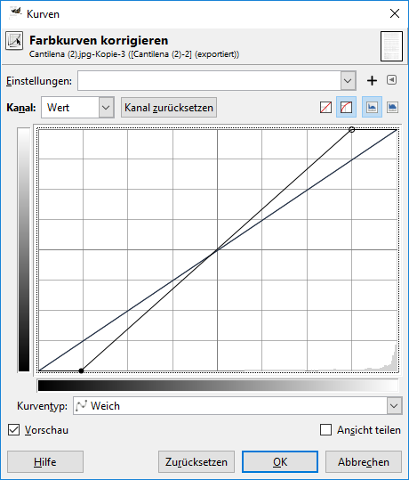
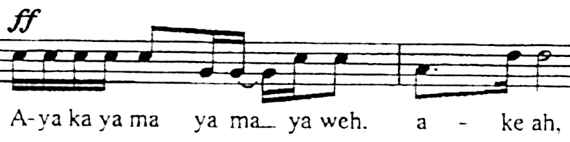
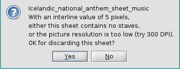
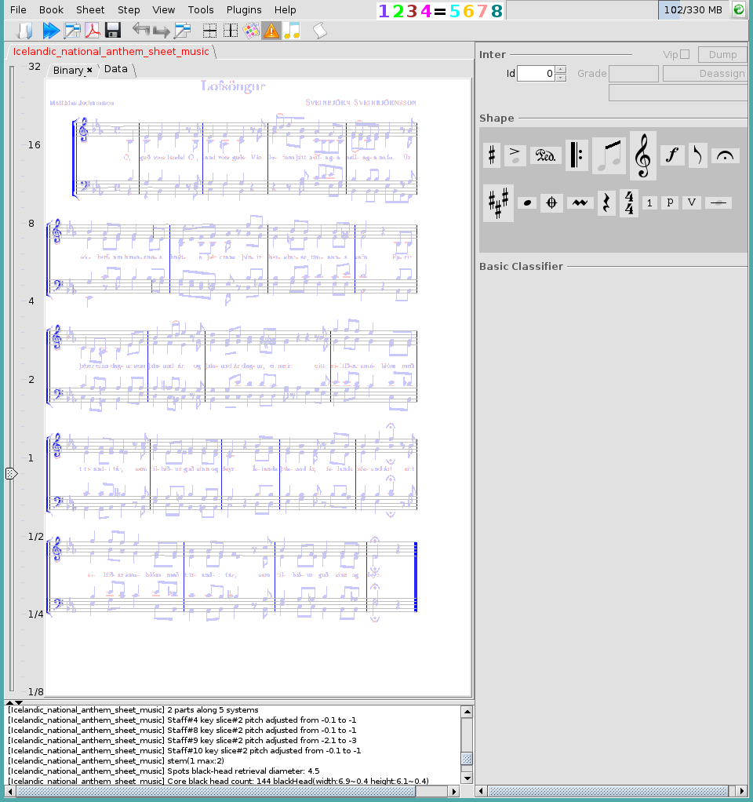
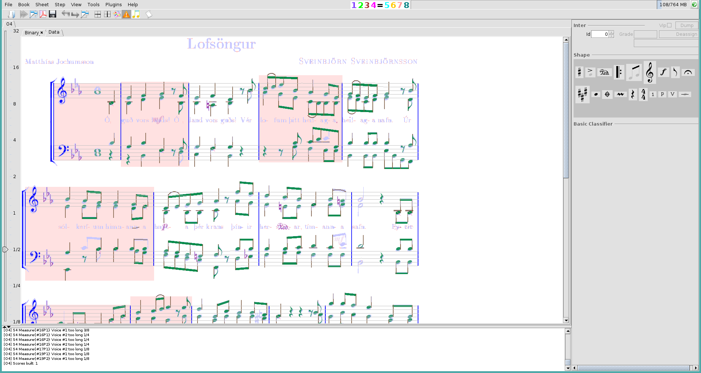

## Improve Input
{: .no_toc }

Sometimes the base image is of rather bad quality.
Although the human's eye can identify the notes correctly, the algorithms have problems to detect
the components of a score correctly.

---
Table of contents
{: .no_toc .text-delta }

1. TOC
{:toc}
---

### Using Gimp

[Contribution by Baruch Hoffart]

Here are some possible improvements using Gimp.

#### Adjust Brightness and Contrast

The simplest way is to adjust the brightness of an input image.
Although Audiveris has a very good automatic binarization algorithm, sometimes manual adjustment
improves the recognition.

Have a look a the following part of a score: there are a lot of disturbances between the staff lines.


Now simply increase the brightness of the image by using the color curve tool.
Keep the dark parts black, to get an image like this:


#### Improve Image using Filters

Have a look at the following image: here we have a lot of noise in the lines and in the bars.
The transcriptions will have problem to properly detect the bars in such a case.


Now use a gaussian blur filter with size 1.5 to 2.0, and you get the following:


Now use the color curve tool an remove about the top and bottom 10% of the input brightness range
(look at the result, the optimal values depend on your input image):



and you get something like this (the stems should still be a close line):


Finally use an "unsharp mask" filter with standard deviation set to about 1.0 to regenerate a sharp image:



You see that now the noise is almost completely removed.

### Enlarging Low Resolution Scans

[Contribution by Ram Kromberg]

This section describes how to pre-process low resolution sheet music scans before processing with Audiveris OMR.

When attempting to process low-resolution images with Audiveris, one may encounter warnings and/or identification errors.






It is possible to improve or even entirely overcome such obstacles using super-resolution processing software and services to enlarge the image before processing with Audiveris. e.g.



This document will detail an example using free, open-source software that is commonly distributed in Linux distributions. Alternatives for Macintosh and Windows will be mentioned as well.

#### Software Required

1. _waifu2x_. For the enlargement.

* Linux: [waifu2x-ncnn-vulkan](https://github.com/nihui/waifu2x-ncnn-vulkan).
* Windows: [waifu2x_snowshell](https://github.com/YukihoAA/waifu2x_snowshell).
* Mac: [waifu2x-ncnn-vulkan-macos](https://github.com/moeoverflow/waifu2x-ncnn-vulkan-macos).

2. [ImageMagick](https://imagemagick.org). For git-2-png conversion.

3. _wget_. To download the example image.

4. Audiveris OMR.

#### Step-by-step

1. In this example we'll be using the [Icelandic national anthem](https://commons.wikimedia.org/wiki/File:Icelandic_national_anthem_sheet_music.gif) as follows:

```bash
wget "https://upload.wikimedia.org/wikipedia/commons/6/6c/Icelandic_national_anthem_sheet_music.gif"
```

2. Since _waifu2x-ncnn-vulkan_ can't process gif files, we'll convert the image to a png using ImageMagick's _convert_ executable:

```bash
convert "is~.gif" 00.png
```

3. Finally, we'll enlarge the converted png:

```bash
waifu2x-ncnn-vulkan -s 4 -i 00.png -o O4.png
```

#### Notes

1. By default, _waifu2x-ncnn-vulkan_ makes use of the GPU. It is possible to force the use of the CPU with the `-g -1` flag and specify the use of more threads with the `-j` flag. e.g. 4 CPU threads: `waifu2x-ncnn-vulkan -g -1 -j 2:4:4 -s 2 -i 00.png -o 04.png`.
Be advised even low-end GPUs will out-perform the CPU many times over.

2. In this example we were forced to override the default scaling to 4x using `-s 4` to satisfy Audiveris requirements. There will be times when the default 2x would suffice. Other-times, 4x will prove too much as we'll cross Audiveris's maximum pixel capacity.

3. When executed to scaling exceeding 2x, _waifu2x-ncnn-vulkan_ will often terminate with `Segmentation fault (core dumped)` but would otherwise enlarge the images sufficiently well.

4. _waifu2x-ncnn-vulkan_ comes with denoising capabilities that can be used with or without scaling.
That is, a severely degraded or poorly focused image may still be recoverable for OMR use
as long as it is readable by humans.
