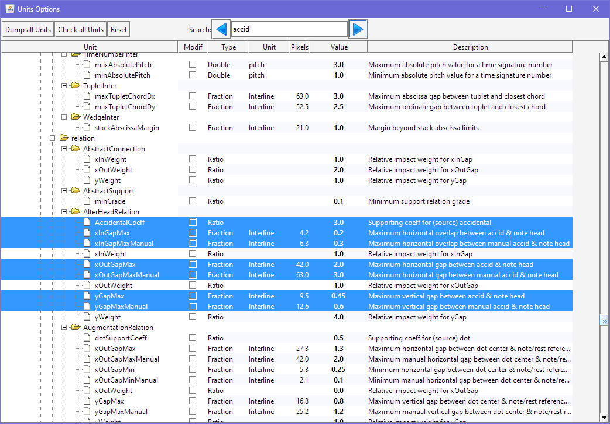

## Options {#options}
{: .no_toc }

There is (or should be) no hard-coded constant in Audiveris code.
Instead, algorithms are backed by "_application constants_" (more than 800 of them today).
This mechanism is a low level yet powerful way to handle nearly all application tuning data.

This data is presented as options to the end user, and is modifiable at run time:
* Through the CLI `-option KEY=VALUE` argument
* Through the pulldown menu `Tools | Options`

---
Table of contents
{: .no_toc .text-delta }

1. TOC
{:toc}
---
### Dialog

The display below combines a tree of classes on the left side, and a table on the right side,
where details of the options from the containing classes are available for display and modification.

The picture represents the top of the scrollable Options view:
We are located at the top of Audiveris software, with the root packages: `org`, `audiveris`, `omr`.

To ease the browsing of all options, there is a `Search` area, where the user can enter some text
to be searched for among the class names, option names and option descriptions.
The search is not case-sensitive.

Let's suppose we would like to somewhat relax the constraint on the horizontal distance between
an accidental alteration sign (like a sharp) and the note head on its right side.

We can enter `accid` in the search area and press the search button (perhaps several times)
until we get to several interesting options.
Here is what we can read:

1. We are in the package named `relation`, (its full name is org.audiveris.omr.sig.relation)
and the class named `AlterHeadRelation`, which governs a potential relation between an alteration
and a head.
2. Among the various class options, we are interested by `xOutGapMax` and `xOutGapMaxManual` which
define the maximum horizontal gap between an accidental alteration and a note head.
The former is meant for the OMR engine, the latter for manual assignment.
Threshold for manual assignment is larger,  because we can offer to be less strict when the user
is in the driver's seat.
3. Notice that these value fields are coded using "interline" fractions,
(2.0 and 3.0 on this picture) to be scale independent.
If we have a selected sheet at hand, the previous column (`Pixels`) displays the corresponding
number of pixels using the sheet interline scale (42 and 63 on this picture).
4. We can directly select the value field by a double-click and then type a new
value there.
The new value applies immediately.

### Options Lifecycle

The overriding mechanism is defined as follows, from lower to higher priority:

1.  FACTORY: The default value as defined in the source code,
2.  USER: The modified value, if any, persisted in a hidden specific `run.properties` file,
3.  CLI: The value, if any, specified in the command line by a `-option key=value`.
The CLI value is persisted in the USER file when running in interactive mode,
and not persisted when running in batch.
4.  UI: The value, if any, specified through the `Tools | Options` user interface.
These UI values are persisted in the USER file.

If ever you want to discard the modification you have made and get back to the FACTORY value of an
option, simply uncheck the box in the `Modif` column of this option in the Options window.

To restore the FACTORY value for **all** options, use the `Reset` button located at the top of the
Options window.
Needless to say, you will be prompted for confirmation beforehand...
