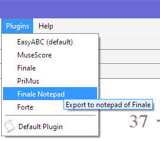
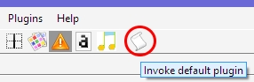

## Plugins {#plugins}
{: .no_toc }

Many music notation programs, if not all, can import MusicXML files as those exported by Audiveris.

The standard sequence is to:
1. Ask Audiveris to transcribe the book at hand, if so needed,
2. Export book music into a MusicXML file,
3. Launch the desired external program,
4. Ask the external program to import MusicXML,
5. Make it navigate to where the MusicXML file is located.

This sequence can be automated via the use of one or several plugins.

---
Table of contents
{: .no_toc .text-delta }

1. TOC
{:toc}
---

### Use of Plugins

Once plugins are correctly configured, you can call an external program by selecting the desired one
in the pulldown `Plugins` menu:



Even simpler, the default plugin can be directly called by pressing the toolbar plugin icon:



In either case, Audiveris makes sure the book has been transcribed, that the MusicXML export file
exists and is up-to-date with the latest score modifications performed manually by the user,
and finally launches the proper external program,
providing the path to the exported file as an import argument.

### Plugins Configuration

You can define one or more plugins, by creating a single XML file, named `plugins.xml`,
in [Audiveris configuration folder](../folders/essential.md#config-folder).

At Audiveris launch time, if a `plugins.xml` file is found in the configuration folder, then a
proper pulldown `Plugins` menu and a plugin toolbar button are defined according to the file content.

Here below is an example of such `plugins.xml` file.

```xml
<?xml version="1.0" encoding="UTF-8"?>
<!--
====================================================================================================
                                        p l u g i n s . x m l
====================================================================================================
    This file will be looked up in user config folder.
    It defines the list of Audiveris export plugins.
    Each plugin element is defined as follows:
    - Attribute id: (mandatory) Unique name for the plugin
    - Attribute tip: (optional) Description to be used as a tip
    - Elements arg: (mandatory) One separate element for each argument.
                    At least one arg element must equal {} to indicate where to insert at run-time
                    the export file path(s).    
====================================================================================================
-->
<plugins>

    <!-- MuseScore -->
    <plugin id="MuseScore" tip="Invoke MuseScore on score XML">
        <arg>C:\Program Files\MuseScore 3\bin\MuseScore3.exe</arg>
        <arg>{}</arg>
    </plugin>

    <!-- Finale -->
    <plugin id="Finale" tip="Export to Finale">
        <arg>C:\Program Files (x86)\Finale 2014\Finale.exe</arg>
        <arg>{}</arg>
    </plugin>

    <!-- Finale Notepad -->
    <plugin id="Finale Notepad" tip="Export to notepad of Finale">
        <arg>C:\Program Files (x86)\Finale NotePad 2012\Finale NotePad.exe</arg>
        <arg>{}</arg>
    </plugin>

    <!-- PriMus -->
    <plugin id="PriMus" tip="Use of PriMus">
        <arg>C:\Program Files (x86)\PriMus Demo\PriMus.exe</arg>
        <arg>{}</arg>
    </plugin>

    <!-- EasyABC -->
    <plugin id="EasyABC" tip="Export to EasyABC">
        <arg>C:\Program Files (x86)\EasyABC\easy_abc.exe</arg>
        <arg>{}</arg>
    </plugin>

    <!-- Forte -->
    <plugin id="Forte" tip="Forte 9 Free">
        <arg>C:\Program Files (x86)\FORTE\FORTE 9 Free\FORTE.exe</arg>
        <arg>{}</arg>
    </plugin>

</plugins>
```

Although this `plugins.xml` example is obviously meant for a Windows environment, its content is
rather self-explanatory:
* Each `<plugin>` element defines a separate plugin.
* The first plugin found in file is taken as the `default` one.
* The sequence of `<arg>` elements defines the precise syntax of a CLI command.
* The `{}` arg is a placeholder where Audiveris will insert the path(s) to
  the exported MusicXML file(s).
