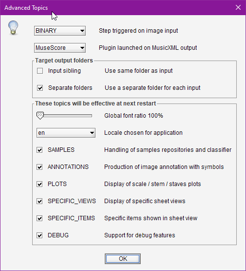

## Advanced Topics
{: .no_toc }

---
Table of contents
{: .no_toc .text-delta }

1. TOC
{:toc}
---

Only standard features are visible by default in Audiveris user interface.

Some advanced features are gathered by `Topics`, that we can explicitly activate.

This is done via the `Tools | Advanced Topics...` pulldown menu.

### Input Step

This box allows to define which step is automatically trigerred on an input file.

### Default Plugin

This allows to interactively choose a new default plugin among the declared ones,
since by default the first declared plugin is set as the default one
(See [Plugins](plugins.md) section).

### Target output folders
{: .d-inline-block }
new in 5.3
{: .label .label-yellow }

These boxes govern where output files are located by default.

- **Input sibling**: If set, all outputs are stored in the same folder as the input file 
(unless the ``-output`` option is specified on command line).
- **Separate folders**: If set, all outputs related to a given input file are stored in a *separate*
folder, created according to the input file name without its extension.

For further explanation, see section on [Standard folders](../folders/standard.md).

### Global font ratio
{: .d-inline-block }
new in 5.3
{: .label .label-yellow }

The slider allows to select a larger font size used throughout the application views.

### Locale
{: .d-inline-block }
new in 5.3
{: .label .label-yellow }

We can pick up a different user language.  
As of this writing, available locales are:
- **en** (English), the default
- **fr** (French), still partially implemented...

### Advanced Topics

 Each of these topics can gather several related features.

* `SAMPLES` deals with sample repositories and classifier training.
* `ANNOTATIONS` deals with production of symbol annotations.
* `PLOTS` deals with display of plots for scale, stem, staff or header projections.
* `SPECIFIC_VIEWS` deals with specific sheet tabs (staff free, staff-line glyphs).
* `SPECIFIC_ITEMS` deals with display of specific items on views (attachments, glyph axis, ...)
* `DEBUG` deals with many debug features (notably browsing a book internal hierarchy).

 Note that an __application restart__ is needed to take any modified selection into account,
 because of the various impacts this implies on UI elements.
