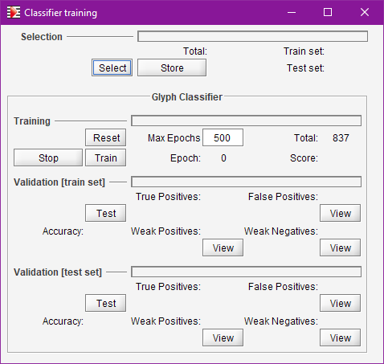
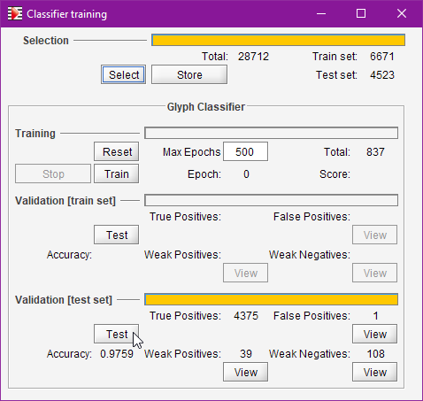

## Training {#training}
{: .no_toc }

Audiveris has the ability to train the underlying Glyph classifier with representative samples.

Note that the program is released with a pre-trained classifier so the casual user can safely ignore
this training section.
However, if the score(s) you want to transcribe use some specific music font significantly different
from the provided examples, you may consider training the classifier to better fit your case.

Make sure you have enabled the `SAMPLES` topic in the `Tools | Advanced Topics...` menu,
and restarted the application to take this advanced topic into account in all UI corners.

Then, you will need a bunch of training samples (a sample is basically a glyph and a shape).
This is addressed in the [Samples](samples.md) section before.

Finally, you can launch one or several trainings of the glyph classifier, via the dedicated Trainer
dialog.

---
Table of contents
{: .no_toc .text-delta }

1. TOC
{:toc}
---

### Trainer Dialog {#trainer}

This dialog is dedicated to the training of the Audiveris 5.1 basic classifier (a glyph classifier).
It is launched via the pulldown menu `Tools | Train classifier...` or, from the global repository,
by its `Repository | Train classifier...` menu.

Here we can launch and monitor the training of the classifier neural network.

`Select` button makes a new random selection among the samples of the global repository.

`Reset` button builds a new network from scratch (forgetting any previous training).

`Train` button launches a training of the current network
(which is either the initially-trained one, or a brand new one if `Reset` was hit).

Note that training hyper-parameters cannot be directly modified on this interface.
If really needed, use the `Tools | Options` menu and search for `BasicClassifier`.
There you can set amplitude, learningRate, momentum and maxEpochs parameters.

`Stop` button allows to stop the training before the maxEpochs count has been reached.

### Validation

There are two data sets available for validation, the train set (of no major interest)
and the test set.

`Test` button launches validation on the data set at hand.
Note that validation is disabled if any training is going on.

In picture above, without further training, we have directly run validation on a random test set.

Beside the accuracy measure value, 3 `View` buttons are of interest to launch a repository view
with just the samples involved in:
* __False Positives__: samples which were mistaken for a different shape, with a high grade.
* __Weak Positives__, samples correctly recognized, but with a low grade.
* __Weak Negatives__, samples mistaken with a low grade.

Clicking of the `View` button, especially for the False Positive case, allows to manually check if
the sample was correct in first place, and if not, remove or reassign it before a potential future
(re-)training.
