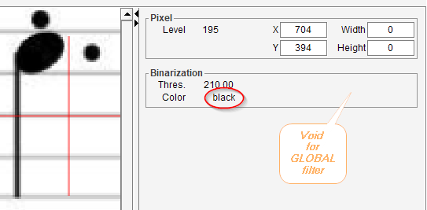
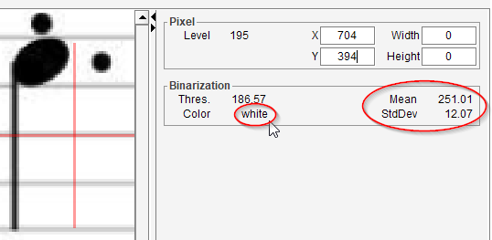

# Binarization board
{: .no_toc :}

This board, together with the [Pixel board](./pixel.md), is meant to visualize the behavior of the binarization algorithm documented in the [BINARY step](../steps/binary.md).

The board is displayed by default in the Gray tab and on demand in the Binary tab.
Of course, to be effective, the gray image must still be available.

- The pixel board displays the selected _location_ (x, y).
It can also display the _gray level_ at this location when available.
- The binarization board always displays the _threshold_ value and the resulting _binary color_.

## Threshold
The threshold value to be compared with the gray level at the selected location.

## Color
The resulting color of binarization at the selected location -- either _black_ or _white_.

## Board for the Global filter

For the global filter, the threshold value is constant for all pixels in the image.

## Board for the Adaptive filter

For the adaptive filter, the threshold value is computed for each location,
based on the mean and the standard deviation of gray values in location vicinity.

### Mean
The average value of all gray pixels read around the selected location.

### StdDev
The standard deviation value of all gray pixels read around the selected location.

