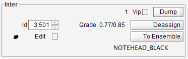
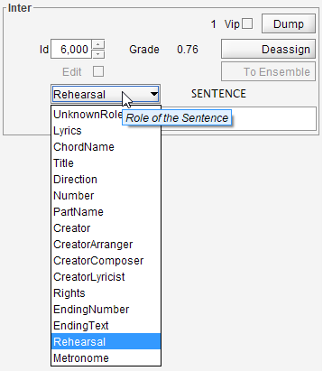

## Inter board
{: .no_toc :}

---
Table of contents
{: .no_toc .text-delta }

1. TOC
{:toc}
---

### Vip
(input/output)  
Flag this entity as VIP, resulting in verbose processing information.

### Dump
(input)  
Dump main entity data into the log window.

### Id
(input/output)  
Integer ID of entity.

### Grade
(output)  
The intrinsic grade value assigned to the Inter instance.
Followed by the computed contextual grade, if any.

### Deassign
(input)  
Button available to manually delete this interpretation.

### (shape icon)
(output)  
If available, the icon related to the Inter shape.

### (shape name)
(output)  
Name of the shape assigned to the Inter instance.

### (word)
(input/output)  
For a word inter, the modifiable word textual content.

### (sentence)
(output)  
For a sentence inter, the _non-modifiable_ sentence textual content.
Modifications can be performed at word level only.

### (sentence role)
(input/output)  
Role of the sentence (such as Direction, PartName, Rights, Lyrics, ...).

Nota: `Lyrics` is such a specific sentence role that it cannot be changed in an existing Inter.
Instead, a new (lyrics) inter must be created.

