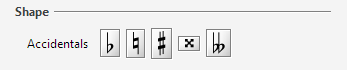

## Shape board
{: .no_toc :}

## Table of contents
{: .no_toc .text-delta }

1. TOC
{:toc}

---

### Top dialog: families

The shape board displays a panel of shape families.

For example, the first line in the panel contains these buttons:
Accidentals, Articulations, Attributes, Barlines, BeamsAndTuplets, Clefs, Dynamics, Flags.

### Palettes: shapes
Clicking on a family button replaces the global family panel by the selected family palette,
for example the Accidentals palette:

In this palette you can:
* Assign a shape, via a double-click on proper shape button, to the current glyph.
* Initiate a drag n' drop action, by pressing and dragging a proper shape button to the desired
location in sheet.

To leave the current palette and return to the global family panel, press the `ESCAPE` key or
click on the palette name (the "Accidentals" word in our example).

### More recently used
The shapes most recently assigned (by whatever means) always appear at the top of shape panel,
available for a direct reuse.
