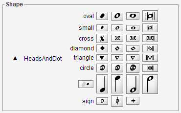

## Shape board
{: .no_toc :}

--
Table of contents
{: .no_toc .text-delta }

1. TOC
{:toc}
---

### Top dialog: sets

The shape board displays a panel of shape sets.

In the picture above, we can see:
- First row: Accidentals, Articulations, Attributes, Barlines, BeamsAndTuplets,
  Clefs, Dynamics, Flags, Holds.
- Second row: Keys, HeadsAndDot, Markers, Ornaments, Rests, Times, Digits,
  Pluckings, Romans, Physicals.

### Palettes: shapes
Clicking on a shape set button replaces the global shape panel by the selected set palette,
for example the ``HeadsAndDot`` palette which adapts to the book at hand:

Here is a simple configuration

And here is a more complex configuration for drums notation.
See [Drums](../specific/drums.md) chapter for further details.

From any shape palette we can:
* Assign a shape, via a double-click on proper shape button, to the current glyph.
* Initiate a drag & drop action, by pressing and dragging a proper shape button to the desired
location in sheet.

To leave the current palette and return to the global shape set panel,
we press the `ESCAPE` key or click on the ``up`` (&#x25B2;) button.

### More recently used
The shapes most recently assigned (by whatever means) always appear at the top of shape panel,
available for a direct reuse.
