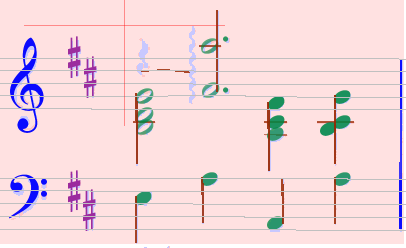
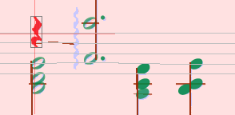
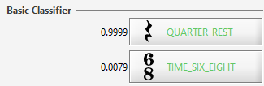
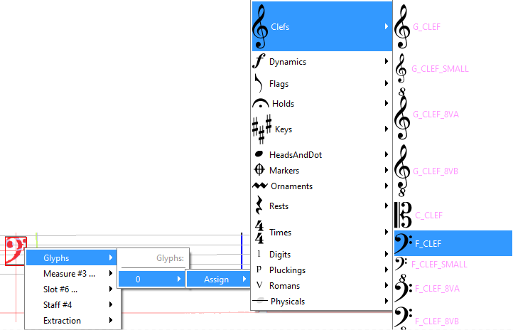
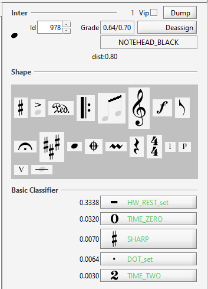

## Inters in action
{: .no_toc }

Now that we have seen how to select entities and how to edit them, let's use these
techniques to address typical use cases of OMR correction.

## Table of contents
{: .no_toc .text-delta }

1. TOC
{:toc}

---

### Abnormal rhythm

Audiveris checks whether the voices for each measure fit with the detected time signature.
If not, it flags the whole measure by filling its background with pink color:

In this example a rest has not been detected.
Just select the rest glyph (either by pointing at the glyph directly,
or by putting a selection rectangle around it).
The selected glyph turns red:

Have a look at the basic classifier board, with its top 5 of best results.
Often the correct interpretation is listed there and can be directly selected by clicking
on proper button.

NOTA: This method of selecting a glyph to trigger the classifier on it, requires two things:
1. There must be a suitable glyph to select,
2. The target shape must be handled by the classifier.
   This is **not the case for note heads**, since they are handled by template matching,
   and the neural-network based classifier is thus not trained on note heads.

In these cases, you have to use drag n' drop the desired shape from the shape palette instead.   

### Context menu {#context-menu}

With a right click on an object or a group of selected elements in the sheet view,
you get a pop-up menu whose content depends on the current context.

From "Inters..." sub-menu, you have two main possibilities:

* delete selected interpretations (top option),
* delete a relation for a selected interpretation.

The "Glyphs" sub-menu allows you to define new interpretations for all selected elements at a glance.
It builds a "compound" glyph (built by combining all the selected glyphs) and submit it to the
classifier.

Be sure to have deleted the wrong interpretation before.

### Boards {#boards}

On the right of the sheet view, you can find the boards column that gives you information about
the selected element (top) and allows you to define new interpretations of it.

* Classifier
  Displays the result of the glyph evaluation by the neural network evaluator.
  The top 5 best shapes are displayed, with their related grade in range 0..1.
