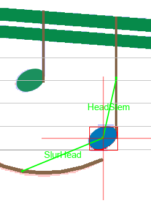
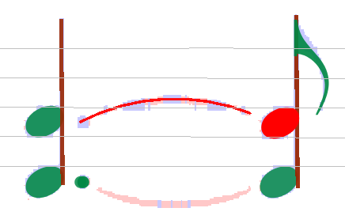
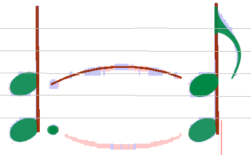

## Relations in action
{: .no_toc }

## Table of contents
{: .no_toc .text-delta }

1. TOC
{:toc}

---

Most Inter instances have relations with other Inter instances.
E.g. an eighth note consists of 3 Inter instances: The note head, the stem and the flag.

You can visually check the relations when you select an Inter.
Here the stem was selected:
(the name of each relation is also displayed, provided that current zoom is high enough (>=2))

By default, if a _non-manual_ Inter lacks a needed "partner", it will be removed at some point during
normal transcription process.

But a _manually-created_ Inter will not be automatically removed, because OMR user has priority on
OMR engine, fortunately! :-)
Moreover, when such Inter is manually inserted / shifted / resized, needed relations are
searched for automatic creation, more aggressively than for a non-manual Inter, since in this case
the software has no doubt about the reality of this Inter.

Anyway, when the geometry is really beyond specified limits, the needed relation may not be created.
In such cases, it is then necessary to add it manually.

### Add Relation

Assuming that a note head has not been recognized during analysis.

The user adds the note head, but unfortunately the program did not add the relation automatically
(normally, in such a simple case, it should!
But, for the sake of demonstration, let's assume it did not).
Then, the note head will be colored in red, showing that there is an element without the relation(s)
necessary for an element of this type.

To insert the relation, just point and drag from note head to stem (a thin black vector will
appear as you move the mouse, see picture below), then release the mouse when reaching the stem.
This commits the relation insertion.

A similar action will be necessary for the slur to the left of the note head.
So, drag from the note head to this slur, and the correction will be done.

NOTA: When linking two elements, say A and B, the direction is irrelevant:
you can either drag from A to B or drag from B to A, the result will be identical.

### Remove wrong relations

In the following case, a sharp has been linked to the wrong note head:

To remove this relation, select the sharp, right-click for context menu,
select "Inters" submenu, then the sharp item and see the current relation(s) of the element.

By clicking on the relation, this relation will be removed.

Now the correct relation can be added as in the example below:

### Implicit relation removal

In the case shown above (correcting reference of accidentals), explicit removal of the relation
would not be necessary, because an accidental can only reference just one note head
(if we except the specific case of _shared_ note heads -- see below).

So the wrong relation would be removed automatically when inserting a new one.

The same applies to note heads: they can only reference one stem
(if we except again the specific case of a single note head _shared_ between two opposite stems).
Defining a new relation would remove the former one.

### Note head shared by two voices

Generally a note head (black or void) is connected to exactly one stem, as in the following example.

If head and stem are connected, both appear with their own standard color.
If not, one or both appear in red and to fix this, you can simply drag a link from one to the other.

Then, if needed, you can insert a stem on the other side of the head, in the opposite direction.

It appears in red because it can't get automatically connected to the head
(because this head is already connected on the other side).

To actually set the  connection, you have to **manually** drag a link between the (new) stem and the
head.
The program then checks if the resulting configuration is the canonical one
(which means _a stem down on left side of the head and a stem up on the right side,
the shared head being located at the end of each stem_):

* If the check fails, the new connection is set but the old one is removed.
This is the standard behavior.
* But if the check succeeds, both connections are kept and the _'shared'_ head gets logically
duplicated into two heads, one _'half'_ for the left and one _'half'_ for the right:

By selecting all components, you can see the various links
(_HeadStemRelation_ between each head half and "its" stem, and _MirrorRelation_ between the two
half heads):

And if voices are colorized, the separation between head 'halves' gets even more visible:

Playing with relations around note heads, such as relation with an accidental or with an
augmentation dot, is still possible with shared note heads.
Simply, pay attention to point to the desired "half" head.

Here, the alteration sign is "shared" and thus also split, each sign _'half'_ colorized as its
related head half.

Here, the augmentation dot is related only to one head _'half'_
(otherwise it would exhibit both colors as the alteration sign of the previous example)
