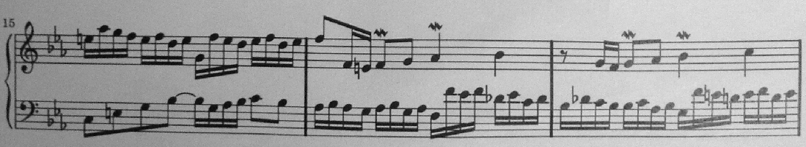
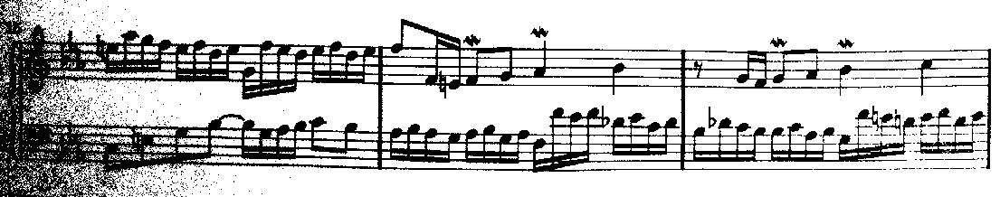
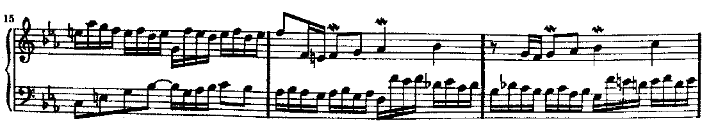
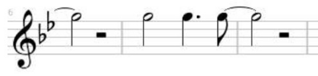
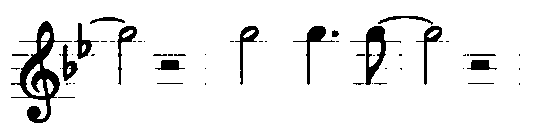
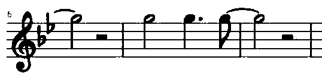

# BINARY step
{: .no_toc }

Many components of the Audiveris engine are meant to work on a black & white input image.
In such image, the black pixels compose the foreground and the white pixels the background.

The goal of the BINARY step is to provide this black & white image.

---
{: .no_toc .text-epsilon }
1. TOC
{:toc}
---

## Inputs

- The gray image of the sheet
- The chosen binarization filter -- by default, this is the _adaptive_ filter

## Output

- The black & white image of the sheet

## Processing

The gray value -- a number between 0 and 255 -- of each image pixel is compared with
a threshold value.
The result is:
- black (0) if gray value <= threshold value
- white (255) if gray value > threshold value

What is this _threshold_ value?
It depends on the binarization filter used on the sheet image.

Via the {{ site.book_parameters }} pull-down menu, the precise filter and its parameters
can be defined for the default, book and sheet scopes.

### The GLOBAL filter

This is the older filter.

It provides a single threshold value which is applied globally on every pixel
of the gray image.

The threshold default value is ``140``, and we can change this value
via the {{ site.book_parameters }} pull-down menu.

It generally provides good results, except when the input image exhibits different
illumination values.
Let's consider the ``BachInvention5.png`` image,
available in the ``data/examples`` folder of Audiveris.

Here is the bottom part of the gray image:

Note that the image appears dark on the left and pale on the right.  
If we apply the _global_ filter on it, we get this binary image:

The following engine steps will miss both the left part and the right part of this system.
The left part because almost every pixel looks like foreground.
The right part because several staff lines lack foreground pixels.

In this case, increasing or decreasing the overall threshold value has no point, because it cannot improve both parts at the same time.  
We need something more sensitive to the local environment.

### The ADAPTIVE filter

This is the newer filter.

Instead of being a constant value, a specific threshold value is now computed for every pixel,
based on its location in the image.

The actual gray value is measured for every pixel in a rectangular neighborhood
around the current location.
Based on this population, the engine computes two values:[^threshold_computation]
- ``mean``: the mean gray value,
- ``std_dev``: the standard deviation of gray values.

The resulting threshold is then defined according to the following formula:
> threshold = mean_coeff * mean + std_dev_coeff * std_dev

The parameters are by default ``0.7`` for ``mean_coeff`` and ``0.9`` for ``std_dev_coeff``.
We can modify them via the {{ site.book_parameters }} pull-down menu.

On the same example, we now get this binary image:

Our experience on hundreds of gray images has shown that the adaptive filter gives good results
and its default parameters are OK.
Therefore, the _adaptive_ filter has been promoted as the default binarization filter
for every input...

... until [this discussion](https://github.com/Audiveris/audiveris/discussions/703)
was recently posted on Audiveris forum.  
Here below is a portion of the gray input image posted in the discussion:

We can notice that the staff lines, as well as the bar lines, are painted in a pale gray color.  
Here, the pale gray is not a transition between black and white as seen on the other scores.

Applying the standard _adaptive_ filter gives this binary result:

Here, we must go back to the _global_ filter.  
With a threshold value set to 225, we now obtain this binary result:

## Boards

### Binarization board

The Binarization board is present in the `Binary` tab.

It allows the end user to interactively choose the filter, adjust its parameters,
and observe the results on the image immediately.

Please refer to the [Binarization board](../../reference/boards/binarization.md) section.

### Binary board

Available in the ``Gray`` and ``Binary`` tabs,
the Binary pixel board presents the resulting black or white pixel value at the current location.

Please refer to the [Binary board](../../reference/boards/binary.md)  section.

[^threshold_computation]: The implementation does not use brute force to compute mean and standard deviation around each and every point, but the result is the same.