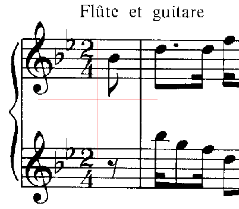
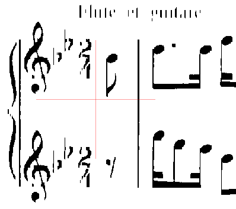
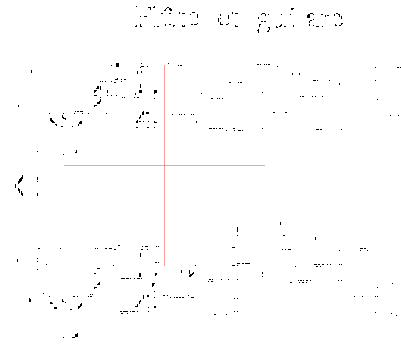
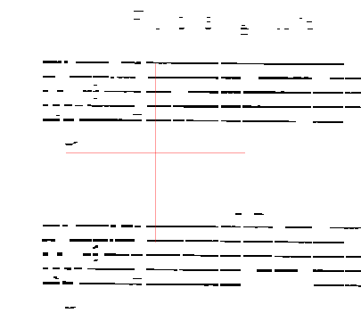
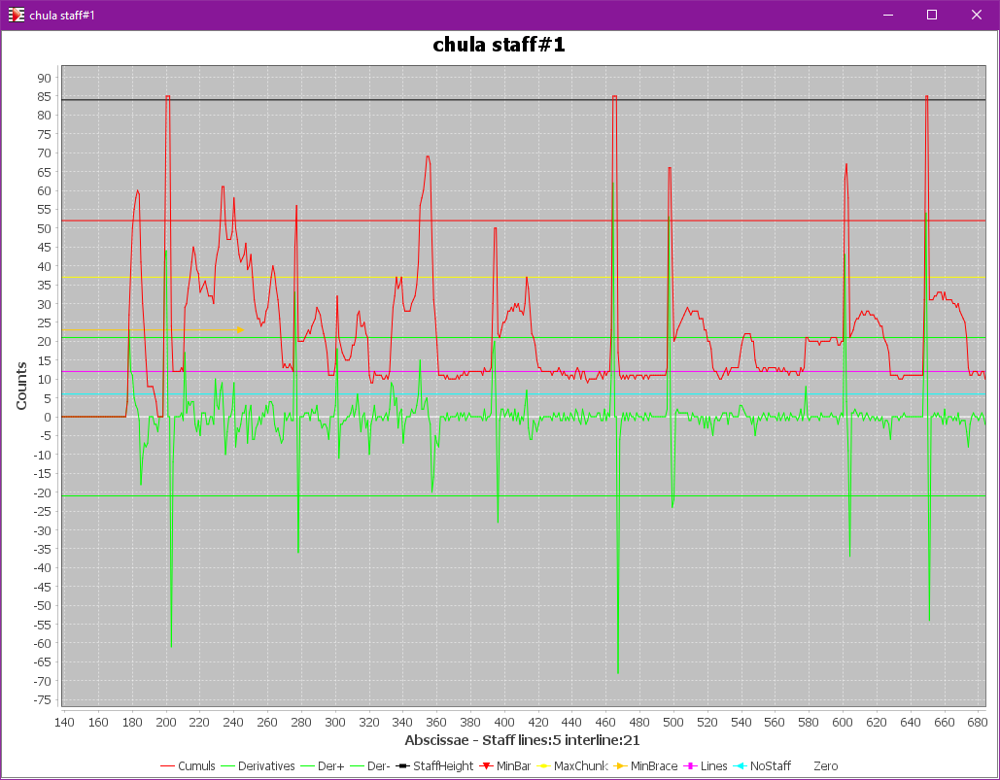
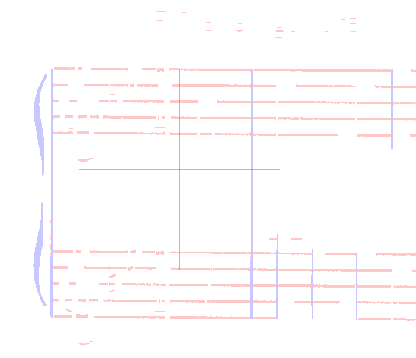
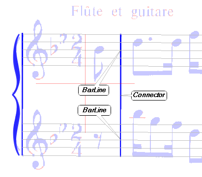
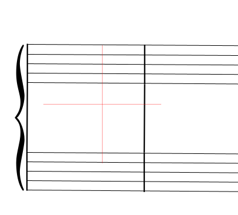
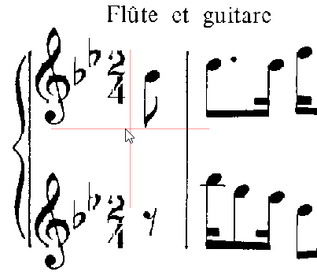

# GRID step
{: .no_toc }

The purpose of the ``GRID`` step is to retrieve the systems and staves of the sheet.

---
{: .no_toc .text-epsilon }
1. TOC
{:toc}
---

## Inputs

- The black & white image
- The maximum staff line thickness
- The typical interline value (and the small interline value if any)

## Outputs

- The LAG of horizontal sections -- See [Section and LAG](../../tutorials/main_concepts/run_section.md#section-and-lag) description.
- The LAG of vertical sections
- The staff lines organized in staves
- The global skew of the image
- For every staff:
    - the barlines if any
    - the vertical connectors if any with a staff above or below
    - the starting brace if any
    - the starting bracket if any
- The gathering of staves into systems
- The no-staff image

## Processing

### Filtering runs and sections

First, all the foreground (black) pixels of the binary image are organized into vertical
[runs](../../tutorials/main_concepts/run_section.md#run-and-runtable).

Then, the engine determines a maximum line thickness, based on the maximum staff line thickness
provided by the [``SCALE`` step](./scale.md#outputs),
slightly augmented to cope with potentially thicker ledgers.

Any vertical run which is longer than this maximum staff line thickness cannot be a
pure portion of a staff line -- it must be a (portion of) crossing object.

Therefore:
- All "long" vertical runs are set aside into the _vertical LAG_.
- All remaining pixels are organized in horizontal runs gathered in the _horizontal LAG_.

Then, within each [LAG](../../tutorials/main_concepts/run_section.md#lag), adjacent runs are organized into
[sections](../../tutorials/main_concepts/run_section.md#section).

The horizontal sections are further separated between short sections and long sections,
because the long sections will drive the staff lines detection.

We can visualize this material.
To do so, we have to use the {{ site.tools_constants}} pull-down menu and there
tick the boolean constant ``displayRuns`` (it is located in class ``LinesRetriever``).

| Content                   | View  |
| :---                      | :---: |
| Binary image              |  |
| Long vertical sections    |  |
| Short horizontal sections |  |
| Long horizontal sections  |  |

### Long horizontal filaments

From the set of long horizontal sections, the engine gradually builds long and thin
[filaments](../../tutorials/main_concepts/run_section.md#filament)
which are likely to correspond to long portions of staff lines.

The filaments that are not straight enough are discarded.
A small set of filaments, the longest ones, are used to compute a global slope of the score image.
The filaments whose slope diverges from the sheet global slope are discarded.

Then the horizontal filaments are vertically gathered into clusters likely to represent staves.
Within a cluster:
- the filaments are expected to be spaced according to a known staff interline
- the number of filaments must match the possible staff sizes (1-line, 4-line, 5-line or 6-line) as
defined by the end user via the {{ site.book_parameters }} pull-down menu.

In the end, the remaining clusters are transformed as standard staves, one-line staves or tablatures
according to their line count.

At this point, the left and right abscissa limits of each staff are defined purely
via its detected lines.

### Staff vertical projection

Since the engine knows the top line and the bottom line for each staff, it can compute a projection 
of all black pixels located between these two lines onto the x-axis.[^one_line_projection]

Provided we have activated the ``PLOTS`` topic in the {{ site.tools_advanced }} pull-down menu,
we can visualize this projection:
- either via the {{ site.sheet_staves_plots}} pull-down menu
- or via the {{ site.popup_staff }} contextual menu from a staff

From this projection limited to the staff height, the engine detects peaks which can represent:
- barlines,
- half braces,
- half brackets,
- as well as long stems, etc.

The slim vertical sections located within a peak are used to build vertical filaments.
Note that these filaments may extend past the top and/or the bottom of the staff.

If, via the {{ site.tools_constants}} pull-down menu, we have ticked the boolean constant
``displayFilaments``, then a specific ``Filaments`` tab is displayed
for both horizontal and vertical filaments initial material:
- The horizontal filaments are in pale red
- The vertical filaments are in pale blue

| Content   | View  |
| :---      | :---: |
| Initial Filaments |  |

All the peaks in vertical projection are handled as vertices in a common peak graph at sheet level.
Any vertical alignment detected between a peak in one staff and a peak in the following staff is
recorded as an edge in the global peak graph.

Each alignment is then checked for the presence of enough foreground pixels between
the two staff peaks, to detect concrete connections between them.

Any filament which extends beyond the staff top or bottom limits and which is not a connector
cannot be a barline and is thus discarded.

Based on the detected connections, the engine is now able to gather staves into systems.

### System internal alignments

Within each system, the staff peaks are organized into system-based columns.

The starting column, if any, is used to refine the system and staves left abscissa.

The columns found on the right of the starting column must embrace the whole system height,
otherwise they are discarded.
Also, the peaks that extend past the system vertical limits are discarded.

Brace portions and bracket portions are searched on the left of the starting column.
The presence of braces in left margin drives the gathering of staves into parts.

Finally, Inters are created in each system [SIG](../../tutorials/main_concepts/sig.md#sig) for:
- barlines
- connectors
- braces
- brackets

## Results

At the end of this ``GRID`` step,  we can see the ``Data`` tab
populated with the grid of systems and staves (shown below in physical and logical modes):

| Mode      | View  |
| :---:     | :---: |
|  Physical |  |
|  Logical   |  |

Note that some false barlines may persist at the end of the ``GRID`` step.
They generally get discarded later in the [``REDUCTION`` step](./reduction.md).

### The no-staff image

Since the engine knows which precise horizontal sections compose the staff lines,
it can logically "erase" these sections from the binary source and provide
what is called the no-staff image.

The no-staff image will be used by several steps down the pipeline.

We can visualize the no-staff image via the {{ site.sheet_nostaff}} pull-down menu:

| Content  | View  |
| :---:    | :---: |
| No staff |  |

[^one_line_projection]: In the specific case of a 1-line staff, the engine uses a target barline-height defined as a number of interlines (and perhaps modified via the {{ site.book_parameters }} pull-down menu).