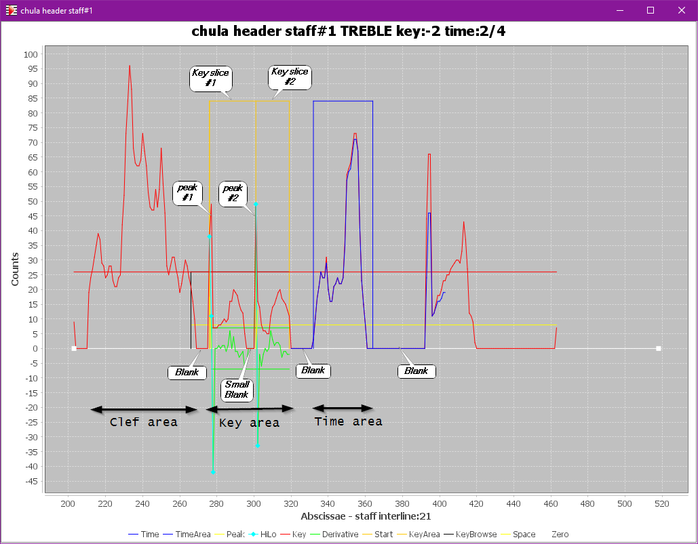
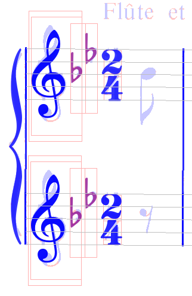
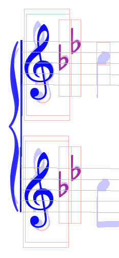

# HEADERS step
{: .no_toc }

The ``HEADERS`` step detects  clef, key and time information at the beginning of every staff.

---
{: .no_toc .text-epsilon }
1. TOC
{:toc}
---

## Inputs

- The systems and staves
- The no-staff image

## Outputs

For every staff:
- The clef (mandatory)
- The key signature, if any
- The time signature, if any

## Processing

The engine can be rather aggressive because of the standardization of the sequence of these
entities in the header portion of the staff.

Moreover, within the same system, the header components (whether present or absent)
are vertically aligned in "columns" across the system staves.
This allows several cross-validations within a multi-staff system:
- **Clefs**:  
  A clef is mandatory at the beginning of each staff header.  
  It can be different from one staff to the other.
- **Key signatures**:  
  A key signature can vary (and even be void) from one staff to the other.  
  If present, the alteration slices are aligned across system staves.
- **Time signatures**:  
  Either a time signature is present and identical in every staff of a system, or there are none.

### Staff-free pixel source

To process each staff header, the engine uses the no-staff image
-- the binary image where all staff line pixels have been removed,
made available by the [``GRID`` step](./grid.md#no-staff-image).

With a projection to the x-axis, this allows to detect the blanks between the header components
and thus limit the region of interest for each of them.

Specifically for the key signature, the projection is also used to detect peaks
likely to represent "stem-like" portions of sharp or flat signs.

### Clef candidates

Using the pixels of a rectangular lookup area, the engine extracts all the elementary glyphs
-- defined as connected black pixels ensembles.

These elementary glyphs, as well as their combinations, are submitted to the glyph classifier,
to come up with a list of acceptable clef shapes.

There may be several (mutually exclusive) acceptable clefs.
They are registered in the system SIG and kept for the time being.

### Key candidates

A key signature is a sequence of consistent alterations (all sharps or all flats or none) in a
predefined order (FCGDAEB for sharps, BEADGCF for flats).

{: .warning }
In the case of a key signature change, there may be some natural signs to explicitly cancel the
previous alterations, although this is not mandatory.
As of this writing, the engine is not able to handle key signatures containing natural signs.

The relative positioning of alterations in a given signature is identical for all clefs (treble,
alto, tenor, bass) with the only exception of the sharp-based signatures in tenor clef.

Regarding the vertical projection of the staff-free pixels onto the x-axis:  
- Vertically, the projection uses an envelope that can embrace any key signature (under any clef),
  ranging from two interline values above the staff to one interline value below the staff.
- Horizontally, the goal is to split the projection into slices, one slice for each alteration item
  to be extracted.

At the staff level, the engine strategy is as follows:
1. Find the first significant space right after the clef, it's the space that separates the clef
  from the next component (key signature or time signature or first note/rest, etc).
  The next really wide space will mark the end of the key signature area.
1. Look for projection peaks in the area representing "stem-like" portions
  (one for the flat shape, two for the sharp shape)  
   Since at this point in time there is no reliable way to choose between flats and sharps,
   the engine will work in parallel on the two hypotheses (flat-based key vs. sharp-based key).
1. Determine a precise splitting of the projection into vertical regions of interest (slices),
based on the "stem-like" peaks and the shape hypothesis.
1. Try to retrieve one good component in each slice,
  by submitting each glyph compound to the glyph classifier.
  For the slices left empty, force slice segmentation and perform recognition within the slice only.
1. Check each item pitch against the pitches sequences imposed by the staff clef candidate(s).
  In the system SIG, register a support relationship between any compatible clef candidate
  and key candidate.

And for the systems that contain several staves:
1. Across all the system staves, align the abscissa offset for each slice.
1. Check that within any multi-staff _part_, the part staves exhibit the same key signature,
otherwise select the best one and replicate it in the other staves of the part.
 
### Time candidates

Since all time signatures must be identical in any vertical "column" of a system,
the retrieval is made directly from the system level:

1. In the system header area, a "column" of staff areas is defined, right after the key "column" 
if any, otherwise right after the clef "column".
1. For each staff of the system, knowing the abscissa range for time candidates, three lookup regions are defined:
    - A rectangle as high as staff height, searched for possible whole time signature shapes
such as COMMON_TIME, 4/4, 6/8, etc.
    - A small rectangle centered on the higher staff half, searched for possible numerator shapes
    - A small rectangle centered on the lower staff half, searched for possible denominator shapes
1. Not all num/den pairs are possible, the engine restricts them to the commonly used ones.
1. If, in a staff header, no time signature was found, the search within the current system is abandonned.

## Results

The picture below presents the results of the ``HEADERS`` step on the first system of the ``chula`` input example.

We can see the lookup areas used for:
- Clef: outer and inner rectangles
- Key: rectangular slice for each item of this two-sharp key
- Time: one whole and two half rectangles

The next picture presents the results on the second system.

Notice that, in the first staff, the projection of the quarter note,
located right after the key signature area,
has been searched for a time signature candidate.
But no time symbol could be recognized there.

Consequently, the header of the second staff was not even considered for a time signature lookup.

