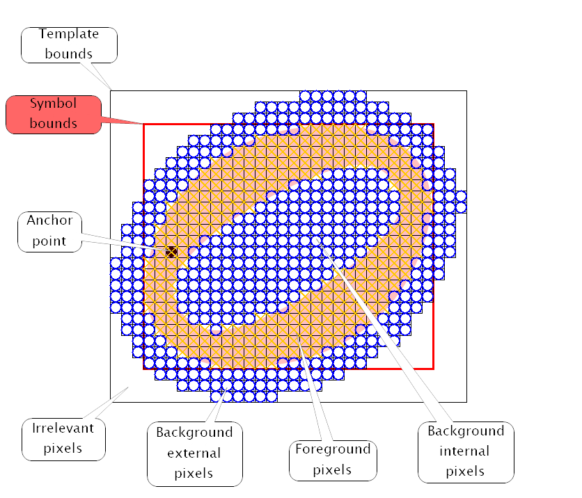
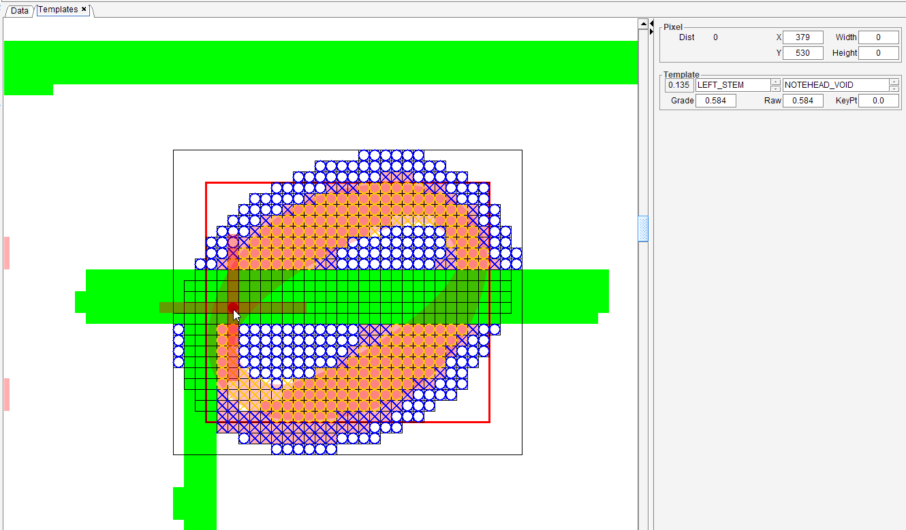

# HEADS step
{: .no_toc }

The `HEADS` step uses a template matching technique to retrieve all note head candidates
(black head, void head, whole head) in the current sheet.  
The note rests will be addressed later in the [`SYMBOLS` step](./symbols.md).

---
{: .no_toc .text-epsilon }
1. TOC
{:toc}
---

## Inputs

- The `BINARY` image of the sheet
- The interline value for each staff
- The staff lines and ledgers
- The stem seeds
- The book parameters (musical font family, specific staves, specific head shapes)

## Outputs

- The detected note heads

## Prolog

### Building the distance table

On a copy of the `BINARY` image, all the pixels that compose horizontal lines (staff lines, ledgers)
as well as vertical lines (barlines, connectors and stem seeds)
are "erased", that is replaced by the background color (white).

Based on the resulting image, the engine computes the sheet "distance table":
Each (x,y) cell of this table contains an integer value, which represents the euclidian distance
from the (x,y) pixel to the nearest foreground (black) pixel. [^chamfer]

For the "erased" elements (the vertical and horizontal lines),
the distance integer value is replaced by a special value (-1)
to indicate that these locations must be ignored by the template matching process.
The reason is these black pixels in the input image would still be there,
regardless of the presence or absence of any head.

A cell of the distance table can now contain:
- the value `0` (foreground point)
- a positive value (distance of this background point to the nearest foreground point)
- the value `-1` (point to be ignored)

### Loading the head spots

The engine loads the "head spots" detected and stored during the [`BEAMS` step](./beams.md).

These spots are likely to correspond to black heads and are therefore used to speed up
the application of black head templates along a staff/ledger line even without stem seeds.

## System processing

The processing is done separately for every staff of every system.

The engine considers a collection of possible head shapes (out of a total of about 25)
which can be narrowed down depending on the selection made in the {{ site.book_parameters }} menu,
notably:

| Option | Expected note heads |
| :---   | :---                |
| [X] 1-line percussion staves | Oval |
| [X] 5-line standard staves   | Oval |
| [X] 5-line unpitched percussion staves | Drum notation |
| [X] Small heads | Small oval |
| [X] Cross note heads  | Crossed oval |

Within the shapes selection, specific processing is made for:
- Stem-based heads -- they are imposed near a stem seed
- Heads with a hollow part -- they are slightly boosted compared to the filled ones

### Head templates

Based on the staff interline value and on the chosen music font family,
a specific version of the templates is picked up from the template factory.

- For every head shape, the factory defines a template as follows
(the display is here magnified 16 times)

- The above example represents the template for an oval void head:
    - It expects a stem on the lower left side of the head (hence the anchor point)
    - It defines interior and exterior background pixels
    (note the exterior pixels are limited to a kind of ring around the head)
    - It defines foreground pixels

### Staff processing

Two passes are made along every staff, with all relevant templates:
- The first pass is driven by the stem seeds.
    Only abscissa locations next to a stem seed are looked up, and with just the "stem heads" templates.
- The second pass explores the entire range of possible x values, regardless of stem seeds,
    because of potential missing portions of stems.
    All heads templates are applied on every x value, so this pass is rather costly.

In both passes, every line (staff line or ledger) is scanned
as well as every space between or just beyond lines (staff line or ledger).

Depending on the region within a template, a pixel match or mismatch is weighted differently:
- Weight 6 for the foreground region,
- Weight 4 for the interior background region,
- Weight 1 for the exterior background region.

At the end of a staff processing:
- Duplicates (same shape, same bounds, same underlying glyph) are removed
- Good long beams defeat overlapping head candidates
- Good heads defeat overlapping short beams
- The remaining head candidates are inserted in the system SIG.
- Overlaps between two head candidates are detected using IOU (Intersection Over Union) criteria,
and are formalized by an exclusion relationship in the system SIG.

### Observing a template in action

By defaut, the `Templates` tab, which allows to interactively observe the template behavior
is not presented to the end user.
It requires the constant boolean `displayTemplates` to be selected in the `DistancesBuilder` class.

Note this is only a way to *study* very precisely the behavior of the template mechanism.  
It is available after the `HEADS` step has been run, and is *not meant to modify its results*.

The picture above presents the application of a template at a specific location in the input image.

Note the green pixels which correspond to the points to be ignored in the input image (staff line, ledger, stem, barline).

The Template board, in the right column, allows to manually select a template by its anchor
and by its shape.

The location where the template is applied is defined by the mouse right button.
It is convenient to use the Alt + arrow keys to move the location one pixel at a time.

The result of applying the chosen template at the chosen location can be read in the Template board.
- The distance appears in the upper left field,
- The resulting grade in the field below.

## Epilog

- The head spots, gathered by the `BEAMS` step for this `HEADS` step, can now be discarded.

- The whole population of heads candidates in the sheet are analyzed to measure
the effective horizontal distance, per horizontal side and per head shape,
between the head anchor and the related stem seed.  
This data is stored in the sheet Scale class, and will later be used to precisely adjust
the stem reference point of every head inter.

[^chamfer]:     The distance is computed using the Chamfer Distance algorithm with a 3x3 kernel