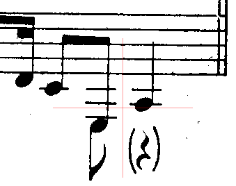
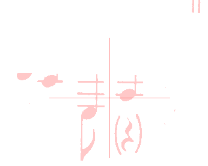
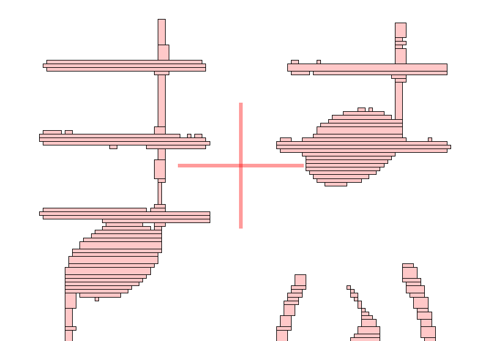
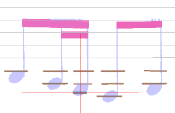
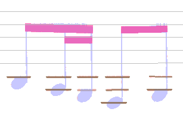

# LEDGERS step
{: .no_toc }

The `LEDGERS` step tries to detect all ledgers in a sheet.

This data is important because the following scan for heads will be driven precisely
along and between the staff lines and ledgers of the sheet.
See the  [`HEADS` step](./heads.md).

---
{: .no_toc .text-epsilon }
1. TOC
{:toc}
---

## Inputs

- The no-staff image
- The detected staves

## Outputs

- The collection of ledgers, organized by (even) pitch around each staff

## Prolog: retrieval of candidate sections

In terms of vertical distance, a ledger cannot be closer than one interline to a staff.

Therefore, the engine takes the no-staff image as input,
and erases the areas occupied by the detected staves,
vertically augmented by a half-interline margin above and below each staff.

This gives the picture below, where the remaining pixels are viewed as a horizontal run table,
hence the pale red color.

These runs are then gathered into horizontal sections.
The chosen policy is to combine adjacent runs only when they exhibit
the same starting and ending abscissa values.  
This results in rectangular sections as can be seen below in a magnified view of the `Ledgers` tab:

(the `Ledgers` tab is displayed only if the constant `displayLedgers` is set to true beforehand)

These horizontal sections are finally dispatched to their related systems
(if a section is located between two systems, it is dispatched to both).

## Ledgers detection at system level

The engine uses a stick factory to build short straight horizontal filaments.
(the same as used vertically in the [`STEMS_SEEDS` step](./stem_seeds.md#vertical-filaments)).

There is no possible histogram approach to measure the expected ledger thickness.
And it can be as thick as 3 times the staff line thickness.
So, the engine uses a maximum value extrapolated
from the staff line thickness and the staff interline value.

Filaments that are too long or which intersect (good) beam candidates are discarded.

The candidate ledgers are then checked incrementally around each staff:
- Starting one interline above staff and going up, one interline at a time,
- Starting one interline below staff and going down, one interline at a time.

And of course, to be considered, a candidate ledger must build upon the needed intermediate ledgers.

A candidate ledger is then applied weighted checks:
- Minimum length
- Minimum and maximum thickness
- Straightness
- Gap with the theoretical vertical location
- Convexity on horizontal sides (check for white pixels above and below the ledger end portions)

If the resulting check grade is too low, the ledger candidate is discarded
(and no further candidate can be looked up beyond the candidate position).

## Epilog: post-analysis

During the collecting of ledgers candidates at system level, the engine had only empirical values
of acceptable ranges for ledger attributes.  
Moreover, we must remember that this `LEDGERS` step is performed before the `HEADS` step.
So, at this point in time, the engine cannot use any information coming from head candidates.

But now that the whole population of ledgers candidates is available for the current sheet,
the engine can compute the mean value and the standard deviation for key attributes 
and re-check each ledger candidate about:
- the vertical distance from the previous ledger or staff line
- the ledger thickness

The purpose of this post-analysis is to further filter out some candidates.  
For example, in the picture below, the designated candidate is somewhat
too close vertically to the ledger above it:

The additional filtering leads to this final configuration:

Remark: This is not the end of it, since the `REDUCTION` step,
which is run after the `HEADS` and `STEMS` steps, will discard the ledgers left unused.

