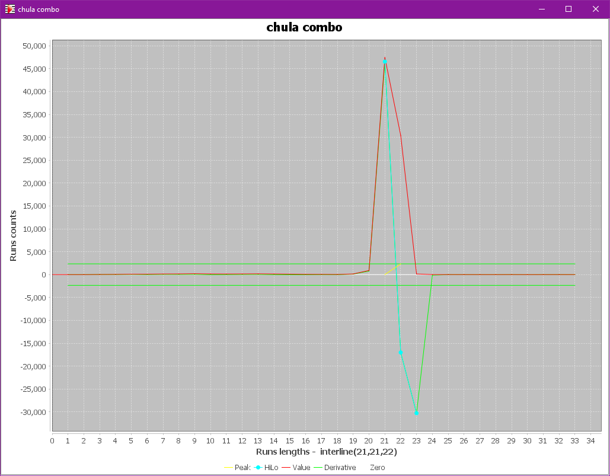

# SCALE step
{: .no_toc }

Music is written on staves composed of one or more horizontal lines
regularly spaced within the same staff.

Depending on the input image, these lines can vary in thickness and spacing.
And the dimensions of almost all the music elements to be detected depend on these values.

The purpose of the ``SCALE`` step is to measure this key scaling data for the sheet at hand.

---
{: .no_toc .text-epsilon }
1. TOC
{:toc}
---

## Input

The black & white image provided by the [``BINARY`` step](./binary.md).

## Outputs

Most of the scaling items use a tuple of 3 values, specified as a number of pixels:
- The minimum value
- The main (most frequent) value
- The maximum value

1. Mandatory outputs:
    - Staff line thickness
    - Staff interline -- the vertical distance between staff lines,
      measured from line center to line center

2. Optional outputs:
    - Small staff interline -- when two populations of staves exist in the sheet,
      this is the vertical spacing for the smaller staves
    - Beam thickness -- when beams exist in the sheet, this is the measured beam thickness
    - Small beam thickness -- when two populations of beams exist in the sheet,
      this is the thickness for the smaller beams.

## Processing

To retrieve the various scale values, the engine inspects every abscissa of the binary image
for the sequence of vertical runs it contains, alternatively white and black runs.

The picture below was taken when working on the ``chula.png`` image
found in the ``data/examples`` of Audiveris installation.  
It is a partial view of a column read at a given abscissa,
with the sequence of white and black runs and the length of each run in pixels:

With all these vertical run lengths read in the whole image, the engine builds two histograms:
- The **black** histogram uses the length of every black run,
- The **combo** histogram tries to use the length of every white run twice
  1. combined with the length of the black run **above** if any
  2. combined with the length of the black run **below** if any

The final histograms can be viewed via the {{ site.sheet_scale_plots }} pull-down menu
-- provided we have activated the ``PLOTS`` topic in the {{ site.tools_advanced }} menu.

### Black histogram

In this plot, we can clearly see two peaks on the length of vertical black runs:
- a first peak around value 3, this is the typical staff line thickness
- a second peak around value 12, this is the typical beam thickness

### Combo histogram

Here we have just one peak around value 21, this is the typical interline value.

### Engine behavior

The engine detects these peaks rather easily, using:
- a threshold on peak height (for beam thickness in the black histogram)
- a threshold on the absolute values of derivative before and after the peak
  (leading to the "HiLo" sequences shown on the plot),
  to precisely grab the minimum and maximum values around the peak.

In the current example, the output of the ``SCALE`` step can be read in the log as:
> [chula] Scale{ interline(21,21,22) line(2,3,4) beam(12)}

This simple example represents the most frequent case.  
We can also encounter more complex cases as listed below.

Regarding the _black_ histogram:
- It may exhibit just one peak, meaning that no significant beam-based runs were detected.
  The image can in fact contain no beam, but it can also contain too few of them,
  resulting in no clear peak.  
  In the latter case, the end user may have to explicitly provide the beam thickness to the engine.
  See this [sheet scale section about beam thickness](../../guides/main/sheet_scale.md#beam-thickness).
- It may exhibit 3 peaks, one for the typical line thickness and the two others
  for two populations of beams: small and large (standard).

Regarding the _combo_ histogram:
- It may exhibit 2 peaks, due to the presence of 2 populations of staves in the image,
one with a smaller interline and one with a larger (standard) interline.
- It may exhibit no clear peak, or a peak detected far from the expected values
  -- Audiveris expects an interline value not too far from 20 pixels.
  - This generally means that the image at hand contains no staff, but perhaps some illustration.
    The engine will notify the user about a sheet considered as "*invalid*" from the OMR point of view.
  - This case can also occur when the score contains no multi-line staff,
    hence there is no physical *inter*-line to measure.
    See [snippets with only one-line staves](../../guides/specific/snippets.md).
