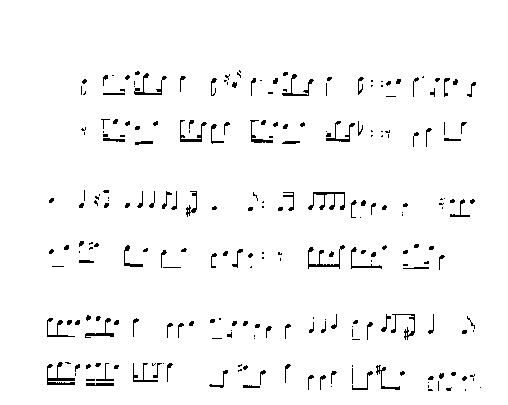
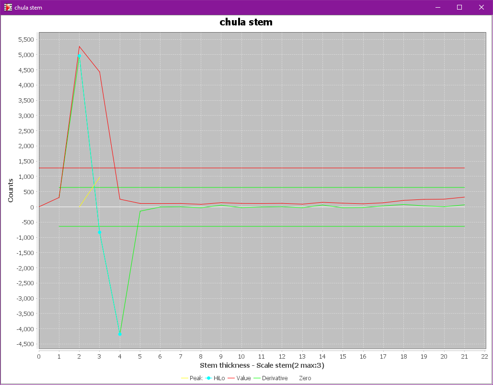

# STEM_SEEDS step
{: .no_toc }

A stem is a rather long vertical segment meant to join note heads, perhaps with beams.
And in a perfect world, any stem could be easily recognized on its own.

But in reality, there may be missing black pixels in the input image,
perhaps breaking a stem in smaller segments, or damaging the connection between a stem and
some of its partnering heads and beams.

To cope with this, the engine uses several approaches to gradually detect:
1. (portions of) stem candidates -- this ``STEM_SEEDS`` step!
1. beam candidates -- the [``BEAMS`` step](./beams.md)
1. ledger candidates -- the [``LEDGERS`` step](./ledgers.md)
1. heads candidates -- the [``HEADS`` step](./heads.md)

and finally to:
1. determine all full stem candidates joining heads and beams -- the [``STEMS`` step](./stems.md)
1. filter all the candidates -- the [``REDUCTION``  step](./reduction.md)

---
{: .no_toc .text-epsilon }
1. TOC
{:toc}
---

## Input

- The systems and staves
- The no-staff image
- The vertical LAG
- The horizontal LAG (very partially)

## Output

- The typical stem thickness for the sheet
- The stem seeds as glyphs in the ``VERTICAL_SEED`` group

## Prolog: stem thickness

The user can directly specify a stem thickness value for the sheet at hand
via the {{ site.sheet_scaling }} pull-down menu.

In the normal case -- that is with no thickness value provided --
the engine must, as a step prolog, measure the typical stem thickness.
It does so by crafting an input image suitable for a global stem analysis.

To avoid any pollution brought by lyrics, title or other external Main concepts,
the engine focuses only on the core staff areas, which is the staff height augmented vertically
slightly less than one interline above and one interline below.

Within each staff area, the staff lines have been removed, as well as the detected barlines
and the header components.  
Note that some stems may have been mistaken for barlines candidates
during the [``GRID`` step](./grid.md);
this should have a negligible impact on the stem thickness computation.

The result is an input image like this one (still for the ``chula`` example):

On this input, it is easy to build a histogram of horizontal black runs lengths, as shown below.

We can display this histogram via the {{ site.sheet_stem_plot }} pull-down menu
-- provided we have activated the ``PLOTS`` topic in the {{ site.tools_advanced }} menu.

The retrieved peak gives the stem thickness: in our example, the most frequent value is 2 pixels,
and the maximum value is 3 pixels.

These values are stored in the sheet scaling data.
Then the rest of step processing is performed system per system.

## System processing

### Vertical filaments

Based on the retrieved (or specified) stem thickness value, the engine can now build vertical
straight filaments from the vertical sections that are slim enough and long enough.

For now, the engine is only looking for stem *seeds*.
Hence, it makes no attempt to extend these filaments vertically
-- this will be done later in the ``STEM`` step.

The filaments can just be thickened with compatible adjacent vertical sections
and tiny horizontal sections as long as the resulting thickness stays within
the limit on stem thickness value.

### Checking seeds

Each retrieved filament is further checked to be kept as a stem seed.

The checks concern:
- slope
- straightness
- length
- cleanliness -- not too many adjacent pixels
- high black part
- low white part

The checks are evaluated according to the declared quality of the sheet input
(synthetic, standard, poor).

The successful candidates are finally registered in the specific ``VERTICAL_SEED``
group of glyphs, ready to be picked up by the following steps.