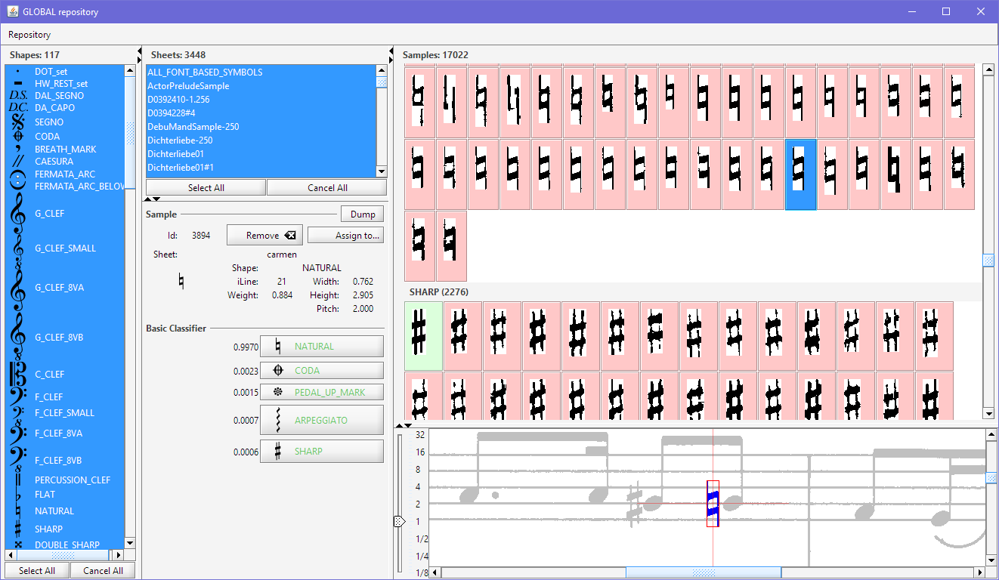

# Samples
{: .no_toc :}

This chapter describes how to set up repositories of Glyph samples and how to carefully filter the
global repository so that it can be used for training.

Note: To use this feature, make sure the advanced `SAMPLES` topic is activated.
If not, select the `SAMPLES` topic in the {{ site.tools_advanced }} menu
(and restart the application).

Audiveris basic classifier is a Glyph classifier, which means that it needs to be trained with
glyph samples (a sample is basically a glyph with the related shape).

---
Table of contents
{: .no_toc .text-epsilon }
1. TOC
{:toc}
---
## Initial samples

There is an Audiveris Google drive located at
[this address](https://drive.google.com/drive/u/1/folders/0B9_F5tULPk_oeEU0a2Z1U0gwLTg?resourcekey=0-W_yyQcPj9JL9Bc2bKTAtrg).

It contains training data, organized by folders.
Let's inspect folder 5.3 which is the more recent folder as of this writing.
 
This folder contains three files:

| File Name              | Size     | Content                 |
| :--------------------- | -------: | :---------------------- |
| `samples.zip`          |  4 MB    | ~15000 samples          |
| `images.zip`           | 453 MB   | ~3500 sheet images      |
| `basic-classifier.zip` | 0.3 MB   | Resulting trained model |

The `samples.zip` file is the `global` repository.
It's the one that has been used to train the Glyph classifier provided with
latest Audiveris release.

We begin by downloading this archive (without expanding it) into our own `config/train` folder
(see its precise location in [Folders] section).  
We will then be able to augment this collection on our own.

We can also download the `images.zip` file which is not mandatory for training, but which will
help us see most samples within their sheet context.

## Sampling a Sheet or a Book

After perhaps some manual corrections, when we are really satisfied with all the glyphs recognized
in a given sheet, we can save the sheet data as training samples.
This is done via the pull-down menu {{ site.sheet_sample }}.

We can also use the pull-down menu {{ site.book_sample}} if we are comfortable with all the
book sheets.

Data is saved under two zip archives located in the book folder.
In say the `foo` book folder, there will be:
* `foo-samples.zip` for the collection of samples (this is the book sample repository)
* `foo-images.zip` for the containing sheet images.

It is a good practice to work on one book at a time, and only merge a book repository into the
global repository when the book data has been thoroughly verified and its samples carefully filtered.

## Sample Repository

The purpose of the Sample Repository dialog is to provide a user interface to visually review some
or all of the various SAMPLES which could be used for training the classifier.

The main objective is to easily identify samples which have been assigned a wrong shape.
Using them as part of the training base could severely impact Audiveris recognition efficiency.
So the strategy, when such a wrong sample has been identified, is to remove it from the
repository or to assign it a correct shape.

To work on the **GLOBAL** repository, we use the `Tools → Browse Global Repository...` pull-down menu.
It will work on the `samples.zip` and `images.zip` files if any are found in our own `config/train`
folder (see the [Train folder](../../reference/folders/essential.md#train-folder) section).

To work on a **book** repository, we use the `Book → View Book Repository...` pull-down menu.
We will be able to pick and merge book repositories into the GLOBAL repository later on,
because the training process uses only the GLOBAL repository.

Either way, the repository user interface is the same:

The repository interface is organized as follows:
* Left column:
  * Shapes selector
* Middle column:
  * Sheets selector
  * Sample board
  * Classifier board
* Right column:
  * Samples selector
  * Sample context

### Sample Selection

1. Initially, all panes are empty except the `Sheets` selector which appears populated with
  sheets names.  
  These are the sheets available in the underlying repository (either the book sheets for a book
  repository, or all registered sheets so far for the global repository).  
  There are a few special sheets, all prefixed by `# SYMBOLS FROM FONT #`, which are not real sheets,
  but gather all the synthetic samples built from Audiveris musical and textual font families.  
  We can select one or several sheets in the Sheets selector.

2. The `Shapes` selector gets populated as soon as sheets are selected.  
We can now select the shapes of interest.

3. The `Samples` selector gets populated as soon as shapes get selected.  
  The samples are gathered by shape.
  In a shape collection, via a right-click, we can sort samples by width, height, height or grade.  
  The synthetic samples (there are a handful of these in each shape collection) are displayed with a
  green background.  
  Only one sample can be selected at a time.

4. If an image is available for the sheet which contains the sample at hand, the Sample `context`
  panel displays the selected sample in its sheet context.  
  This can be helpful for visual checking.

### Sample Editing

The selected sample can be:
* **Removed** from the repository.  
  This is done by typing the `DELETE` key or clicking on the `Remove` button in the Sample board
  or selecting the `Remove` item in the sample right-click menu.
* **Assigned** to a new shape.  
  This is done by clicking on the `Assign to` button in the Sample board or selecting the
  `Assign to` item in the sample right-click menu, and then selecting the new shape.

## Merging Repositories

When we are satisfied with a book repository we can push its content to the global repository.

We do so from the book repository interface, by selecting the pull-down menu
`Repository → Push to Global`.
