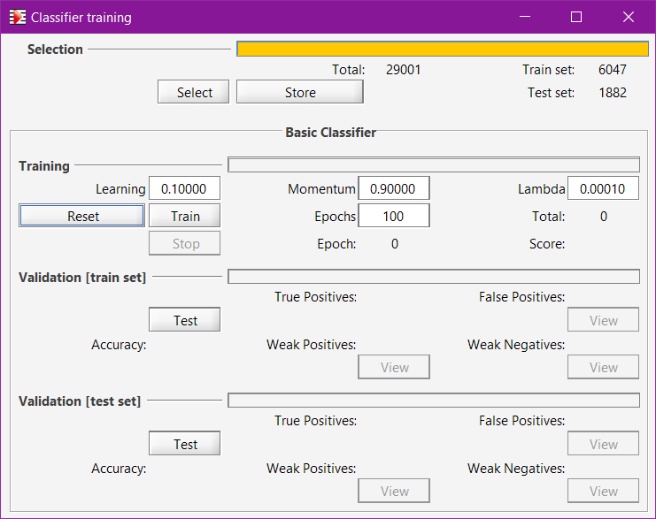
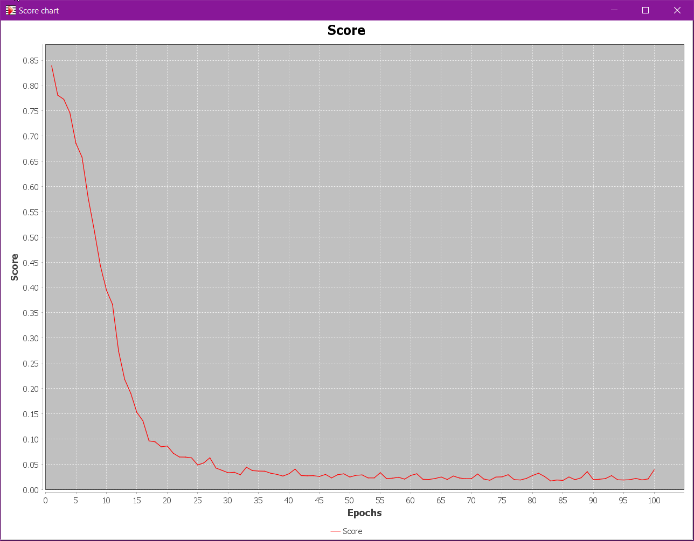
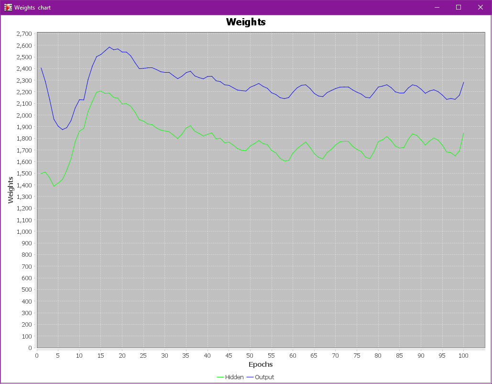
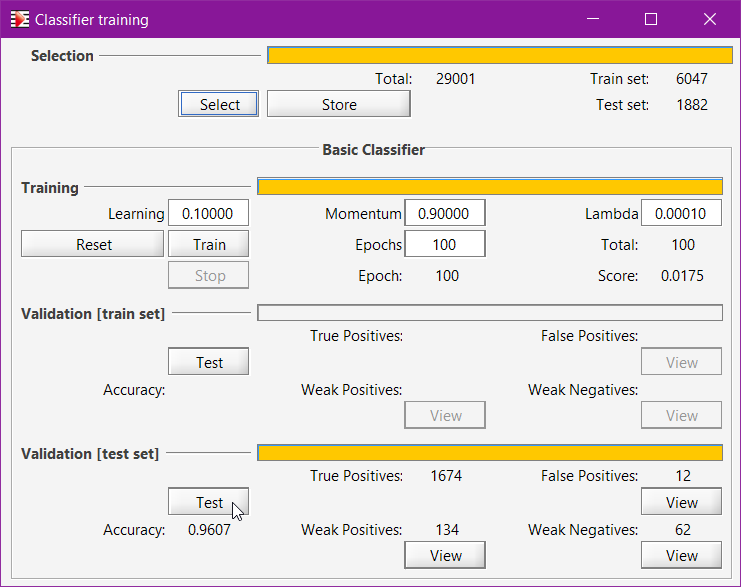

# Training {#training}
{: .no_toc }

Audiveris has the ability to train the underlying Glyph classifier with representative samples.

Note that the program is released with a pre-trained classifier so the casual user can safely
ignore this training section.

However, if the score(s) we want to transcribe use some specific music font significantly different
from the provided examples, we may consider training the classifier to better fit our case.

First, let's make sure we have enabled the `SAMPLES` topic in the {{ site.tools_advanced }} menu,
and restarted the application to take this advanced topic into account in all UI corners.

Then, we will need a bunch of training samples (a sample is basically a glyph and a shape).
This is addressed in the [Samples](./samples.md) section before.

Finally, we can launch one or several trainings of the glyph classifier, via the dedicated Trainer
dialog.

---
Table of contents
{: .no_toc .text-epsilon }
1. TOC
{:toc}
---

## Trainer Dialog {#trainer}
{: .d-inline-block }
updated for 5.11
{: .label .label-green}

This dialog is dedicated to the training of Audiveris basic classifier (a glyph classifier).
It is launched via the pull-down menu {{ site.tools_train }} or, from the global repository,
by its `Repository → Train classifier` menu.

Here we can launch and monitor the training of the classifier neural network.

1. The `Select` button makes a new random selection among the samples of the global repository.  
[The `Store` button can store the selection as `.csv` files for any *external* use. Today, Audiveris makes no use of them].

2. The `Reset` button builds a new network from scratch (forgetting any previous training).

3. The `Train` button launches a training of the current network
(which is either the initially-trained one, or a brand new one if `Reset` was hit).

Advice:  
When training on new shapes, it is recommended to first reset the network before launching the training,
so that all samples be given the same 'chance'.  
If desired, a second training can then be launched (with no reset this time) to further train the network.

Since the 5.11 release, the training hyper-parameters can be directly modified on this interface before launching the training:

| Parameter                  | Typical value |
| :---                       | :---          |
| Learning rate              | 0.1           |
| Momentum                   | 0.9           |
| Lambda (L2 regularization) | 0.0001        |

The `Stop` button allows to stop the training before the maxEpochs count has been reached.

## Monitoring
{: .d-inline-block }
new in 5.11
{: .label .label-yellow}

With the 5.11 release, the implementation of the basic classifier has been improved
to include an L2 regularization to prevent any overfitting.  
This (Ridge) regularization works by keeping low the sum of the squared weights.

When the training is launched, two charts are displayed and continuously updated:
- The chart of score (mean square error on the training set):

- The chart of the sum of squared weights for the hidden layer and the output layer:

## Validation

There are two data sets available for validation, the train set (of no major interest)
and the test set.

The `Test` button launches validation on the data set at hand.
Note that validation is disabled if any training is going on.

In the picture above, without further training, we have directly run validation on a random test set.

Beside the accuracy measure value, 3 `View` buttons are of interest to launch a repository view
with just the samples involved in:
* __False Positives__: samples which were mistaken for a different shape, with a high grade.
* __Weak Positives__, samples correctly recognized, but with a low grade.
* __Weak Negatives__, samples mistaken with a low grade.

Clicking of the `View` button, especially for the False Positive case, allows to manually check if
the sample was correct in first place, and if not, remove or reassign it before a potential future
(re-)training.
