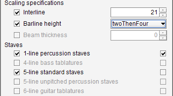

# Book parameters
{: .no_toc }

---
Table of contents
{: .no_toc .text-epsilon }
1. TOC
{:toc}
---

## Dialog

The pull-down menu  {{ site.book_parameters }} opens a dialog to review and modify
high-level processing parameters.

The following example displays the parameters dialog for a book (`Dichterliebe01`) which contains
two sheets:

## Scopes

The dialog is organized in several tabs to describe Default, Book and Sheet's scopes respectively.
In this example, the dialog provides 4 tabs, one for Default, one for Dichterliebe01 book,
and one for each sheet in the Dichterliebe01 book.

The same parameters are defined for each scope, and each scope by default inherits from the upper
scopes in the hierarchy:
1. **Default** level: This is the information provided by default for all books.
Any such global value is read from source, unless we have overridden it at default level.
2. **Book** level: We can override any default value for this book only, and it will apply
transitively to all sheets in this book.
3. **Sheet** level: Finally, we can override any value for the specific sheet at hand.

To override a value for a given scope:
1. We first select the proper scope tab,
2. We then put a checkmark on the left side to indicate that we want to override the selected parameter.
The line gets enabled, it changes from gray to black.
3. We define the new value, either by selecting in a list, or typing a number,
or checking a boolean box, etc.

To cancel a value modification, we simply un-check the box on left side.
The line then gets disabled, changing from black to gray, and it now displays the inherited value
in lieu of the overriding value.

## Lifecycle

All modifications apply only when either the `OK` button or the `Apply` button is pressed,
which actually commits them.
The `OK` button completes the dialog, while the `Apply` button keeps the dialog open.

* All the modified **default** values persist from one run of the application to the other
(until they are modified again or reset to their factory values).

* All the modified **book/sheets** values persist in the book `.omr` project file.

## Parameters

### General

* **Music font**  
We can choose a specific music font between ``Bravura``, ``Finale Jazz`` or ``Jazz Perc``.  
This decision is especially important for head recognition which is based on a font
template matching technique.  
See the specific [Music Font](../specific/fonts.md#music-fonts) section.

* **Text font**  
The text font has no impact on recognition, but can provide a more faithful output.
We can adjust the text font between
``Sans Serif``, ``Serif`` and ``Finale Jazz Text``.

* **Input quality**  
This item allows adapting the OCR engine behavior to the expected quality of the input image between
``synthetic``, ``standard`` and ``poor``.

### OCR languages

Define the specification of dominant languages for OCR'd text
(note that we can select several languages)

### Binarization

(this topic does not appear unless the SPECIFIC_ITEMS advanced topic has been selected)

We can select the kind of filter (`global` or `adaptive`) which gives the best results for the sheet
image at hand.  

We can also adjust the related numbers.
Playing with the `global` threshold is easy, but modifying the parameters of the `adaptive` filter
is not recommended.  
In fact, the default `adaptive` filter seems to give good results in all cases, therefore this
parameter is kept only for potential use on a specific case.
  
### Scaling specifications

* **Interline** specification (expressed in number of pixels).  
  This field appears when ***only*** 1-line staves are declared.
  In this case, the engine has no way to measure an "interline value",
  since there is simply *no* interline.
* **Barline height** specification (`four`, `twoThenFour`, `two`, `oneThenTwo`).  
  This field appears when 1-line staves are declared.
  It defines the typical height for barlines in 1-line staves,
  expressed in number of interlines (or note head heights).
  - `four`: The height of every barline is 4 interlines
  (this is the usual case, as for 5-line standard staves)
  - `twoThenFour`: The height of the first barline (on the left side of the staff) is 2 interlines,
  and the following ones are 4 interlines.
  - `two`: The height of every barline is 2 interlines.
  - `oneThenTwo`: The height of the first barline (on the left side of the staff) is 1 interline,
  and the following ones are 2 interlines.
* **Beam thickness** specification (expressed in number of pixels).  
  This field is always present, it is useful when there are too few beams
  for the engine to get a reliable measurement.

The scaling specifications can depend on staves declarations are shown in the following picture.  
Note in this example that:
- There are no multi-line staves, hence the need for interline specification
- There are 1-line staves, hence the need for barline height specification

### Staves

* Presence of 1-line percussion staves
* Presence of 4-line bass tablatures
* Presence of 5-line standard staves
* Presence of 5-line unpitched percussion staves
* Presence of 6-line guitar tablatures

### Processing

In some cases, supporting a rather rare feature may imply collateral damage, the small note heads
are an example of such a tricky feature.
So it is safer to use them only when we have to.

  * Keep loaded gray images
  * Use of system indentation
  * Potential presence of small note heads
  * Potential presence of small beams
  * Potential presence of cross note heads
  * Potential presence of tremolos
  * Potential presence of fingering digits
  * Potential presence of frets roman digits (I, II, III, IV...)
  * Potential presence of plucking (p, i, m, a)
  * Potential presence of partial whole rests
  * Potential presence of multi-whole head chords
  * Potential presence of chord names
  * Potential presence of lyrics
  * Potential presence of lyrics even located above staff  
  * Potential presence of articulations
  * Link augmentation dot to both shared heads
  * Support for implicit tuplets

{: .highlight }
A switch can disable a feature for the OMR automatic recognition,
but in most cases the feature remains available for manual user actions.

