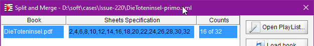
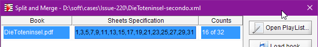
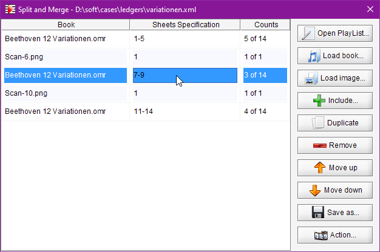
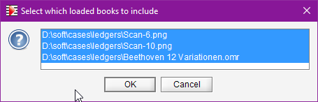

# Split and merge
{: .no_toc }

This feature is meant to be the Audiveris "Swiss Army Knife" to configure books, images and sheets.

---
Table of contents
{: .no_toc .text-epsilon }
1. TOC
{:toc}
---

## Concepts

The Split and merge feature relies on the concept of *"PlayList"* that the user can define, modify,
save/reload, and finally use to build the resulting compound book.

In terms of structure:
- A PlayList is merely a sequence of excerpts to be processed one after the other.
- An Excerpt represents, not surprisingly, a selection of sheets in a given Container.
- A Container is a file, either a Book file or an image(s) Input file.

The PlayList can be defined conveniently via the interactive "Split and merge" dialog.   
It can also be written from scratch via a plain text editor
(see the paragraph about the [PlayList format](#playlist-format)).

Either way, the PlayList can then be used interactively or in batch to produce a compound book
according to the PlayList content.

## Use cases
This section lists typical use cases from the end-user point of view.

### 4-hands piano sheet

The request in issue #220
([Support for 4 hands piano sheet](https://github.com/Audiveris/audiveris/issues/220))
was clearly stated:

>Some four hands piano sheets have a page/page layout, where left page is for left player and right page is for right player.
The two pages are meant to be played at the same time.

The provided input file for the case at hand is a 32-page pdf file, in which odd-numbered sheets
are marked as "Secondo" and even-numbered sheets as "Primo".

The easiest way to "split" the single input file into two separate books is to open two
`Split and merge` dialogs and to edit them as follows:





Then pressing the `Action` button in each dialog builds the corresponding compound books
`DieToteninsel-primo.omr` and `DieToteninsel-secondo.omr` respectively.

### Compound book

The case is described in issue #129
([Allow to load multiple images into one book](https://github.com/Audiveris/audiveris/issues/129))
where a paper score is scanned page after page into separate image files.

1. With a PlayList referencing the image files in proper order, we can build a compound **book of images**.

2. We can also start processing each input file separately and perhaps try some image improvement
techniques.   
And when each 1-sheet book is correctly processed, we can combine all the separate books into
a compound **book of books**.   

3. And more generally, we can have references to book files and references to image files in the same
PlayList, resulting in a **mixed compound**.

In all these cases, the engine will update the sheets where needed and process the inter-sheet
dependencies (slurs, time-signatures, measure IDs) before building the resulting score(s).


### Sheet replacement

We have seen that sheet addition/removal can be done at any time, regardless of the transcription
process of any sheet.

If, within a long book, a sheet needs some rework (such as a new input), then it's simple
to remove this sheet and insert a new version at the same position.

For example, let's assume we have:
- `Beethoven 12 Variationen.omr`: a large book of 14 sheets, more or less well transcribed.

Let's assume we have come to the conclusion that some input images should be replaced by other
images of better quality:
- `Scan-6.png`: to replace sheet #6 of the book above
- `Scan-10.png`: to replace sheet #10 of the book above

Then we could use a PlayList as defined below:



In this example, we are using references to `.png` image files.
We could as well prefer references to `.omr` book files, containing the same sheets perhaps
partly transcribed.

## Dialog

It is accessed via the {{ site.book_split }} menu item.

The dialog large table, meant for the underlying PlayLists, is initially empty.

### Populating the PlayList

- If we have a PlayList available somewhere, we can open it via the `Open PlayList...` button
  in the upper right corner of the dialog.   
  This will add the content of the opened PlayList to the dialog.
- If we already have Books or Image files loaded in the Audiveris main window, we can immediately
  select and include a few of them into the PlayList.   

  
- Via a Drag 'n Drop from a file explorer, we can drop one or several Book or Image files onto
  the dialog, and each will lead to the addition of a corresponding excerpt at a precise location
  in the PlayList.
- Similarly, via the `Load files` button, we can load one or several Book or Image files and
  their corresponding excerpts will be appended at the bottom of the PlayList.

### Legend
- There is one row per excerpt, composed of the container name, the sheets specification string
  and the resulting count of sheets as selected in this excerpt.
- A container name ends with `.omr` extension to denote a Book, and with another extension
  (like `.png`, `pdf`, etc) to denote an image(s) file.
  The latter case is in reality a book created on-the-fly just to handle the image file.
- The sheets specification is an editable field.
  By default, all sheets are selected but, if the originating book already had a sheets selection
  defined, this definition would be copied over to the excerpt field.
  -- see the previous section on [Sheets Selection](./sheet_selection.md) in a book.
- Note that the same container can appear on several rows of the PlayList,
  with different sheets specifications
  -- see the example of [Sheet replacement](#sheet-replacement) above.

### Editing the PlayList

- We have seen that the sheets specification of any excerpt can be manually edited.
- We can add/include and remove excerpts.
- We can move a selected excerpt up and down within the PlayList.
- The `Duplicate` button duplicates the selected excerpt, including its current specification.   
  It's a convenient way to insert another excerpt of the same container in the PlayList:
  we can simply duplicate a line, move it where desired, and modify its sheets specification.

When satisfied with the PlayList, we can save it for future reload or use it immediately as follows.

### Creating the compound book

The `Action!` button creates the compound book according to the PlayList
current content.

The newly created Book is a full-fledged book that exists on its own.  
It can be used from now on, just like any other book:
- whole book transcription,
- individual sheet transcription,
- interactive validation / correction,
- export in MusicXml, etc.
- it can even be used as a source for another PlayList.

The created book begins its life in some status, depending on the status of each of its sheets.
- it has simply been *created* by the `Action!` button,
- its full *transcription* will generally require some additional actions,
like pressing the `Transcribe` button at book level.

{: .important }
> We must keep in mind that this compound book is a brand new **stand-alone** book,
> kept separate from its original "parts". 
> In other words:
> - any further work made on this compound book will not impact the *original* "parts",
> - any further work made on any of the *original* "parts" will not impact the compound book.

## PlayList format

A PlayList can be created or saved as a plain XML file,
- with `<play-list>` as its root element,
- composed of a sequence of `<excerpt>` elements, each of which containing
  - the mandatory `<path>` element to a container file
  - and a possible `sheets-selection` element.

Here is the content of the `variationen.xml` example file, where the populated PlayList has been
saved:

```xml
    <?xml version="1.0" ?>
    <play-list>
        <excerpt>
            <path>D:\soft\cases\ledgers\Beethoven 12 Variationen.omr</path>
            <sheets-selection>1-5</sheets-selection>
        </excerpt>
        <excerpt>
            <path>D:\soft\cases\ledgers\Scan-6.png</path>
            <sheets-selection>1</sheets-selection>
        </excerpt>
        <excerpt>
            <path>D:\soft\cases\ledgers\Beethoven 12 Variationen.omr</path>
            <sheets-selection>7-9</sheets-selection>
        </excerpt>
        <excerpt>
            <path>D:\soft\cases\ledgers\Scan-10.png</path>
            <sheets-selection>1</sheets-selection>
        </excerpt>
        <excerpt>
            <path>D:\soft\cases\ledgers\Beethoven 12 Variationen.omr</path>
            <sheets-selection>11-14</sheets-selection>
        </excerpt>
    </play-list>
```

## CLI option

There is a new option available on command line interface: `-playlist <foobar.xml>` which allows
loading an `.xml` file as a PlayList, provided that file content is compliant with the PlayList
format described above.

Then, according to the current mode (batch or interactive), the actions differ slightly:
- In *batch* mode, the PlayList is immediately used to build, next to the provided `foobar.xml`
  file, the resulting compound book `foobar.omr` file.
- In *interactive* mode, a `Split and merge` dialog is populated with this PlayList and displayed
  to the user for further action, such as review / edit / build compound.
