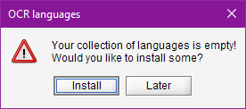
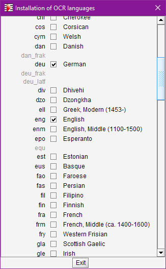
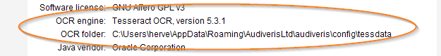

# OCR languages
{: .no_toc }
{: .d-inline-block }
new policy in 5.4
{: .label .label-yellow }

Audiveris delegates text recognition to the Tesseract OCR library.

Tesseract OCR is potentially capable of processing text in over a hundred languages.  
But, for a language to be effectively supported:
1. A specific data file (containing learning materials, a dictionary, etc. for that language)
must be installed locally.
2. This language must be specified as default, or for the book, or just for the sheet in question.

For example, the processing of an input score  using the English language (code: `eng`)
requires that:
1. the `eng.traineddata` file is installed beforehand;
2. the `eng` code is specified for the input score.

---
Table of Contents
{: .no_toc .text-epsilon }
1. TOC
{:toc}
---

## Pre-installed languages

Starting from version 5.4, no languages ​​are installed by default.
(except for the Windows installer which only preinstalls the English language).

At launch, Audiveris checks the installed language collection and issues a warning if this collection is empty.

In interactive mode, the following warning dialog is displayed:

We can then:
- proceed immediately with the installation of some languages;
- or simply postpone this action;
in the meantime, we can still process the input scores, but the TEXTS step will be ignored.

## Installing languages

Prior to the 5.4 release, the end user was left alone to manually download data
files from the Tesseract web site into a local folder.
This resulted in recurring errors.[^errors]

Starting from the 5.4 release, Audiveris offers a convenient way to install OCR languages
*interactively* from within the application.

The preferred method is to add languages via the {{ site.tools_languages }} pull-down menu.  
Of course, *this feature requires Internet access*.  
If OK, we get the dialog below:

Here, we can browse through the 100+ languages available on the GitHub Tesseract site,
one line per language:
- The language 'code' (generally 3 letters) appears on the left
- The full name is on the right
- The checkbox in the middle indicates if the corresponding data file is installed locally
- A gray code, with no checkbox and no full name, can be ignored

To actually download a language, we simply check the related box.
The corresponding data file is immediately downloaded to the local target folder
and the checkbox is updated once the download is complete.

### The local `tessdata` folder

At launch, Audiveris tries to initialize the Tesseract library with a `tessdata` folder:
1. It first checks if the `TESSDATA_PREFIX` environment variable is defined
and actually points to a directory. If so, this location is chosen.  
Note that setting this environment variable is not mandatory,
it is meant merely to reuse an existing configuration.
2. Otherwise, Audiveris looks for a directory named `tessdata` under the OS-dependent Audiveris
[user config folder](../../reference/folders/essential.md#config-folder).  
If this directory does not exist, it is created on-the-fly.  

NOTA: this target folder must be **writable** to actually install any language there.

The `About` dialog, launched from the {{ site.help_about }} pull-down menu,
displays key information about the OCR engine version and the local OCR tessdata folder:

## Specifying runtime languages

At runtime, we can specify which languages should be considered by the OCR software
for the input image at hand.

This is done via a language specification string -- a plus-separated list of language codes,
like "fra+eng+ita":

- The easiest way is to define this language specification interactively.  
Using the {{ site.book_parameters }} menu, we can make specifications
at the global level, book level and even individual sheet level.

- The default (global) specification is determined by the application constant
`org.audiveris.omr.text.Language.defaultSpecification`, whose initial value is `eng`.  
So, we can also modify this default directly by changing the constant value:
  - either interactively (using the {{ site.tools_constants }} menu)
  - or in batch (using something like
    `-constant org.audiveris.omr.text.Language.defaultSpecification=ita+eng`).

{: .highlight }
NOTA: Specifying too many languages for a given book or sheet will slow down the recognition task
and may increase the number of false recognitions.  
So, let us be as specific as possible.

[Tesseract tessdata]:  https://github.com/tesseract-ocr/tessdata
[^errors]: Most frequent confusion cases:  - Tesseract *program* vs. Tesseract *library* (linked by Audiveris)  - Tesseract `LSTM` model vs. `legacy` model (the one needed by Audiveris)  - Version of Tesseract language files to be downloaded (4.x)  - `TESSDATA_PREFIX` environment variable (pointing to the local tessdata folder)
