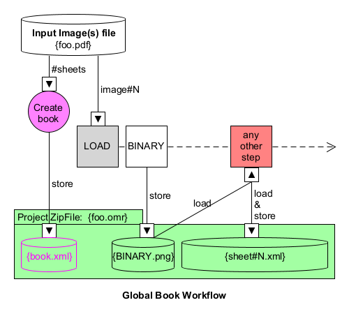
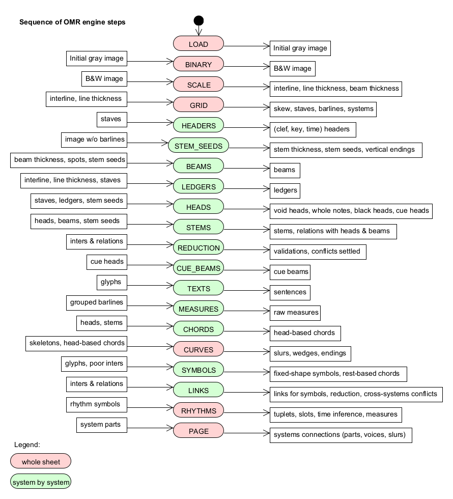

# Pipeline
{: .no_toc }

---
{: .no_toc .text-epsilon }
1. TOC
{:toc}
---

## Global book workflow
When working on a book, the Audiveris V5 OMR engine can process any sheet of the book independently of
the others.
Only the final gathering of sheets results, which comparatively is a very fast action,
is performed at book level.

The diagram above presents the typical workflow for an example input file, named `foo.pdf`:
1. When opening the `foo.pdf` input file, Audiveris creates a Book instance.
2. It then detects how many images the input file contains, and allocates one sheet
(just a sheet "stub" actually) for each contained image.
3. When processing a given sheet, the corresponding image is loaded from the input file,
and the OMR pipeline is applied on the sheet.
4. At any time, when saving the project, all the book and sheets OMR information is saved into the
`foo.omr` project file.

{: .highlight }
**TIP**: Audiveris V5 can accommodate a book of hundreds of sheets.
To save on memory, especially during long interactive sessions, we can ask Audiveris to
transparently swap all book sheets to disk (except the current sheet).
This is done via the pull-down menu {{ site.book_swap }}.

## Sheet pipeline

The processing of a given sheet by the OMR engine is done via a pipeline of some 20 steps
applied, one after the other, on sheet OMR data.

Here below is the sheet pipeline sequence, with the main inputs and outputs of every step:

{: .note }
Each of these 20 steps is detailed in the dedicated
[explanation pages](../../explanation/steps/README.md).   
There is no need to go through all of them in a first reading of this handbook.  
We can just keep in mind that this information is available and is likely to help
us understand how each of these steps works.

## Driving the pipeline

A sheet step is like a mini-batch applied on the sheet data, and this is the smallest increment
that the OMR engine can perform.

In the selected sheet,  we can decide to move the pipeline forward until a target
step.
To do so, we select the target step in the pull-down `Step` menu:

Note that selecting the pull-down menu {{ site.sheet_transcribe }} is just another way of selecting
the pull-down menu `Step → PAGE`.

Be careful, we cannot move the pipeline directly backward.  
But there are two indirect workarounds:

* We can select a target step that has already been performed:
    1. we are first prompted for confirmation,
    2. the sheet data is then reset to its initial status
    -- the gray image if available, otherwise the binary image,
    3. and all necessary steps are re-performed up to the target step.
* We can also abandon the book and reload it from a previously saved status.
