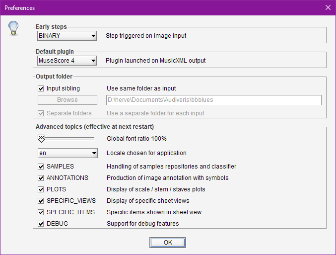

# Preferences
{: .no_toc }

The {{ site.tools_preferences }} pull-down menu opens this dialog, 
focused on on the handling of a few user preferences.  
It operates at a much higher level than the direct handling of application constants.

Beside standard features, the dialog also presents a set of `Advanced Topics` 
that impact the Audiveris user interface and thus require an application restart.

---
Table of contents
{: .no_toc .text-epsilon }
1. TOC
{:toc}
---

## Early steps

This box allows to define which step is automatically trigerred on an input file.

## Default plugin

This allows to interactively choose a new default plugin among the declared ones,
since by default the first declared plugin is set as the default one
(See the [Plugins](./plugins.md) section).

## Output folder

These boxes govern where output files are located by default.

- **Input sibling**: If set, all outputs are stored in the same folder as the input file 
(unless the ``-output`` option is specified on the command line).
- **Browse**: Allows to define a default output folder.
- **Separate folders**: If set, all outputs related to a given input file are stored
in a *separate* folder, created according to the input file name without its extension.

For further explanations, see the section on [Standard folders](../../reference/folders/standard.md).

## Global font ratio

The slider allows to select a larger font size used throughout the application views.

## Locale

We can pick up a different user language.  
As of this writing, the available locales are:
- **en** (English), the default
- **fr** (French), not yet fully implemented...[^locales]

## Advanced Topics

 Each of these topics can gather several related features.

* `SAMPLES` deals with sample repositories and classifier training.
* `ANNOTATIONS` deals with the production of symbol annotations.
* `PLOTS` deals with the display of plots for scale, stem, staff or header projections.
* `SPECIFIC_VIEWS` deals with specific sheet tabs (staff free, staff-line glyphs).
* `SPECIFIC_ITEMS` deals with the display of specific items on views (attachments, glyph axis, ...)
* `DEBUG` deals with many debug features (notably browsing the book internal hierarchy).

 Note that an __application restart__ is needed to take any modified selection into account
 for these advanced topics,  because of the various impacts this implies on many UI elements.

 [^locales]: If you are willing to add another locale, please post a message on the [Audiveris discussion forum](https://github.com/Audiveris/audiveris/discussions).