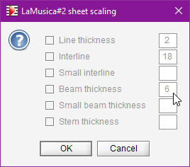
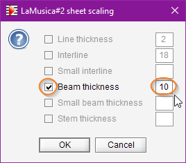
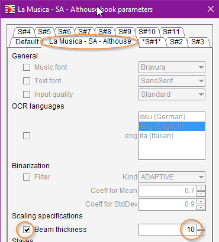

# Sheet scale
{: .no_toc }

---
Table of contents
{: .no_toc .text-epsilon }
1. TOC
{:toc}
---

## General scaling

The behavior of steps like GRID (staves, etc), BEAMS and STEMS depends highly on the accuracy
of scaling data estimated during:

* ``SCALE`` step: Staff line thickness, interline, small interline if any, beam thickness,
small beam thickness if any.
* ``STEM_SEEDS`` step: Stem thickness.

Scaling data is inferred from histograms of vertical run lengths.  
Here are two examples of such histograms:

| Combo histogram | Black histogram |
| :---: | :---: |
|  |  |

- The combo histogram focuses on the combined length of a black run and its following 
  white run.
  This leads to the measurement of staff interline.
- The black histogram focuses on the length of vertical black run.
    - The main peak corresponds to the typical staff line thickness (3 pixels in this example).
    - If the sheet contains a significant population of beams, we can observe a second peak
    which corresponds to the typical beam thickness (12 pixels in this example).

## Beam thickness
{: .d-inline-block }
new in 5.3
{: .label .label-yellow }

The Audiveris OMR engine, in its BEAMS step, makes a pretty good processing of beams
-- when it knows the typical beam thickness in the sheet at hand.

A problem arises if the sheet at hand contains only a couple of beams:
The contribution of these beams to the global black histogram may be just too low to result in any
reliable peak.

In this case, the OMR engine may pick up a wrong beam peak or detect no beam peak at all
and simply make a guess on beam thickness (using say 1/2 of staff interline).  
And without a precise thickness estimate, chances are the beams will not be correctly detected
and processed in the sheet.

### Manual beam correction

After the SCALE step, but before the BEAMS step, we can manually modify the beam thickness value
as computed by the OMR engine.

We can do this using the {{ site.sheet_scaling }} pull-down menu.

Initially, all rows appear in gray, and the data values, if any, are displayed on the right.

* To modify a data, we first select the row by checking the box on the left; the row turns black.  
  We can then modify the data value.
* Deselecting a row resets the data to its initial value.
* Finally, pressing the `OK` button commits the modified values and closes the dialog.

| Original scaling | Edited scaling |
| :---: | :---: |  
|||

- Pros:
  - We directly tell the engine which beam thickness to use in this sheet.
- Cons:
  - Each time the processing of this sheet is restarted from zero, the correction is lost and
  the modified value must be re-entered.
  - We may have to perform the correction manually for each and every sheet in the containing book.

### Upfront beam specification

A different approach is to provide upfront the OMR engine with a beam thickness specification.

#### Interactive mode
We can do this using the {{ site.book_parameters }} pull-down menu:

Here, we have chosen the whole book tab, selected beam specification and entered a thickness value
as a number of pixels.

Since the specification is made at book level, it applies by default to all sheets in the book.
This is generally a good strategy, since often all sheets in a book share the same scale
and the same beam thickness.

If ever we need a different value for a given sheet, we can simply select the related sheet tab
in the ``Book parameters`` dialog, and enter a specific value for this particular sheet.

Specification value ``0`` has a special meaning, which is: ``no specification``.
It can be used at book and/or sheet levels.

- Pros:
  - It's easy to set book-wide as well as sheet-specific specifications.
  - The specification(s) are stored in the ``.omr`` project file and survive
    any reload or any processing restart from scratch.
- Cons:
  - It is only a *specification*, to be used by any subsequent SCALE step.  
    Hence, to be effectively applied, the SCALE step must be performed (or reperformed).
    
#### Batch mode

When running in batch on a brand new input, we can include this beam specification in the
command line arguments, using an option like:

> -constant org.audiveris.omr.sheet.Scale.defaultBeamSpecification=10

As opposed to the interactive mode, this batch specification is *not* stored within the book
project file.  
And we must keep in mind the fact that, in batch, this beam thickness specification applies to
*all* books processed by the current command entered on the command line interface.

Similarly, we can notice that there is no beam specification available in the ``Default`` tab
of the ``Book parameters`` dialog.
Otherwise this hard-coded pixel specification would apply for all books processed from now on...
