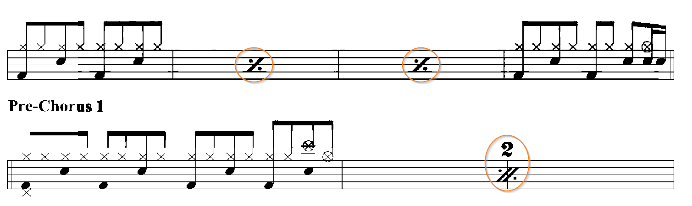
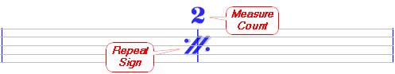
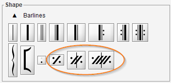

# Bar Repeat
{: .no_toc }
{: .d-inline-block }
since 5.3
{: .label }

A "bar repeat" sign indicates that preceding written measures must be repeated exactly.

---
Table of contents
{: .text-epsilon }
1. TOC
{:toc}
---

## Example

In the example above, we have two systems, the first one with 4 measures #1, #2, #3 and #4  
and the second one with 3 measures #5, #6 and #7:
- On the first system, the measures #2 and #3 contain both a one-bar repeat sign, to repeat the measure #1 twice.
- On the second system, a two-bar repeat sign appears right above the barline between the measures #6 and #7,
to repeat the previous two measures (#4 and #5).

We could also encounter a four-bar sign, to repeat the four previous measures.

## Model

Since release 5.3, Audiveris OMR engine is able to recognize both:
- The repeat sign itself, with either 1, 2 or 4 slashes.
- An optional measure count that can appear above the sign.
It should correspond to the count of slashes in the repeat sign.

## Editing

If needed, we can manually assign or drag these signs from the shape palette,
using the three symbols available in the ``Barlines`` set.

The measure count is not mandatory, but can be manually assigned or dragged from the shape palette,
in the ``Times`` set.

We can choose a predefined item from the ``Parts`` numbers.

Or pick up the custom ``0`` item and then manually assign the desired value.

## Output

The MusicXML output is correctly populated with these bar repeat signs
and with the content of the repeated measures.

Regarding the display:
- When read with Finale (version 27), the repeat signs are displayed as expected.
- When read with MuseScore (version 3.6.2) the repeat signs are not displayed but 
the repeated measures are shown as if they had been physically duplicated.

Regarding the playback:  
- In both cases (Finale and MuseScore), the repeated measures sound as expected.