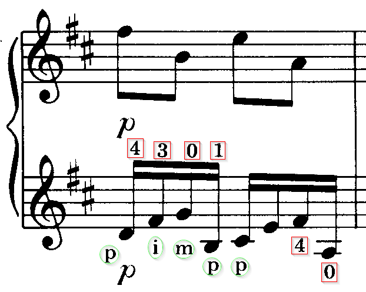
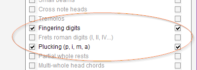
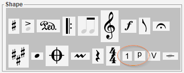
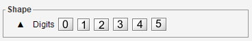
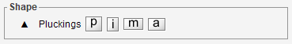
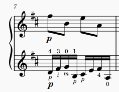

# Fingering and Plucking
{: .no_toc }
{: .d-inline-block }
completed in 5.3
{: .label }

These are technical informations for guitar or similar instrument, to indicate how
a note should be played.

[Assuming a right-handed person]:
- **Fingering** describes the left-hand finger, via a digit number (0, 1, 2, 3, 4)
- **Plucking** describes the right-hand finger, via a letter (`p`, `i`, `m`, `a`)

---
Table of contents
{: .text-epsilon }
1. TOC
{:toc}
---

## Example

Here is an example with fingering indications (in red squares)
and plucking indications (in green circles):

## Detection

The OMR engine must be explicitly told to detect these indications.
This can be done via the processing switches in the {{ site.book_parameters }} pull-down menu:

## Insertion 

Regardless of the switches values, we can always manually assign or drag & drop these
indications from the shape board:

| Shape Set | Palette |
| :---: | :---: |
| Fingerings |  |
| Pluckings |  |

## Export

These indications get exported to MusicXML and are thus visible from MuseScore for example:

