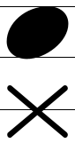
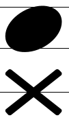
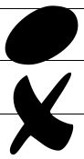
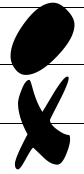
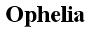
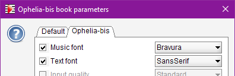

# Fonts
{: .no_toc }
{: .d-inline-block }
since 5.3
{: .label }

Audiveris uses specific fonts for music symbols and for text symbols.

---
Table of contents
{: .no_toc .text-epsilon }
1. TOC
{:toc}
---

## Music fonts

Before 5.3 release, only one music font family was used (**Musical Symbols** font initially,
later replaced by **Bravura** font for SMuFL compliance).

Since 5.3 release, we can tell Audiveris which music font family to use by default,
or for a given book or sheet.

### Head symbols

This choice is key for **head symbols**, since the OMR engine uses a *template matching* technique to
detect them during the HEADS step.

Here below are samples of just two significant head shapes -- black head and cross head --
for each of the available music font families
(**Bravura** (the default), **Leland**, **Finale Jazz** and **Jazz Perc**).  
Pictures are magnified 4 times for a better reading:

| Shape / Font Family | Bravura | Leland | Finale Jazz | Jazz Perc |
| :---:|  :---:|  :---:|  :---:|  :---:|
| **Black Head** <br> and <br> **Cross Head**  | | | | |

The head templates are built upon a specific font:
- its family is the user-selected music font family,
- its precise size is derived from the measured staff interline.

{: .important }
Due to the way template matching works, it is essential to carefully check the match
between the input score image and the selected font family.
- The major difference is between _standard_ fonts (`Bravura` and `Leland`) and _jazz_ fonts
(`Finale Jazz` and `Jazz Perc`), especially for all the cross-like shapes.
- Within the jazz fonts, `Finale Jazz` and `Jazz Perc` differ mainly by their width,
and the impact on template matching is more visible on oval-like shapes.

### Other symbols

For symbols other than head symbols, such as Clef, Flag, etc,
recognition is not based on template matching but on a neural network.

With proper training on representative samples, the neural network is able to recognize their shape,
regardless of the selected music font family.  
We can observe its top 5 results in the ``Glyph Classifier`` board.

At this point, the reader may wonder why this neural network approach is not also used for head recognition...
The reason is the current network needs a glyph to work upon, and there is yet no way to isolate
a head glyph *reliably*.
[^prototype]

### Music fonts hierarchy

Not all symbols are available in every music font family.

To cope with this situation, Audiveris has defined a hierarchy between music font families.
Hence, when a given symbol is not available in a family, the families above in hierarchy are 
transitively searched until the symbol is found.

The current family hierarchy is as follows:[^musical_symbols]

```
    Bravura
    ├── Leland
    ├── Finale Jazz
    │   └── Jazz Perc
    └── Musical Symbols
```

## Text fonts

Texts recognition is less sensitive to font family, compared to music symbols recognition.  
The main reason is that Audiveris delegates texts recognition to Tesseract OCR.[^ocr_font]

Since 5.3 release, we can tell Audiveris which text font family to use among the families available
(**Sans Serif** (the default), **Serif** and **Finale Jazz Text**):

| Sample / Font Family | Sans Serif | Serif | Finale Jazz Text |
| :---: | :---: | :---: | :---: |
| Ophelia ||||

A proper choice of text font family will result in a better consistency between the input image
and its displayed transcription.

## Selection of fonts families

In interactive mode, we can use the {{ site.book_parameters }} dialog in its ``Music font``
and ``Text font`` fields:



In batch mode, we can make choices on the command line interface.

- For **music**, choice is between *Bravura*, *Leland*, *FinaleJazz* and *JazzPerc*:  
```
-constant org.audiveris.omr.ui.symbol.MusicFont.defaultMusicFamily=JazzPerc
```

- For **text**, choice is between *SansSerif*, *Serif* and *FinaleJazzText*:  
```
-constant org.audiveris.omr.ui.symbol.TextFont.defaultTextFamily=FinaleJazzText
```

[^musical_symbols]: The old "Musical Symbols" family has been totally replaced by "Bravura" family. It is kept only for samples generation from old ``.omr`` projects, something the end user can safely ignore.

[^ocr_font]: In some cases, we have observed rather poor OCR results with a Jazz-like text font, perhaps because lowercase characters are displayed as small uppercase characters. To be further investigated.

[^prototype]: There are on-going works on global recognition without prior glyph segmentation. See this [Audiveris Wiki article](https://github.com/Audiveris/audiveris/wiki) in its "6.x prototype" section.
