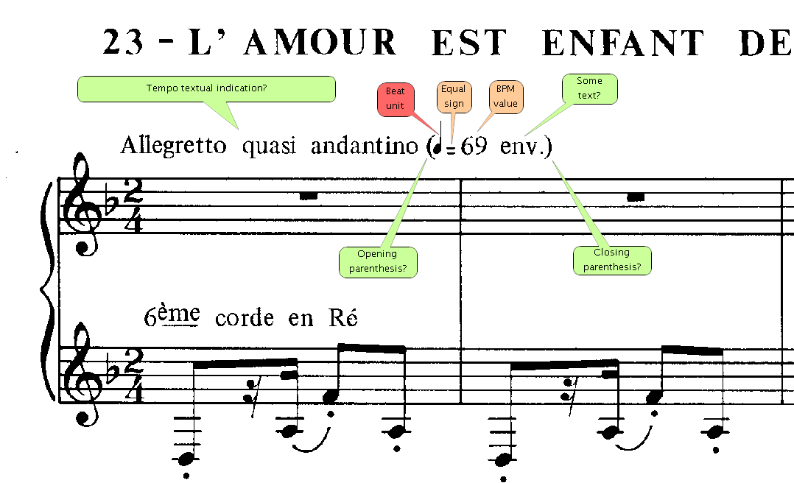
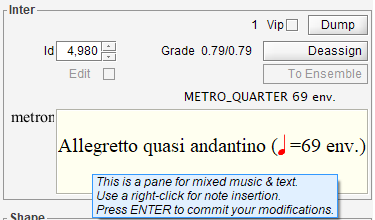
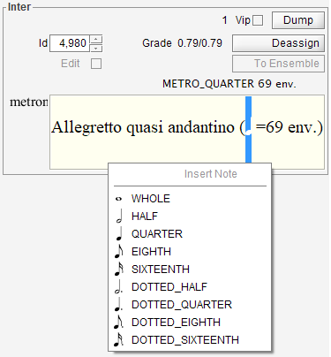
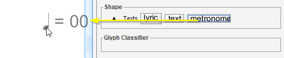
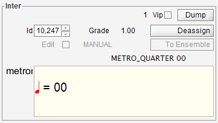
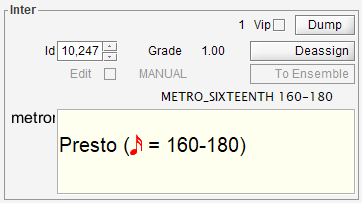

# Metronome
{: .no_toc }
{: .d-inline-block }
new in 5.4
{: .label .label-yellow }

The picture below displays a typical metronome mark :

---
Table of contents
{: .no_toc .text-epsilon }
1. TOC
{:toc}
---

## Structure

From left to right, a metronome mark can contain: [^swing]

| Mandatory? | Item|
|:---:|:--- |
|  -  | a tempo textual indication, like "Allegretto quasi andantino" |
|  -  | an opening parenthesis `(` |
| YES | a beat unit symbol, like "&#x2669;"|
| YES | the equal (`=`) character |
|  -  | some text, like "ca." |
| YES | an integer value |
|  -  | a minus (`-`) character, followed by a second integer value |
|  -  | some text, like "env." |
|  -  | a closing parenthesis `)` |

## Engine recognition

The OCR can recognize text characters, words and sentences.

The main problem comes from the *beat unit symbol*, like the quarter symbol in the example above,
because there is no way to make Tesseract OCR recognize this symbol as a known character. [^symbol]

For the time being, the OMR engine uses a rather acrobatic approach:
1. It looks for an OCR'd sentence which matches a regular expression
crafted for the optional and mandatory items listed above,
2. It isolates the word located just before the `=` character[^colon] and grabs its underlying glyph,
3. It submits this glyph to the glyph classifier, looking for a beat unit symbol.

If the test is positive, then the sentence is recognized as a metronome sentence.
As any sentence, the metronome mark is made of words, but one of them is special,
it's the beat unit word which contains just the beat unit symbol.

## MusicXML export

The various metronome items (textual tempo, beat unit, bpm values, ...) are exported in a MusicXML `direction` element including a `tempo` element.

The tempo value is the number of *quarters* per minute, which is determined according to:
- The beat unit,
- The number of beats per minute (either the single value or the mean value if two values are found).

## Manual editing

In Audiveris, a standard sentence content cannot be edited directly.
The editing can be made at word level only.  
But specially for the metronome sentence, editing can be made at both sentence and word levels.

For instance, we can click on any word of the metronome sentence, it gets displayed in the `Inter` board.
There, we can click on the `To Ensemble` button to get to the containing sentence: the metronome mark.

There, we have a small pane where we can see and directly edit the metronome content.
The field accepts standard cut and paste actions on text and music characters.

Text can be entered by typing on the keyboard, but music characters are different.
They are displayed in red to make them stand out.

To enter a beat unit, we use a right-click in the pane.
This opens a popup menu with all the supported beat units:

The selected beat unit is inserted at the current position --
or replaces the selected characters if any were selected.

As usual, the modifications get committed when we press the `ENTER` key.  
And we can always undo/redo such actions.

## Changing a sentence to metronome

The OMR engine may have mis-recognized a metronome mark, and consider it as a **plain sentence**,
for example with a *direction* role.

In that case, we can simply select this sentence and manually change its **role** to
the `Metronome` role.

The `Inter` board will consequently display the metronome mark, based on the recognized items.
Typically, we'll have to manually correct or insert items like the beat unit, the `=` character, ...

The OCR engine may also have totally **ignored the sentence**, for whatever reason.  
In that case we can select the sentence (actually we select the underlying glyphs as a whole)
and assign it the Metronome **shape**.  
And, here again, we manually correct the metronome mark.

## Creating from scratch

We can always create a metronome mark from scratch.

To do so, we click on the `Texts` set in the shape board, which opens this set as:

This set (new in 5.4) gathers just the text-oriented shapes: `lyric`, (plain) `text`  and `metronome`.

We now can make a drag n' drop from the metronome button to the sheet location of our choice.

Notice, as we drag away from the `metronome` button and enter the sheet view,
that the "metronome" label is replaced by a metronome symbol:

We can drop the symbol, this creates a **minimum** metronome mark, using default elements,
at the drop location.  

The `Inter` board now displays this minimum metronome mark:

We finally have to modify/augment this basic version to get something more in line with what we want.
For example:

[^swing]: The rhythm-oriented marks, like this one:  are not supported yet. 

[^symbol]: If you know of a way to train Tesseract on beat units, please post a message on the [project discussions](https://github.com/Audiveris/audiveris/discussions).

[^colon]: The equal character (`=`) is sometimes OCR'd as a colon character (`:`), so the regular expression has been adjusted to also accept the colon character.