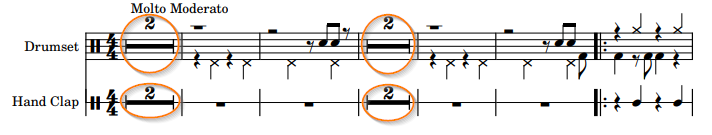
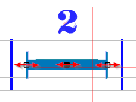

# Multi-Measure Rest
{: .no_toc }
{: .d-inline-block }
since 5.3
{: .label }

A multiple measure rest  indicates a rest of more than one measure.

---
Table of contents
{: .text-epsilon }
1. TOC
{:toc}
---

## Example

It is drawn as a thick horizontal line centered on staff middle line
with serifs at both ends, completed by a time-like number drawn above the staff.

In the example above, we have instances of multiple measure rests, on 5-line and 1-line staves.

## Editing

If not detected, we can still assign or drag a multiple rest item from the shape palette
in its ``Rests`` set:

A double-click on a multiple rest enters its fairly limited editing status: 
- Vertically, the item remains stuck to the staff mid-line,
- Horizontally, the mid handle can translate the whole item, while a side handle can resize it.

And, as for [bar repeats editing](bar_repeat.md#editing), the measure count item can be assigned
or dragged from the shape palette in its `Times` set.

## Model

Since release 5.3, with no need for a specific processing switch,
the multiple rests should be detected (during the `BEAMS` step), 
together with the related measure count number (during the `SYMBOLS` step).

NOTA: If the engine cannot recognize the measure count number,
the multiple rest is set in the "*abnormal*" status.
It is consequently displayed in red, as in the picture below,
where the symbol "8" was not recognized:

And during the reduction performed by the following step (`LINKS`),
all *abnormal* inters are deleted, including the multiple rest shown above!

To remedy this, starting with version 5.8, if no measure count is recognized or provided manually:
1. The multiple rest is **not** deleted
2. It is still exported in MusicXML format, but with a **default count** of 1,
and a warning is issued to the user, like:
> Measure{#25} Multirest with no measure count, using default value 1

We can always manually fix that by selecting the "8" glyph and assigning it the shape 8 (TIME_HEIGHT), either via the popup Glyphs menu, or via the Times shapes palette:

Note the multiple rest is no longer displayed in red,
and it will be exported in MusicXML with the correct count of 8 measures.
