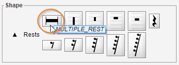

# Multi-Measure Rest
{: .no_toc }
{: .d-inline-block }
since 5.3
{: .label }

A multiple measure rest  indicates a rest of more than one measure.

---
Table of contents
{: .text-epsilon }
1. TOC
{:toc}
---

## Example

It is drawn as a thick horizontal line centered on staff middle line
with serifs at both ends, completed by a time-like number drawn above the staff.

In the example above, we have instances of multiple measure rests, on 5-line and 1-line staves.

## Model

Since release 5.3, with no need for a specific processing switch, these multiple rests are detected
together with the related measure count number.

## Editing

If not detected, we can still assign or drag a multiple rest item from the shape palette
in its ``Rests`` set:

A double-click on a multiple rest enters its fairly limited editing status: 
- Vertically, the item remains stuck to the staff mid-line,
- Horizontally, the mid handle can translate the whole item, while a side handle can resize it.

And, as for [bar repeats editing](bar_repeat.md#editing), the measure count item can be assigned
or dragged from the shape palette in its `Times` set.

