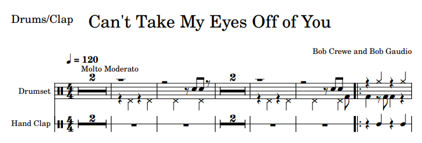
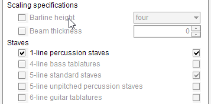

# Snippets
{: .no_toc }
{: .d-inline-block }
new in 5.4
{: .label .label-yellow }

Tiny pieces of music can be found on the Internet, generally for illustration purpose.
For example, this [Wikipedia page](https://en.wikipedia.org/wiki/Fandango) is about the Fandango dance.
It provides some explanation text, a picture of fandango dancers and a snippet of music score to
describe the specific fandango rhythm:

For the Audiveris OMR engine, the processing of such a tiny score brings a few challenges.

---
Table of contents
{: .no_toc .text-epsilon }
1. TOC
{:toc}
---

## Challenges

Let's have a closer look at this image (By Hyacinth, CC BY-SA 3.0, https://commons.wikimedia.org/w/index.php?curid=27409005):

### Interline

If we naively launch Audiveris on this input image, we almost immediately get this alert message:

The engine complains about a too low interline value of 9 pixels.
This message is issued by the ``SCALE`` step, whose main task is to retrieve the sheet "interline value",
which is the main vertical distance, in pixels, between two staff lines.

This is a key value, because it determines the general scale of the image, and will drive the following steps
such as the heads recognition.

It is retrieved by the ``SCALE`` step, via the analysis of the so-called "combo histogram", 
populated with the vertical runs lengths of the image.
The engine measures any vertical black run followed by a vertical white run.
The total length is recorded in the combo histogram, which then exhibits a very visible peak at the
interline value.
For further details, please refer to the [Sheet scale chapter](../main/sheet_scale.md).

But in the case of our snippet, the image contains just one staff line.
Therefore, there is no physical "interline" the engine could retrieve.

For the sake of completion, here below are the black histogram and the combo histogram:

| Legend | Histogram|
| :---   | :---:|
|The black histogram gives correct values for the typical staff line height (4 pixels) and the typical beam height (16 pixels) |  |
|The combo histogram should give the typical interline value, but provides only erratic values | |

### Barline height

Another consequence of the lack of multi-line staves in the input image concerns the typical
barline height that the engine should expect.

For a multi-line staff, any barline is expected to go from the top staff line to the bottom staff line.
But what if the staff at hand is a 1-line staff? This is no upper line or lower line.
So, how far should the OMR engine expect a barline to go above and below the single staff line?

In our snippet example, we have two barlines, one at the center and one at the right side of the staff.
They both go from roughly one head height above to one head height below the line.
We use the notion of "head height" to replace the lacking notion of interline.
These barlines thus have a height of about 2 "interlines".

But let's consider this other example, with a 5-line staff and a 1-line staff: 

The typical barline height for the 1-line staff is here the same as for the 5-line staff, that is 4 interlines.

## Specifications

Since the engine has no way to guess by itself the needed values of interline and barline height, we have to tell the engine which values to use for the image at hand.

This can be performed via the {{ site.book_parameters }} menu as follows:

| Comment | Dialog |
| :---    | :---:  |
| 0/ Initial dialog,  by default the engine expects standard 5-line staves  |  |
| 1/ The 1-line switch has been selected,  the "Barline height" field appears |  |
| 2/ Barline height set to "two" interlines |  |
| 3/ No multi-line staff in image,  the "Interline" field appears    |  |
| 4/ Final dialog content   |  |

Regarding the "Barline height" field, the dialog prompts for a value among four possibilities:
- ``four``: This is the default value of 4 interlines, as seen on typical standard staves.
The other possibilities can apply to 1-line staves only.
- ``twoThenFour``: Barlines are 4 interlines high, except a half-size for the starting barline (either 2 above or 2 below)
- ``two``: All barlines are 2 interlines high, as in our snippet example.
- ``oneThenFour``: Barlines are 2 interlines high, except a half-size for the starting barline (either 1 above or 1 below)

Regarding the "Interline" field, it appears when we explicitly tell the engine that there is no standard 5-line staves, and thus there are only 1-line staves in the image.
Hence the need for the user to enter an interline value.  
We have to measure the typical height of a note head or half the typical height of a barline.
We can do so by drawing a lasso either in the Binary tab, or in the Data tab (once the Pixel board has been opened).  
This gives about 31 pixels for our snippet example.

## Transcription

Once the book parameters are correctly set, the snippet gets perfectly transcribed.
Here is the final result using the MuseScore plugin:

