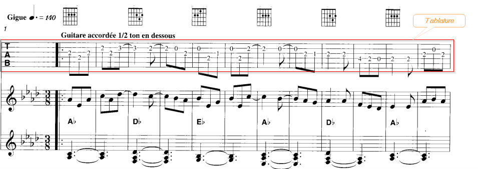
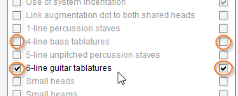

# Tablature
{: .no_toc }
{: .d-inline-block }
since 5.3
{: .label .label-white }

A *tablature* is a special kind of staff that represents the physical locations
of strings and frets to be pressed.

---
Table of contents
{: .text-epsilon }
1. TOC
{:toc}
---

## Example

This tablature example contains 6 lines, and corresponds to a 6-string guitar.  
There exist also tablatures for 4-string bass guitar, represented with 4 lines.

While a standard staff would begin with a clef (G, F or C), this tablature staff begins
with a "TAB" indication.

## Detection

By default, tablatures are not detected.  
To enable their detection, we have to explicitly set the processing switches
(either or both the 4-line or 6-line tablatures as depicted below):

The GRID step of OMR engine detects clusters of regularly spaced horizontal lines.  
Typically a cluster of 5 lines is considered as a "standard" 5-line staff.

If properly enabled, 4- or 6-line clusters are detected as "tablatures" staves.

## Processing

There is no processing *per se* by the OMR engine.

The tablature is merely identified as such and its staff area is carefully ignored by any
subsequent processing.

There is thus no risk of false detection of notes, slurs, text, symbols, etc in this area.

{: .highlight }
The ignored  area is defined by the tablature staff augmented by a slight vertical margin
(this area is indicated by a red rectangle in the example).
But there is no way yet to ignore the pixels from stems or beams located **outside**
the tablature.  
Perhaps a broader solution would be to let the user interactively **blacklist**
certain image areas, starting with properly defined tablature areas.
In the example shown, it could also apply to these guitar chord diagrams that appear
just above the tablature.
  
