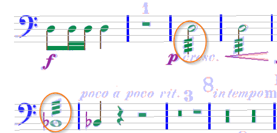
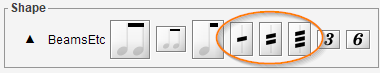

# Tremolo
{: .no_toc }
{: .d-inline-block }
since 5.3
{: .label }

Since release 5.3, Audiveris can handle tremolos as depicted below:

A tremolo is composed of 1, 2 or 3 slanted segments.

It must be horizontally aligned with a chord, either a stem-based chord or a stem-less chord.
Both cases are shown in picture above.

{: .warning }
Audiveris does not yet address the case of tremolos located _**between**_ two chords,
as shown in the picture below, stolen from Wikipedia:  

If the OMR engine has not recognized a tremolo, we can always assign or drag the desired
tremolo from the shape palette, using the ``BeamsEtc`` shape set.

Tremolo editing is limited to translations of the item, which will snap on compatible
chords nearby.
