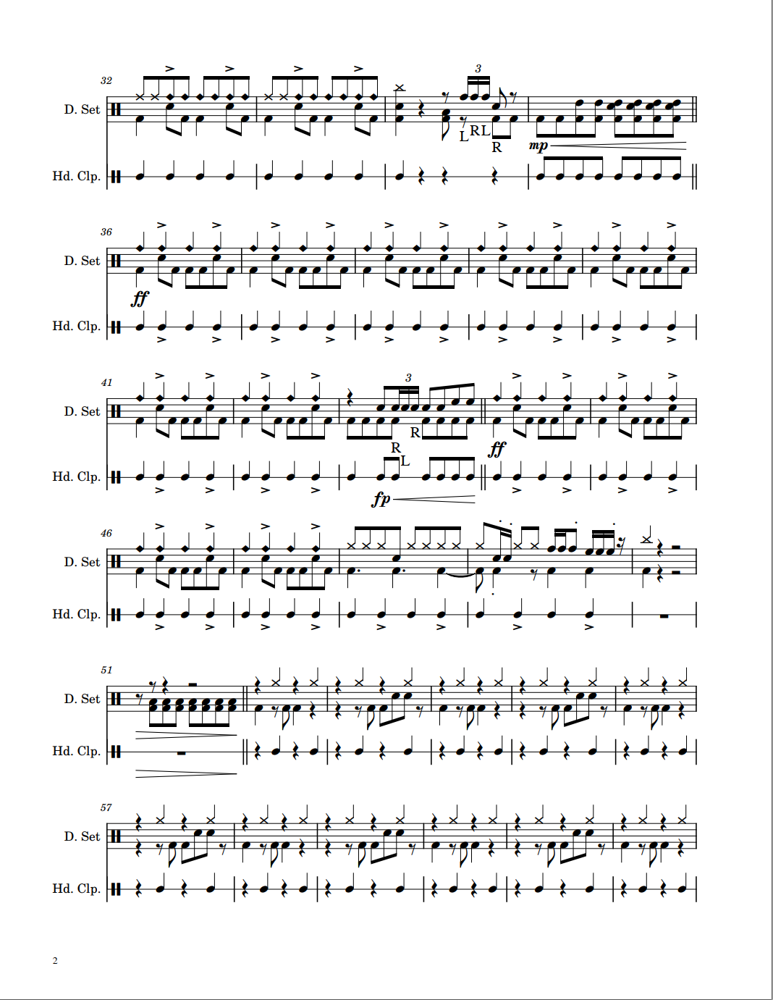
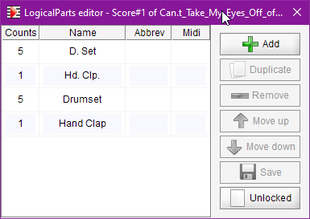

# Can't Take My Eyes Off of You
{: .no_toc }

This case is one of the examples discussed on [issue #33](https://github.com/Audiveris/audiveris/issues/33)
posted on Audiveris forum, dedicated to the support of drum notation.

[Input file available here](https://github.com/Audiveris/audiveris/files/8421680/Can.t_Take_My_Eyes_Off_of_You-Drums%2BClap.pdf)
{: .btn .text-center }

Main score specificities:
- Book of 3 sheets
- Drum notation on 5-lines staves and 1-line staves
- Multiple-measure rests
- Measure repeats

Main UI actions:
- Selection of proper book parameters for drum notation
- Customization of drum-set mapping
- Fix missing rests in original input
- A few symbols to fix
- Editing of logical parts

---
Table of contents
{: .text-epsilon }
1. TOC
{:toc}
---

## Input

{: .highlight }
If you are reading this handbook via a web browser,
you can ask the browser to display each of these sheet images in a separate tab.

| Sheet ID | Input image |
| :---: | :---: |
| Sheet#1 |  |
| Sheet#2 |  |
| Sheet#3 |  |

## Book parameters

Based on a first look at the input score, we can select the proper book parameters,
via the {{ site.book_parameters }} dialog:


We select the **whole book** tab, not just the first sheet tab, because selections will
need to apply to all sheets in book.

Here are the modifications made:
- We select a ``Serif`` font for better consistency with the input font.
- For OCR, ``eng`` and ``ita`` languages are all we need
- We select **both** 1-line percussion and 5-line unpitched percussion staves
- We don't keep lyrics, since there are none in this score

{: .note }
We don't need to also select the "Cross note heads", because we have selected the 
percussion staves. This "Cross note heads" feature is meant for cross heads on *standard* staves.

## Customized drum-set

Since we are dealing with drum notation, we check the default drum-set.xml specifications.
It is available in the Audiveris ``res`` (resources) folder.
Its content is also displayed in [this handbook section](../../../specific/drums.md#appendix).

The default specifications should be OK for the 5-line staff (named Drumset in the input).

However, the 1-line staff in the input is named "Hand Clap", so we will specify the
hand clap "instrument" for an oval on mid-line (pitch-position 0).

In the default ``drum-set.xml``, we have (excerpt):
```xml
    ...
  <staff line-count="1">
    <entry pitch-position="0"  motif="oval"    sound="null"/> <!-- Just a place-holder -->
  </staff>
    ...
```
Which basically means that no instrument is defined for a 1-line percussion staff.

So, we create a "personal" ``drum-set.xml`` that provides one overriding definition:
```xml
<?xml version="1.0" encoding="UTF-8" standalone="yes"?>
<!-- My personal drum-set.xml-->
<drum-set>
  <staff line-count="1">
    <!-- Specific definition for Hand_Clap on the 1-line staves -->
    <entry pitch-position="0" motif="oval"  sound="Hand_Clap"/>    
  </staff>
</drum-set>
```
And we put this file in the user Audiveris ``config`` folder.  
On my Windows PC, the path to this folder is precisely:
> C:\Users\herve\AppData\Roaming\AudiverisLtd\audiveris\config

And that's it.
Audiveris will pick up this personal `drum-set.xml` file and load it to complete
and/or replace the definitions provided by the default `drum-set.xml` file.

## Raw results

We launch the whole book transcription, for example via {{ site.book_transcribe }}.

Two minutes later, we get:

| Sheet ID | Raw result |
| :---: | :---: |
| Sheet#1 |  |
| Sheet#2 |  |
| Sheet#3 |  |


## Manual corrections

### Sheet #1

|| Header Text  |
| :---: | :---: |
| Before | |
| After  | |

At the very beginning of sheet #1, we can see some header text partly recognized:
- "**Drums/Clap**": Not recognized.  
  We select the text with a lasso, then in the ``Physicals`` palette in the shape board 
  we double-click on the ``text`` button.
  This manually calls the OCR on the selected text which is this time well recognized.  
  The `Inter` board now presents the sentence "Drums/Clap" and proposes ``CreatorLyricist``
  as its role. We manually change this role to ``Number``.
- "**Can't Take My Eyes Off of You**": The apostrophe is mistaken for a separate "v" sentence.  
  We select both sentences with a lasso and press the ``Delete`` key to remove them.  
  With the underlying glyphs still selected, we double-click on the ``text`` button.
  The text is correctly OCR'ed as a single sentence and its role correctly set as ``Title``.
- ~~"**&#119135; = 120**": Recognized as "J: 120".  
  This is due to the quarter character (**&#119135;**) which the OCR does not handle correctly.  
  And there is currently no way to fix this.~~  
- "**Molto Moderato**": Correctly OCR'd and assigned the ``Direction`` role.
- "**Bob Crewe and Bob Gaudio**": Correctly OCR'd and assigned the ``CreatorComposer`` role.

{: .highlight }
UPDATE:  
With 5.4 release, the sentence "**&#119135; = 120**" is now correctly recognized as a metronome indication, meaning 120 quarters per minute.


Regarding rhythm, we have 3 measures displayed with a pink background.
Their (local) ids are measures 4 and 8 in the first system and measure 27 in the last system.

We use {{ site.view_voices }} so that each voice is displayed in a specific color.

|| Measures 3 & 4 |
| :---: | :---: |
| Before | |
| After  | |

Measure 3: We observe a missing whole rest at the beginning of the measure.  
- Detection failed because the whole rest is located out of the staff height.  
- We select the glyph and assign it the WHOLE_REST shape using the
``Rests`` palette in shape board.

Measure 4: we can see the input lacks 2 quarter rests. 
This is especially obvious when compared with measure 3.
- So, we use a drag & drop to manually insert these missing quarter rests
(this insertion triggers a RHYTHM re-processing for the containing measure which
now shows a correct result in timing and voice mapping).

Measures 7 and 8: They are identical to measures 3 and 4, they need identical corrections.

|| Measure 27|
| :---: | :---: |
| Before | |
| After  | |

Measure 27: A cross-head is missing, replaced by a strong accent.  
- We delete the strong accent
- We select the stem glyph and assign it the stem shape
- We then insert a cross-head dragged from the ``HeadsAndDot`` palette in shape board.  
- We also assign the accent just above this note
(for example by selecting the underlying glyph, which triggers the glyph classifier;
the ``Accent`` shape button appears in first place in the glyph classifier board;
we simply press this ``Accent`` button).

|| Measure 31|
| :---: | :---: |
| Before | |
| After  | |

Measure 31: This last measure contains a direction word ("sloppily") OCR'd as "s oppi y".  
- To fix this, the best way is to grab this item with a lasso, which selects the item
as well as the underlying glyphs.  
- We then delete the item
- With the underlying glyphs still selected, we manually run OCR
via a double click on the "``text``" button in the ``Physicals`` set of the shape board.
- We then assign the sentence role as ``Direction``.

### Sheet #2

Just one measure (29) is displayed in pink.

|| Measure 29|
| :---: | :---: |
| Before | |
| After  | |

This is due to an 8th rest mistaken for a pair of augmentation dots.  
- With a lasso, we select the 8th rest underlying glyphs as well as the two dot items,
- We deassign the selected items,
- And click on the EIGHTH_REST button which appears at the top of the glyph classifier board.

|| Measure 4|
| :---: | :---: |
| Before | |
| After  | |

Measure 4: A missing crescendo wedge.  
- We select the underlying glyph and use a double-click on the crescendo button
in the ``Dynamics`` palette of the shape board.

A similar action fixes another missing crescendo below measure 12.

### Sheet #3

|| Measure 5|
| :---: | :---: |
| Before | |
| After  | |

Measure 5: A triple forte (fortississimo) is not recognized, because Audiveris
doesn't go beyond fortissimo. [^fortississimo] 
- So, we manually select just a fortissimo, for lack of a better choice.

Measure 6: a "sloppily" direction OCR'd as "s oppy y".
- See similar action in sheet 1.

Measure 10: a missing crescendo sign.
- See similar action in sheet 2.

|| Measure 16|
| :---: | :---: |
| Before | |
| After  | |

Measure 16: An "8" character is mistaken for the start of an octave shift.  
- We simply delete it.

|| Measure 25|
| :---: | :---: |
| Before | |
| After  | |

Measure 25: A missing quarter note.  
- We select the stem glyph and assign it via a double-click on the stem button
in the "``Physicals``" palette in the shape board.  
- Then we drag a cross-head from the "``HeadsAndDot``" palette in the shape board
into the proper location (the needed ledger line gets created automatically)

## Logical parts

If we naively export our work to say MuseScore, we get something that starts like:


That is, for the OMR engine we have 4 separate logical parts:
- D. Set
- Hd. Clp.
- Drumset
- Hand Clap

And indeed, if within Audiveris we open the
[logical parts editor](../../../specific/logical_parts.md#editing-of-logical-parts),
we get this dialog:



Due to the OMR engine's limited capabilities, there is no way to detect that "D. Set" and "Drumset"
refer to the same logical part.

Let's do this manually:
1. We select the first logical (D. Set) and copy its name
2. We then select the third logical (Drumset) and paste into the Abbrev field the copied name
3. We do the same between (Hd. Clp.) logical and (Hand Clap) logical
4. We can now remove the first 2 logicals (D. Set and Hd. Clp.)
5. We save (and thus lock) the logicals configuration


We can finally apply the new configuration, with the logicals now locked:


No mapping warning is issued.

Export to MuseScore or Finale is now OK.  
The first page in Finale looks like:


[^fortississimo]: We will need to add the fortississimo shape to Audiveris and retrain its glyph neural network with enough representative samples.