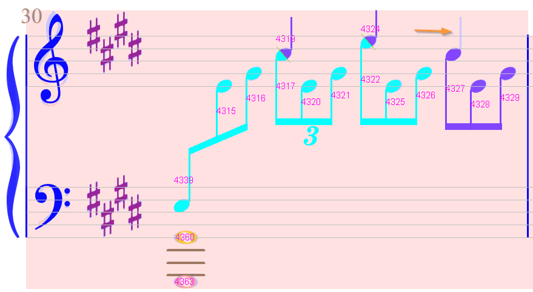
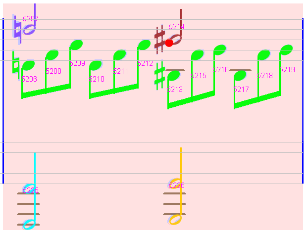
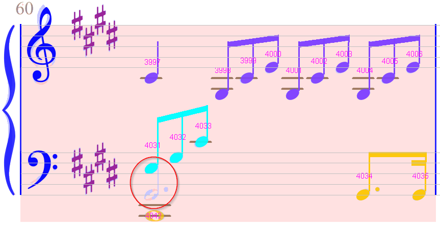

# Moonlight sonata
{: .no_toc }
{: .d-inline-block }
new in 5.4
{: .label .label-yellow }

This famous *Sonata No. 14 "Moonlight"*, 1st movement,
is a typical example of a score with implicit tuplets.
The OMR engine is able to detect most of them but not all, so some user guiding actions are needed.

[Input file available here](https://www.free-scores.com/download-sheet-music.php?pdf=282)
{: .btn .text-center }

It is one of the numerous free scores (190 000+  as of this writing)
available on the  [free-scores.com](https://www.free-scores.com/) site.

Main score specificities:
- Book of 5 sheets
- Lots of implicit tuplets

Main UI actions:
- Use of the `Chords` popup menu to fix voices,
notably `Next in voice`, `Separate voices` and `Preferred voice` actions
- Manual insertion of tuplets

---
Table of contents
{: .text-epsilon }
1. TOC
{:toc}
---

## Input

Here is the first image of a total of 5:

| Sheet ID | Input image |
| :---: | :---: |
| Sheet#1 |  |

## Book parameters

The input score has a "common cut" time signature (2/2),
while each measure is made up of a sequence of 4 linked triplets.
But none of these triplets is explicitly marked with a "3" tuplet sign.

So we'll have to rely on the OMR engine to detect which groups of notes
should be considered *triplets*.

Before launching the transcription, we have to set a few things in the book parameters:
- First, the settings should apply to the entire book,
and not only to the (current) first sheet.
So, we make sure to select the "Moonlight" book tab rather than the "S#1" sheet tab.
- The `Text font` is set to `Serif` rather than the default `Sans Serif` font.
This has no impact on the OCR efficiency,
the effect is mainly a more faithful display of texts.
- The `Input quality` is set to `Synthetic` rather than the default `Standard`.
This higher quality results in a more strict checking and thus less mistakes.
- Finally, setting the `Implicit tuplets` to ON is absolutely mandatory!

We can save the book right now, to save the book parameters with it.

## Raw results

We can launch transcription of the entire book,
for example via the {{ site.book_transcribe }} pull-down menu.

With Audiveris 5.4, the transcription took exactly 2 minutes for 5 sheets
on a 14-year old laptop running Windows 10.

We use the {{ site.view_voices }} menu item to display voices with different colors,
and the {{ site.view_chords }} item to display the chord numeric IDs.

| Sheet ID | Raw results |
| :---: | :---: |
| Sheet#1 |  |
| Sheet#2 |  |
| Sheet#3 |  |
| Sheet#4 |  |
| Sheet#5 |  |

## Sheet #1

No measures to fix.

## Sheet #2

One measure in pink

### Measure #12

Here we have a mess on the lower left side:
- A non-recognized beam
- A false note head
- A tuplet sign

We first delete the note head and the tuplet sign:

We then assign the Beam shape to the underlying glyph.

We enter the edit mode via a double click on the beam, to extend the beam to the left,
until it embraces the left-most stem
(at this point the beam shows 3 links to the embraced 3 stems).

And the measure turns white.

However, the upper staff exhibits 2 unrecognized quarter rests
and the lower staff a missing whole head.

We assign each of the quarter rests for example by clicking on the underlying glyph, 
which triggers the glyph classifier, and we simply click on the top 1 shape (quarter rest).

For the non-recognized whole head, we have no correct underlying glyph.
So, we simply drag a whole head from the ShapeBoard and drop it on the proper location.

We could stop at this point, because it's OK as far as the rhythm is concerned.

We can also further refine the result with two actions:
- At the bottom of the lower staff, we could decide to merge the 3 whole heads into a single chord.
To do so, we select the 3 whole heads, then in the pop-up `Chords` menu, we select the `Merge` action.

- Between upper and lower staff, we can consider that the quarter note
(chord #5358 in voice 5 cyan) should rather belong to the voice 1 (blue).
To do so, we use the `Next in voice` action twice:
    - Between the last quarter #5318 of previous measure and the chord #5358
    - Between chord #5358 and the first quarter rest #5955 in the upper staff.

Here is the final status of this measure:
 

### Measures #1, #2, #3

Let's have a look back at the top of this page, the system #1:

 

All measures in this system are displayed in white and would be correctly exported.

However, we can notice that the "intermediate" voice varies between the three measures of the system:
- Green (voice #2) in measure #1
- Cyan (voice #5) in measures #2 and #3

And similarly, the "lower" voice appears in cyan (voice #5) in measure #1
and in orange (voice #6) in the following two measures.

We may wish to further improve this system.

The current policy of the rhythm algorithm is to assign the voice number
at the very beginnning of a measure according to:
- The containing staff (1-4 for staff #1, 5-8 for staff #2)
- The vertical rank within the staff.

We can override this policy via two ways:
- Within the *same* system, we can use the `Next in voice` action between
the last note of a measure and the first note of the following measure, 
- At the *beginning* of a system, we can use the `Preferred voice` action on the note
of a starting chord to assign an absolute voice number.

 

Doing so for the "intermediate" and for the "lower" voices, we get this final result:

 

## Sheet #3

We have four measures to fix.

### Measure #3

We can observe that the 3 first chords in the upper staff should have a tuplet.

We manually insert a tuplet-3, dragged from the Shape board (the `BeamsEtc` subset)
and dropped at proper location.

{: .highlight }
While being dragged, a tuplet is displayed with its potential links with the embraced chords.
These links, shown as green dashed lines,
are a good visual aid to decide where to precisely drop the tuplet.

We can notice that this manual fix at the start of the measure resulted
in the automatic insertion of the last implicit tuplet at the end of the measure.

### Measure #4

On the upper right, a stem has not been detected.

We select the underlying glyph and in the Shape board (Physicals set)
we double-click on the stem button.

We now have a note head with two stems, one linked on the head left side,
and the other (the new one) on the head right side, but not yet linked.

To link head and stem, we press the mouse on the stem, drag to the head and release the mouse.

The physical note head is now split into 2 logical half-heads, and the measure turns white.

### Measure #5

We have missing implicit tuplets on two locations.

So, we manually insert a tuplet of the left location (at the beginning of the measure).
The second (implicit) tuplet is automatically inserted.

### Measure #11

A false slur detected (to be manually deleted)
and a bass clef not detected (to be manually assigned).

Regarding the tuplets, there is none, certainly due to the complexity at the end of the measure.

So we insert them manually from left to right.

When the 3rd one is inserted between the down eighth and the down quarter,
the measure turns white with the upper tuplets automatically inserted:

## Sheet #4

Just one measure to fix.

### Measure #9

A small glyph has been mistaken for a dot, considered as an augmentation dot.

This kind of error is not often easy to detect visually.
This is why we now have a view option, activated via the {{ site.view_jumbos}} menu
or the `F7` function key.  
When set to ON, all the augmentation dots are highlighted as big red dots,
as in the following picture:

All we have to do now is to delete this false augmentation dot.

## Sheet #5

Two measures to fix.

### Measure #4

A dotted half-note is missing.
We can drag a half-note from the Shape board:

And assign the augmentation dot.

The dotted half-note is now fixed, but we still have no implicit tuplets.

We could manually insert them, but there is an easier way: by voice chaining
the beamed notes on the left of the lower staff with the beamed notes on the upper staff.

And voila:

### Measure #11

No implicit tuplet has been detected.

We have to insert them manually, from left to right.

The first manual tuplet has been automatically followed by an implicit one.

We finally insert the two missing tuplets on the second staff.

## Conclusion

A few remarks, to conclude this editing session.

Regarding precise **tuplet location**:
- We cannot modify the location of an implicit tuplet sign.  
We can put the sign in `Edit` mode and shift it,
but as soon as we leave the `Edit` mode, the containing measure is re-processed,
resulting in the removal of all implicit tuplets and the creation of new ones
at the same locations...
- To actually modify a tuplet location, we have to manually insert a tuplet
-- typically over the implicit one.
This results in a manual (non-implicit) tuplet at the desired location.  
Moreover, this manual tuplet can be further edited if needed.

Regarding **voice number**:
- We have seen how to generally guide the rhythm algorithm
-- see [this section](#measures-1-2-3) above in this chapter.
- The action `Next in voice` can work only within the same system,
but can cross measure boundaries.
- The link it establishes is dynamic, from the left partner to the right partner.
In other words, if we change the voice number in a measure,
it will impact the linked voice in the following measure.
- Between systems (and *a fortiori* between pages or sheets),
the action `Next in voice` cannot apply,
only the static action `Preferred voice` is available.

Regarding the **implicit tuplets**:
- The raw transcription of this "Moonlight Sonata" resulted in:
    - 68 measures processed (all requiring implicit tuplets),
    - 3 measures in error because of mis-recognized symbols (we don't count them),
    - 5 measures in error because of missing tuplets,
    - 60 measures OK with implicit tuplets  
    which gives a success rate of 60/65, that is 92%.
- The "implicit tuplets" algorithm can still be improved, but it is usable right now.  
It is recommended to reserve it for selected scores and to be prepared for manual corrections
as we did in this session.
