# O lux beata Trinitas
{: .no_toc }

{: .note }
You will notice that the description of user editing is very detailed in this example, perhaps too much.
This was done on purpose, so that the session content could be used as an introductory material.

The case at hand describes the processing of an old office hymn available on the IMSLP site.
You can download it directly via the button below:

[Input file available here](https://imslp.org/wiki/O_lux_beata_Trinitas_(Alberti%2C_Johann_Friedrich))
{: .btn .text-center }

The case originated from [issue #481](https://github.com/Audiveris/audiveris/issues/481)
posted on the Audiveris forum, which led to several discussions and engine improvements,
and finally its integration as a UI example into the Audiveris handbook.

The main score specificities:
- Book of 3 movements over 5 sheets
- Non-standard time signature
- Whole rests that are not measure-long rests
- Voice sequences of whole note heads

The main UI actions:
- Use of "partial whole rests" option
- Common-cut (2/2) replaced by 4/2 time signature
- Missing half notes and whole notes
- Chords with no time offset
- Voice alignment

---
Table of contents
{: .text-epsilon }
1. TOC
{:toc}
---

## Program launch

There are many ways to install/build then launch the Audiveris program, depending on our environment.

If we haven't done so, we select [Audiveris releases on github](https://github.com/Audiveris/audiveris/releases) to retrieve the latest release.

Under Windows, we can simply run the installer (for example Audiveris_Setup-5.2.2-windows-x86_64.exe
).
Under Windows, Linux and macOS, we can decide to clone the Audiveris project locally and then build it.
In any case, we will have to make sure that a proper Java version is installed.

Here are the first messages displayed, when pressing the Windows start icon,
selecting the Audiveris folder, then the Audiveris program:

```
Audiveris version 5.2.2

LogUtil. Property logback.configurationFile not defined, skipped.
LogUtil. Configuration found C:\Users\herve\AppData\Roaming\AudiverisLtd\audiveris\config\logback.xml
LogUtil. Logging to C:\Users\herve\AppData\Roaming\AudiverisLtd\audiveris\log\20210710T121739.log

Loaded plugins from C:\Users\herve\AppData\Roaming\AudiverisLtd\audiveris\config\plugins.xml
Classifier loaded XML norms.
Classifier data loaded from default uri file:///D:/soft/audiveris-github/development/res/basic-classifier.zip
Versions. Poll frequency: Weekly, next poll on: 17-Jul-2021
```

Some quick explanations about these early messages :

1. Program version (e.g. 5.2.2)
2. Logging:   
   - Logging can be customized, here we are using a user-defined configuration file.  
   - All session messages are also written into a dedicated user file,
     named according to session date and time (e.g. 20210710T121739.log)
3. Configuration:   
   - User plugins if any to ease access to companion programs like MuseScore, Finale, etc.
   - Glyph classifier trained data.
4. Check for new version on the GitHub site

## Initial processing

1. Let's load the input file O.lux.beata.Trinitas.Alberti.Johann.Friedrich.pdf into Audiveris 5.2.    
   A quick look at the images shows it is of rather good quality.   
   So, via {{ site.book_transcribe }} menu item, let's launch the whole book transcription...   
   Done in 2 min 30 sec, about 30 sec per sheet.

2. The last message says `[O.lux.beata.Trinitas.Alberti.Johann.Friedrich] Scores built: 3` which
   means that 3 movements have been transcribed in this book.

3. Before getting into user actions, let's save the current project status,
   via the command `Book → Save Book` or the command `Book → Save Book as...`.   
   We choose the latter to shrink the project name from "O.lux.beata.Trinitas.Alberti.Johann.Friedrich"
   to simply "Trinitas".
   ```
   [O.lux.beata.Trinitas.Alberti.Johann.Friedrich] Stored /book.xml
   [O.lux.beata.Trinitas.Alberti.Johann.Friedrich] Stored /sheet#1/BINARY.png
   [O.lux.beata.Trinitas.Alberti.Johann.Friedrich] Stored /sheet#1/sheet#1.xml
   [O.lux.beata.Trinitas.Alberti.Johann.Friedrich] Stored /sheet#2/BINARY.png
   [O.lux.beata.Trinitas.Alberti.Johann.Friedrich] Stored /sheet#2/sheet#2.xml
   [O.lux.beata.Trinitas.Alberti.Johann.Friedrich] Stored /sheet#3/BINARY.png
   [O.lux.beata.Trinitas.Alberti.Johann.Friedrich] Stored /sheet#3/sheet#3.xml
   [O.lux.beata.Trinitas.Alberti.Johann.Friedrich] Stored /sheet#4/BINARY.png
   [O.lux.beata.Trinitas.Alberti.Johann.Friedrich] Stored /sheet#4/sheet#4.xml
   [O.lux.beata.Trinitas.Alberti.Johann.Friedrich] Stored /sheet#5/BINARY.png
   [O.lux.beata.Trinitas.Alberti.Johann.Friedrich] Stored /sheet#5/sheet#5.xml
   [O.lux.beata.Trinitas.Alberti.Johann.Friedrich] Book stored as D:\soft\cases\Issue-481\Trinitas.omr
   ```
4. Top of the Audiveris window is now like this:   
   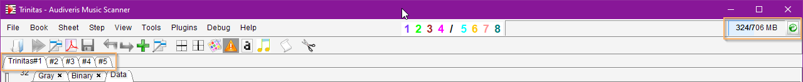   
   Notice the "memory meter" on the window upper right corner which gives 324/706 MB.  
   Notice also that we have the 5 sheets of the Trinitas book in memory.
   This is indicated by the 5 tabs on the window left side:
   there are 5 tabs because the book contains 5 sheets, and these tabs appear in standard font
   because they are currently loaded.   
   Five sheets is not a really high number, but let's do something to save on memory, an action
   specifically useful for books with dozens of sheets or more:   
   The command {{ site.book_swap }} gets rid of all sheets from memory
   -- except the current sheet -- after storing them to disk if needed.   
   ```
   Disposed sheet#2
   Disposed sheet#3
   Disposed sheet#4
   Disposed sheet#5
   ```
   The Audiveris window has changed:
   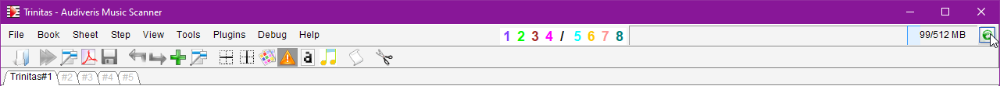   
   All tabs, except tab #1, now appear in gray and the memory meter now shows 99/512 MB.
   We can select again any of these gray tabs, and the corresponding sheet gets reloaded from disk.
   ```
   [Trinitas#2] Loaded /sheet#2/sheet#2.xml
   [Trinitas#3] Loaded /sheet#3/sheet#3.xml
   [Trinitas#4] Loaded /sheet#4/sheet#4.xml
   [Trinitas#5] Loaded /sheet#5/sheet#5.xml
   ```   
   If we look carefully, we can see that, even with all sheets back in memory, the total memory
   consumption is just 164/531 MB, far below the initial 324/706.
   This is so because a bunch of transient data, needed to transcribe sheets, is no longer needed
   and has been disposed of, via the store/reload process.

   Even more efficiently, we could also:
   1. Close the book using the {{ site.book_close }} command (or `Ctrl+W` shortcut).
      We would be prompted to save the book if needed.
   2. Reopen the latest closed book (at its latest opened sheet), via the
      `Book → Most recent book` command (or `Ctrl+Shift+T` shortcut).
   3. Going through all book sheets, the total memory would stay at about 105 MB.

## Raw results

Here are the sheet results, right out of the OMR engine:   
We have selected {{ site.view_voices }} or `F8` command so that voices in the same part
are displayed in different colors.

{: .note }
If you are reading this handbook via a web browser,
you can ask the browser to display each of these sheet images in a separate tab.

| Sheet ID | Raw result |
| :---: | :---: |
| Sheet#1 | 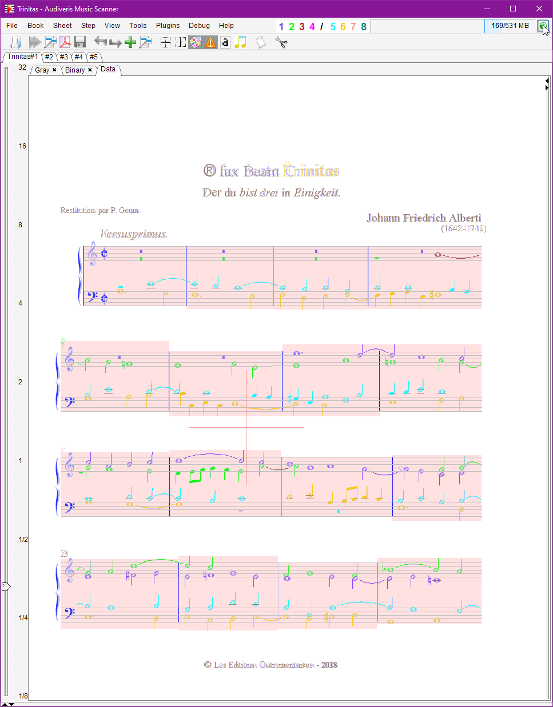 |
| Sheet#2 | 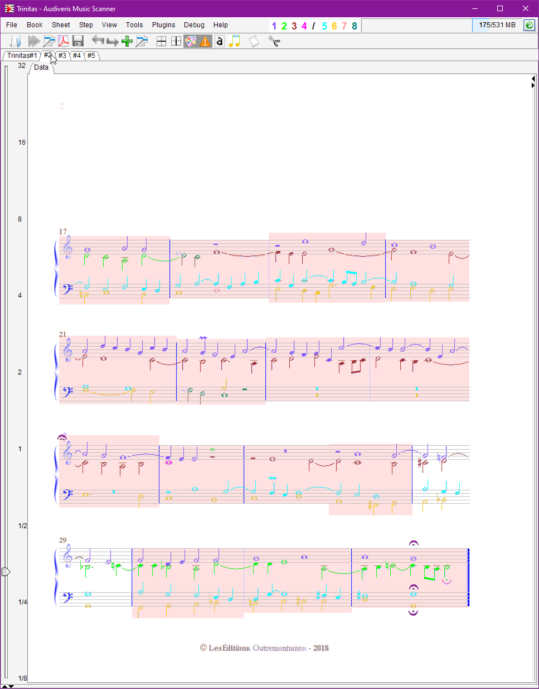 |
| Sheet#3 | 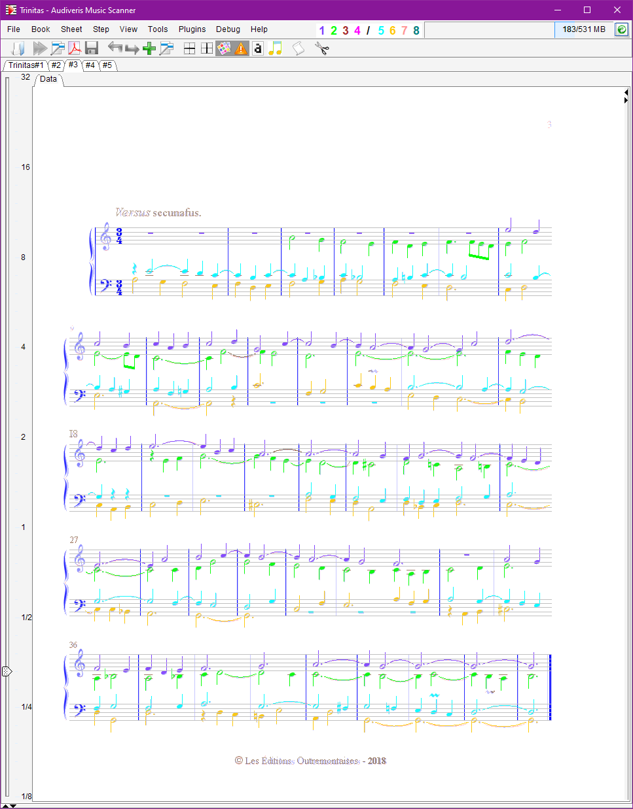 |
| Sheet#4 | 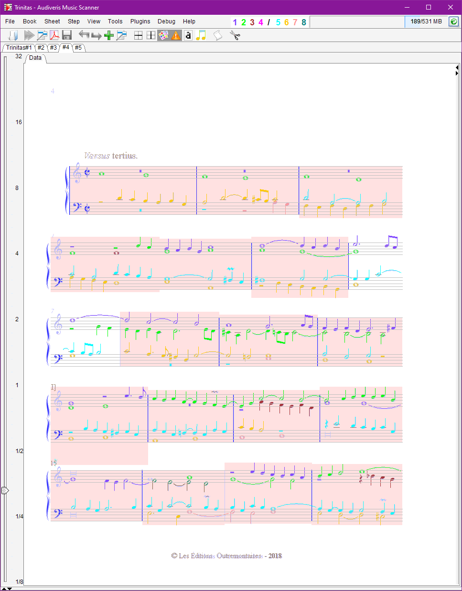 |
| Sheet#5 | 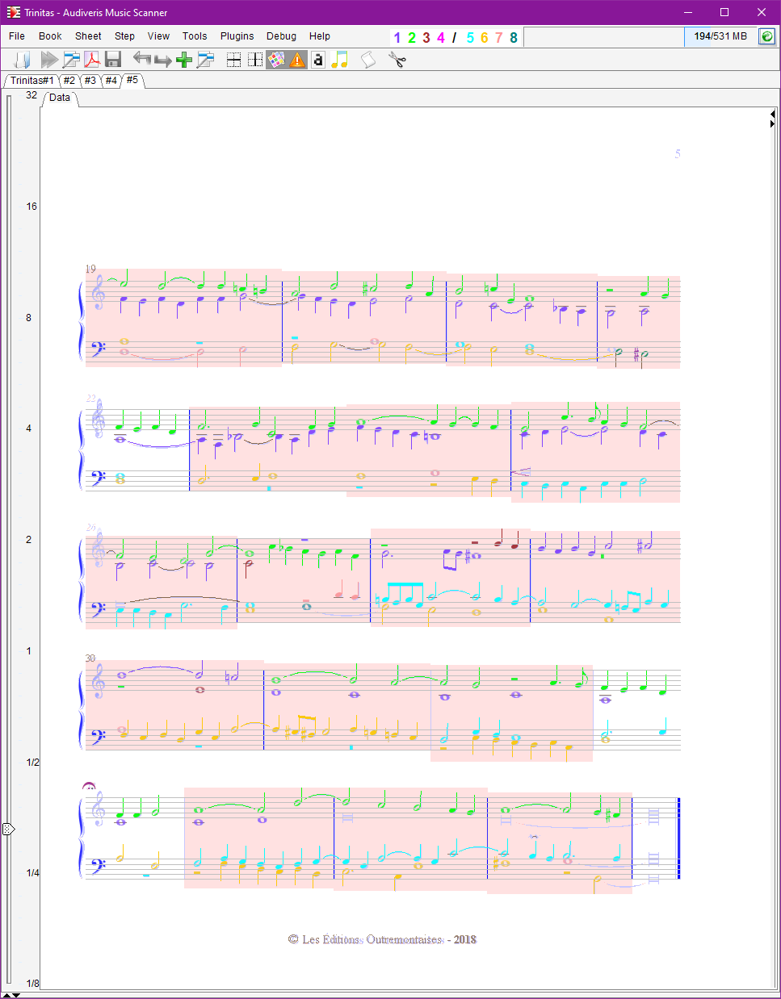 |

Our first impression is that almost all measures, except for sheet #3, are displayed in pink!

A **pink** measure indicates that the **rhythm** analysis has failed for that measure:
- Either because some chord starting time could not be determined,
- Or because some voice was computed to complete after the theoretical measure end,
  as derived from the time signature.

So, what caused such a disastrous rhythm result on a rather good input?

We can double-check the time signatures. All have been correctly recognized:
* **Common-cut** at the beginning of sheet #1
* **3/4** at the beginning of sheet #3 (the one with no signaled errors)
* **Common-cut** at the beginning of sheet #4

Let's have a closer look, with colorized voices ({{ site.view_voices }}) and
with chord IDs displayed ({{ site.view_chords }}).

{: .note }
Chord IDs are dynamically assigned within each sheet by the Audiveris program.
If we replay this processing even with just a slight difference in the engine code or parameters,
some chord IDs may be different that those listed in this handbook version.
The purpose of using chord IDs in this tutorial is to ease user mapping between snapshots
and text lines.

## Sheet #1

### Sheet #1, Measure #1
The first measure of sheet #1 looks like:

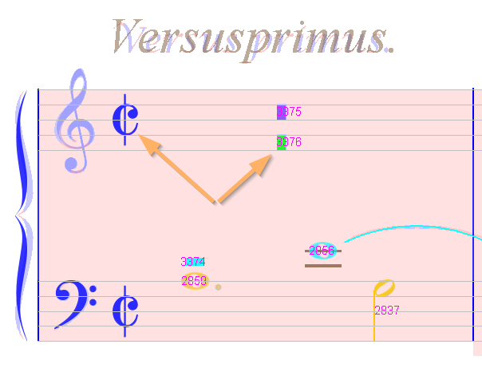

1. Note the presence of "breve rests" (chords #3375 & #3376) on the upper staff.
Such a multiple rest is supposed to last two bars.

2. Note also the presence in the lower staff of a dotted whole head (chord #2859),
followed by a half note (chord #2837), for a total duration of 2 for voice #6.

So, there is a conflict between the actual duration of this measure
(and of almost all other measures in the same page) with the time signature:
2 for each measure vs. 2/2=1 expected by the common-cut time signature.

What is the real "value" of a common-cut time signature?
This [Wikipedia Alla breve article](https://en.wikipedia.org/wiki/Alla_breve) sheds an interesting
light, especially with the (1642-1710) date indication on the score top right corner.
See also this
[Ultimate music theory article](https://ultimatemusictheory.com/breve-note-and-breve-rest/).
Instead of 2/2, it would be worth 4/2.

So let's replace all the common-cuts by explicit "4/2" time signatures.

To delete:
- We select the common-cut `Inter` and press `DEL` key.
- Or we click on the `Deassign` button in the `Inter` board.
- Or we use the {{ site.popup_inters }} contextual menu.

Inserting a 4/2 signature is more complex, since this is not one of the predefined time signatures:
1. From the Shape palette, we select the "Times" family (the family figured by a 4/4 sign) and
   from this shape family, we drag & drop the custom (0/0) time signature into the correct location.
2. Then in the `Inter` board, we replace the custom 0/0 value by 4/2 value and press `Enter`.

We do this for both common-cut signatures in the first measure of sheet #1.
We'll do the same thing on sheet #4 later.

{: .note }
If we delete both original common-cut signatures before entering the new 4/2 values, we will
notice that all measures of sheet #1, except measure #12, will turn white.   
The reason is that at this moment we have no time signature at all, hence no length-check can be
performed on measures.  
[In measure #12 remaining pink, we'll later see that a whole note has not been recognized].

With 4/2 clearly stated, among the 16 measures in the sheet, we now have 11 in white.
A significant improvement! :-)

### Sheet #1, Measure #4

All 4 measures of the first system look nice, with 2 voices in the upper staff and 2 other voices
in the lower staff, except the last one (measure #4) which exhibits 3 voices in the upper staff:

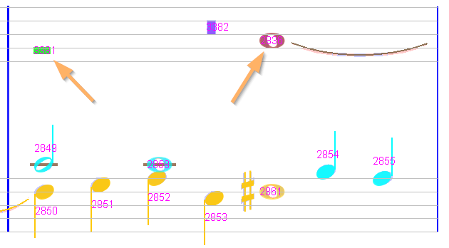

Referring to voice legend ,
this upper staff contains:
1. Voice #1, chord #3382 made of a breve rest, horizontally located at the measure center,
2. Voice #2, chord #3381 made of a whole rest, located at the beginning of the measure,
3. Voice #3, chord #2836 made of a whole note, located at 2/3 of the measure.

The problem is with the whole rest (chord #3381) which, as a measure-long rest, is the only chord
in its voice but should be located at measure center.
In fact, and there are other similar cases in this book, the whole rest is never at measure center
but located as a plain chord in a time slot.

We can visualize the content of the first slot,
using the combined mode  ()
and pressing the right mouse button near the first slot.
Chord #3381 is *not* part of this slot:

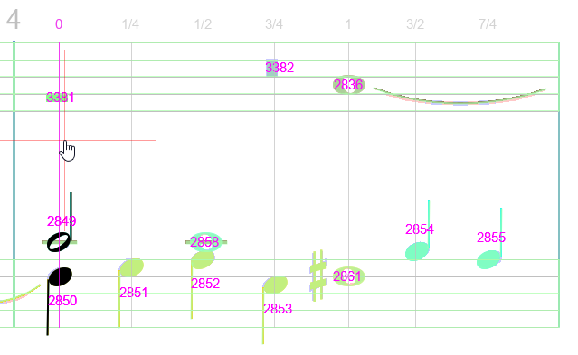


This is the purpose of a new option accessible via {{ site.book_parameters}},
and named "Support for partial whole rests".
When this option is on for the sheet at hand, whole rests are no longer considered as
measure-long rests, they are just plain rests with a duration of 1/1:
- They belong to a time slot,
- Their voice can contain other notes or rests.

So, we open the {{ site.book_parameters}} dialog, and:
1. We *set* this option for the whole book (so that it applies to all sheets in book)
2. We explicitly *unset* this option for sheet #3.

| Whole Trinitas Book | Except Trinitas Sheet #3 |
| :---: | :---: |
|  |  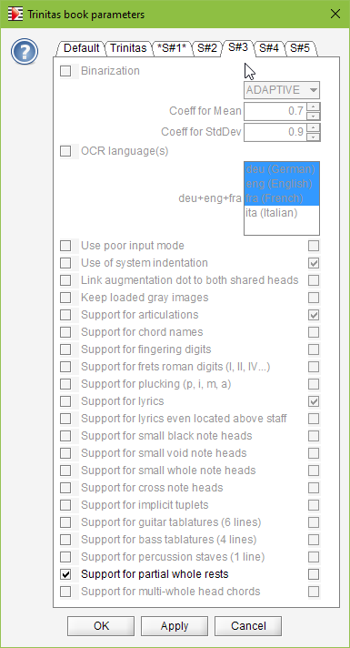  |

We don't forget to press the `OK` or `Apply` button to commit the parameters.

Then, we use the contextual `≡ Page #1 → Reprocess rhythm` to update the page.

Measure #4 now looks like this (notice chords #3381 and #2836 are now in the same green voice):

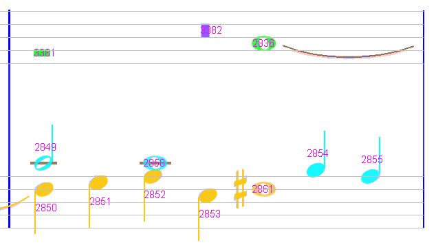

And `≡ Measure #4 → Dump stack voices` dumps its strip as:

```
MeasureStack#4
    |0       |1/4     |1/2     |3/4     |1       |3/2     |7/4     |2
--- P1
V 1 |Ch#3382 ======================================================|M
V 2 |Ch#3381 ===========================|Ch#2836 ==================|2 (ts:2/1)
V 5 |Ch#2849 =========|Ch#2858 ==================|Ch#2854 |Ch#2855 |2
V 6 |Ch#2850 |Ch#2851 |Ch#2852 |Ch#2853 |Ch#2861 ==================|2
```

We can see that voice #1 end time is displayed as 'M' (M for Measure),
meaning full measure duration, which is OK for a measure-long rest such as the breve rest.

Also, voice #2 now contains chord #3381 (a whole rest, but not a measure-long rest)
followed by chord #2836 (a whole note), to sum up to value 2, the same as the following voices
in measure.

Here is the updated view of the first slot content
(which now includes the whole rest in the upper staff):

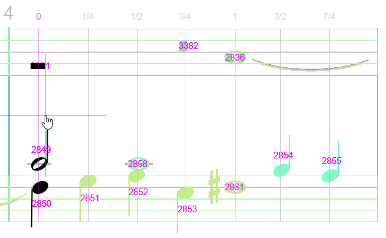

### Sheet #1, Measure #1 (again)

This "Support for partial whole rest" was key to fix rhythms of measures like
measure #4 we just saw.

But, before we set this option, measure #1 already appeared OK.
In fact, its whole rest of chord #3374 had been mistaken for a half rest:

| Data view | Binary view |
| :---: | :---: |
|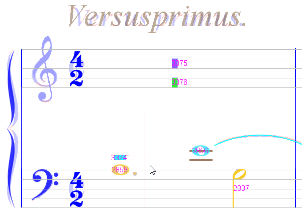|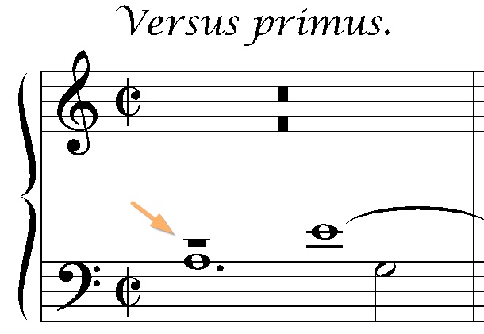|

If we click on this rest, the `Inter` board gives HALF_REST shape.
But the binary view clearly indicates it should be a WHOLE_REST shape.

The measure strip confirms the fact that chord #3374 duration is only 1/2,
resulting in a voice ending at 3/2 instead of 2:
```
MeasureStack#1
    |0       |1/2     |3/2     |2
--- P1
V 1 |Ch#3375 ==================|M
V 2 |Ch#3376 ==================|M
V 5 |Ch#3374 |Ch#2856 |........|3/2
V 6 |Ch#2859 =========|Ch#2837 |2

```

In fact, this is a limitation of the current engine with its glyph classifier.    
Within a staff height, with the staff lines "removed", the glyph for a half rest and the glyph
for a whole rest are nearly identical -- a horizontal rectangle.   
Only the position relative to the staff line nearby allows the engine to tell the
difference between:
* a whole rest -- close to the staff line above --
* and a half rest -- close to the staff line below --

In the case at hand, the rest glyph is badly located with respect to the staff
(see its base aligned with the next ledger on its right side),
and it was thus mistaken for a half rest.

No big deal, we can easily delete this incorrect inter and, re-using its underlying glyph,
manually create a true whole rest inter.
```
MeasureStack#1
    |0       |1       |3/2     |2
--- P1
V 1 |Ch#3375 ==================|M
V 2 |Ch#3376 ==================|M
V 5 |Ch#3420 |Ch#2856 =========|2 (ts:2/1)
V 6 |Ch#2859 =========|Ch#2837 |2
```
A new chord (#3420) has replaced the former chord #3374, and the measure is now OK.

### Sheet #1, Measure #5

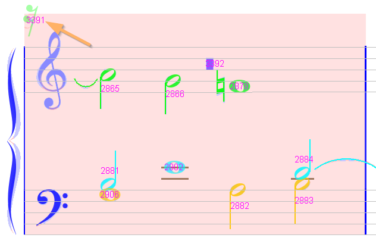

This pink measure exhibits a rather obvious problem:
- A false 16th rest in the upper left corner (chord #3391).   
  Hint: the measure background goes much too high with respect to the staff line,
  indicating some abnormal chord located there.
  We can simply delete it.

This modification automatically triggers a rhythm update for the measure at hand:

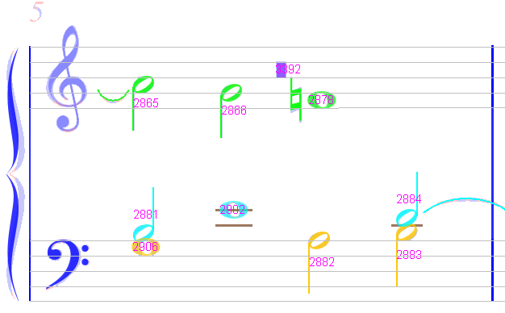

### Sheet #1, Measure #7

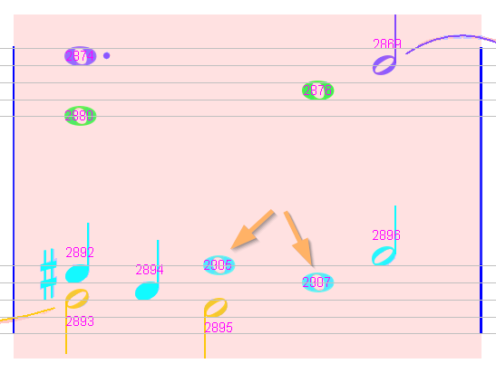

The lower staff of this pink measure exhibits a sequence of 2 whole notes,
together with additional quarter and half notes, all in the same voice!
This cannot fit within a 4/2 measure duration, and is confirmed by the measure strip:

```
MeasureStack#7
    |0       |1/4     |1/2     |1       |3/2     |5/2     |3
--- P1
V 1 |Ch#2874 ===========================|Ch#2869 |........|2
V 2 |Ch#2880 ==================|Ch#2876 =========|........|2 (ts:2/1)
V 5 |Ch#2892 |Ch#2894 |Ch#2905 =========|Ch#2907 |Ch#2896 |3
V 6 |Ch#2893 =========|Ch#2895 |........|........|........|1
```

The fix is to force these 2 whole notes (chords #2905 & #2907) to be in separate voices:

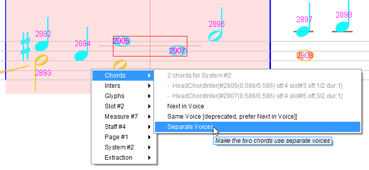

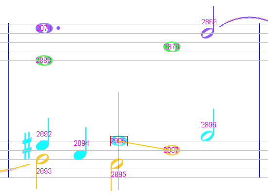

Since chord #2905 is still selected, it displays the "Separate Voice" relation with chord #2907
as an orange-colored segment.

If we increase the zoom ratio to 2 or above, there is now enough display room,
and the relation name "SeparateVoice" explicitly appears:

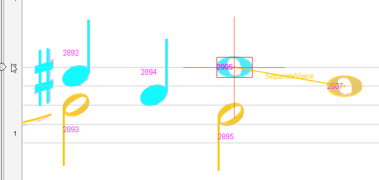

### Sheet #1, Measure #11

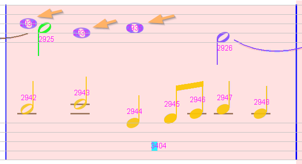

On the upper staff, 3 whote notes appear in the same voice #1 which is really too much,
while a half note stays alone in voice #2!

We can either separate the first 2 wholes (chords #2934 and #2936)   
or we can declare the half note (chord #2925) and the whole chord #2936 as being in sequence
in the same voice.

Either way is OK.

To choose the latter, we select the "Next In Voice" relation between #2925 and #2936.
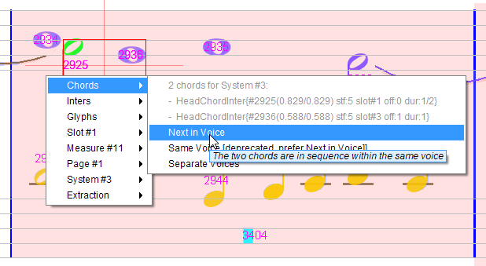

And result is now OK:
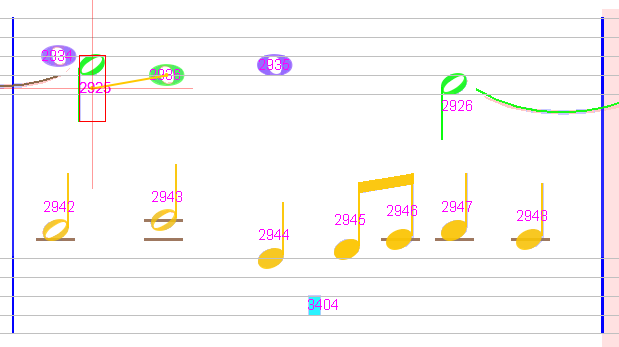

### Sheet #1, Measure #12

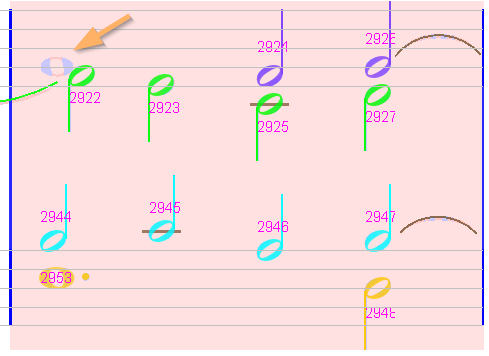

A missed whole note at the beginning of the upper staff.

We select the glyph (which is almost intact, despite the half head on the right) and assign it the
whole note shape using the shape palette.

To do so, in the shape palette, we select the "HeadsAndDot" family figured by a black head and,
while the target glyph is still selected, we use a double-click on the WHOLE_NOTE icon.

{: .important }
The OMR engine uses a specific technique (*template matching*) to recognize heads.   
The glyph classifier works correctly for isolated fixed-size symbols like a treble clef but would
work very poorly on heads because their underlying glyphs are often difficult to retrieve
(think of the glyph merge between head and staff lines and/or between head and stem).   
So, don't even think of the Glyph Classifier top 5 output when dealing with heads!

### Sheet #1, Measure #14

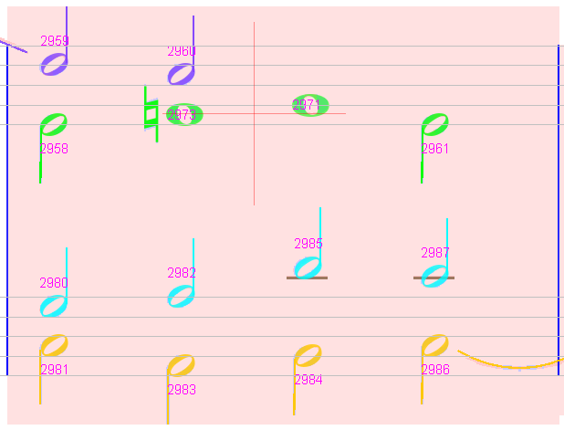

Yet another example of 2 whole notes (chord #2973 & #2971) with other notes in the same voice.
The fix is to force separate voices.

In this rather simple case, we could improve the OMR engine algorithm by checking the current voice
end time when deciding to append or not the second whole note to voice #2. Room for improvement!

This concludes our manual work on Sheet #1, with no rhythm errors left.

## Sheet #2

We update the rhythm on the whole sheet #2, via `≡ Page #1 → Reprocess rhythm`,
to benefit from the time signature fix (4/2) made on sheet #1.

Only 3 measures are left in pink, but let's review all measures.

{: .note }
While we work an a sheet, measure numbers are local to the sheet (to the page to be precise).
Hence, even though sheet #2 image starts with a number "17", local measure numbers start at 1.   
Don't worry, measure numbers will be consolidated when scores are refined at the end of book
transcription.

### Sheet #2, Measure #2

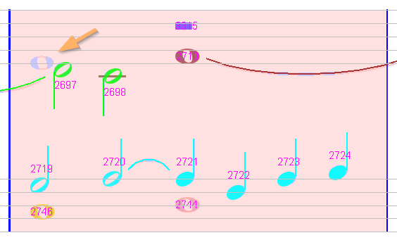

Again a missed whole note at the upper left.
Inserting it manually makes the entire measure OK, even for the voices of the lower staff.

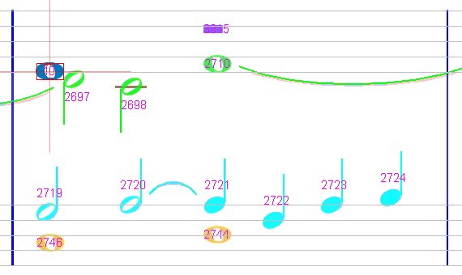

### Sheet #2, Measure #6

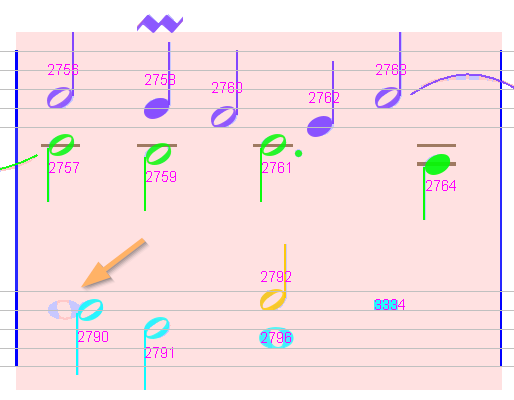

A missed whole note at the beginning of the lower staff.
We create it manually.

However, the measure remains in pink:

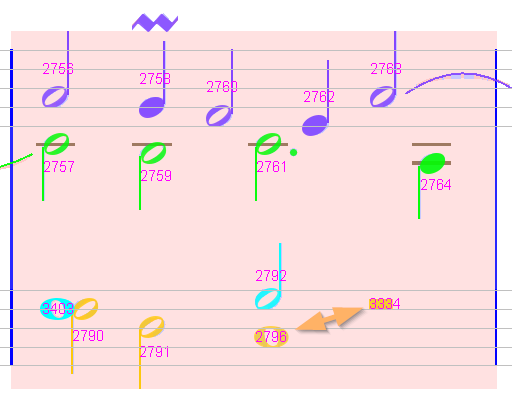

```
MeasureStack#6
    |0       |1/2     |3/4     |1       |5/4     |3/2     |7/4     |2       |5/2
--- P1
V 1 |Ch#2756 |Ch#2758 |Ch#2760 =========|Ch#2762 |Ch#2763 =========|........|2
V 2 |Ch#2757 |Ch#2759 =========|Ch#2761 ==================|Ch#2764 |........|2
V 5 |Ch#3403 ==================|Ch#2792 =========|........|........|........|3/2
V 6 |Ch#2790 |Ch#2791 =========|Ch#2796 ===========================|Ch#3334 |5/2
```

The half rest at the end of lower staff (chord #3334) should not be linked to whole chord #2796
but to half chord #2792.   
So we force either "Separate Voices" between #2796 and #3334 or "Next in Voice" between #2792
and #3334 to get the correct rhythm:
```
MeasureStack#6
    |0       |1/2     |3/4     |1       |5/4     |3/2     |7/4     |2
--- P1
V 1 |Ch#2756 |Ch#2758 |Ch#2760 =========|Ch#2762 |Ch#2763 =========|2
V 2 |Ch#2757 |Ch#2759 =========|Ch#2761 ==================|Ch#2764 |2
V 5 |Ch#3403 ==================|Ch#2792 =========|Ch#3334 =========|2
V 6 |Ch#2790 |Ch#2791 =========|Ch#2796 ===========================|2
```

### Sheet #2, Measure #9

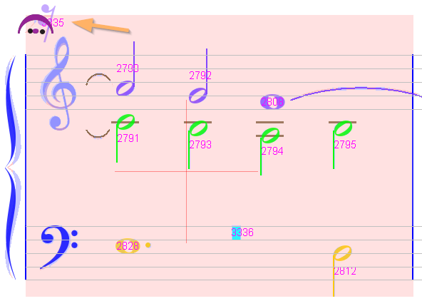

A bunch of unwanted items in the upper left corner. To be manually deleted.

### Sheet #2, Measure #17

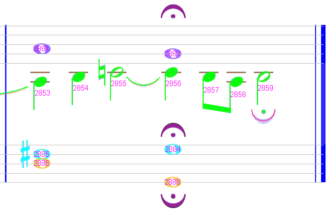

This last measure in the sheet exhibits a missing fermata
(mistaken for a slur and a staccato dot, located below chord #2859).

We delete both slur and staccato.

We then select the two underlying glyphs and, using the shape palette, we assign the shape
FERMATA_BELOW to the compound glyph.

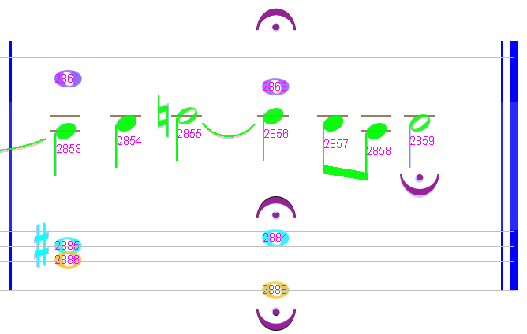

This completes our work on sheet #2.

## Sheet #3

This is a new movement, governed by a 3/4 time signature.

No pink measure in this page, but let's have a closer look...

### Sheet #3, Measure #11

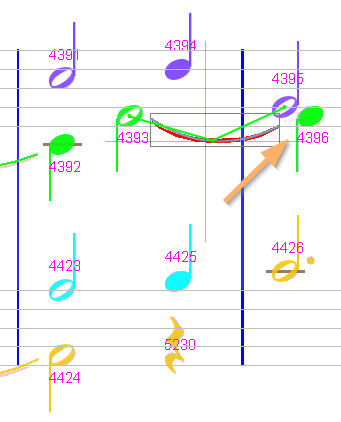

On the upper staff, we do have a slur but it is linked to the wrong note head on its right side,
certainly because this head is closer to the slur end target.

So we drag from this slur to the head of chord #4396; this moves the slur-head relation off of
chord #4395 head to chord #4396 head.

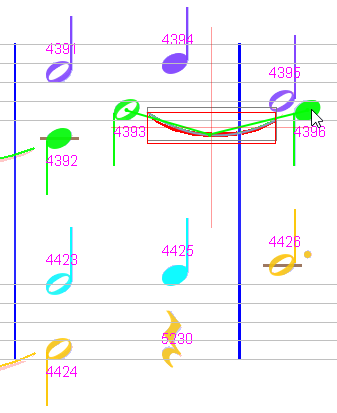

### Sheet #3, Measure #14

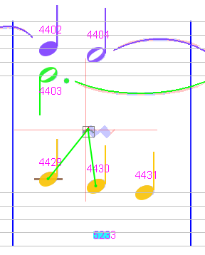

Here we have a false tiny slur on an un-detected inverted mordent.

So we first delete the false slur.

Then we select the underlying glyph for the mordent.

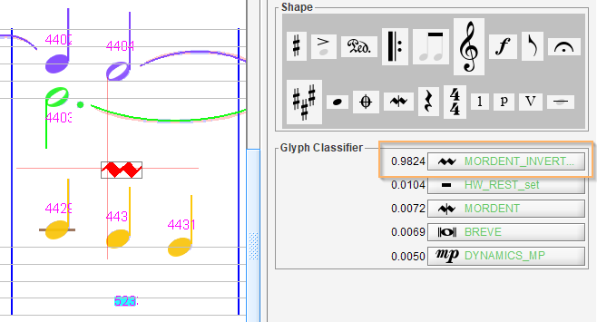

This triggers the glyph classifier which proposes the MORDENT_INVERT shape with a 0.9824 grade.
We thus simply click on this top button.

We have now completed sheet #3.

## Sheet #4

As for sheet #1, we delete the common-cut time signatures and replace them
with custom 4/2 signatures.

3 measures are left in pink.

### Sheet #4, Measures #1 & #2

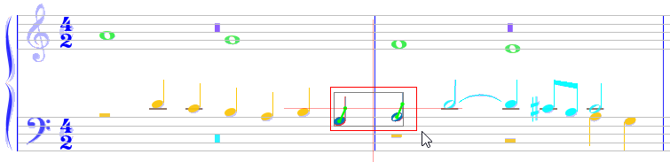

The first two measures are OK, but we would like to align their voices in the lower staff.

So, we select the last chord in measure #1 and the first chord in measure #2, and use
the contextual `≡ Chords → Next in voice` to get:

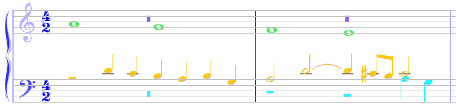

And we do the same voice alignment action between measure #2 and measure #3.

All voices are correctly aligned for this system, but we may not like the fact that the lower staff
exhibits voice #6 (displayed in orange) **above** voice #5 (displayed in cyan).
This is so because the Audiveris engine assigns the voices for measure-long rests first,
and the "standard" voices only afterwards.

To swap these voices, we can use direct voice assignment as follows:
We select (a head in) the first voice chord in the staff, for example chord #4290.

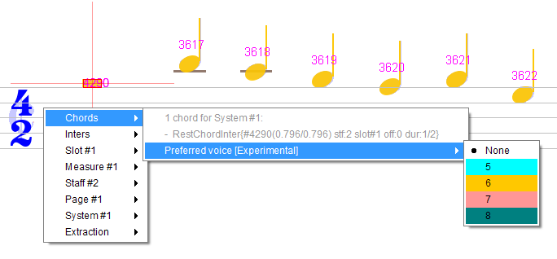


Then in the {{ site.popup_chords }} contextual menu,
we select the "Preferred voice" directly for this chord.   
We can see here that there was no voice assigned ("None").
We select the desired voice number in the menu, that is voice #5 (cyan color).

The engine then swaps voices for this measure (#1), and also in the following measures #2 and #3
to fulfill the "Next In Voice" relations we had just set.

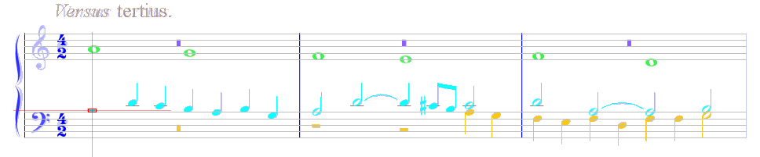

{: .warning }
This direct voice number assignment is still an experimental feature:  
- Though it can be undone, it is a *hard coding*, hence less flexible than the use of relations
like "Next in Voice"  or "Separate Voices",  
- It is effective *only* for the starting chord of a voice in its measure.
  Setting the voice number for another chord in the voice will have no effect,
  and in particular cannot be used as a means to link or unlink voices.

### Sheet #4, Measures #7 & #8

| Half-measure #7a (seen as #7) | Half-measure #7b (seen as #8) |
| :---: | :---: |
| 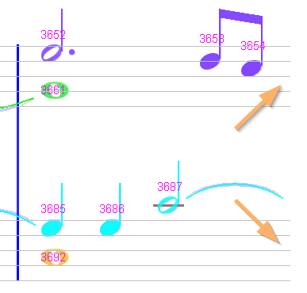 | 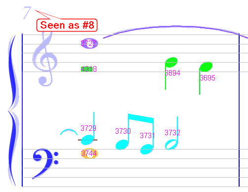 |

Here we have the strange layout of a measure that ends system #2 and starts system #3.
Notice that system #2 ends with no barline, as opposed to the other systems.
Each of these "half-measures" has a duration of 1.

Audiveris can see these only as separate measures, numbered #7 and #8 respectively.   

{: .note }
Unfortunately, this shifts by 1 all the following measure numbers in this movement,
and there is nothing yet we can do to fix this...

### Sheet #4, Measure #9

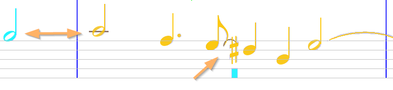

On the lower staff, we align voices between measure #8 and this measure #9.   
We also delete a false slur in the middle of this staff.

### Sheet #4, Measure #11

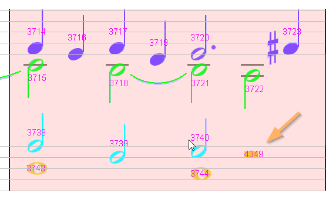

A measure in pink because of a too long voice.   
This is due to the final half rest, which should belong to the voice of the preceding half chord,
rather than the preceding whole chord.

### Sheet #4, Measure #12

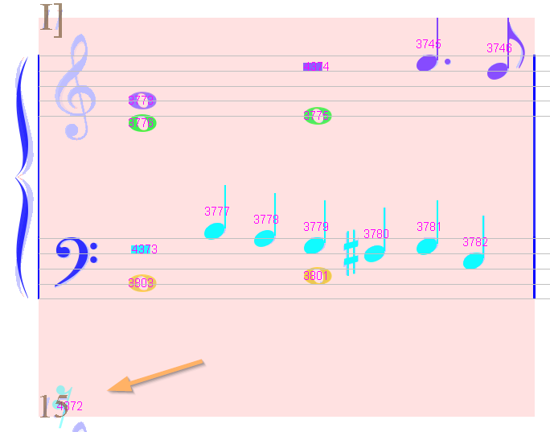

We can see the pink background going very low under the measure staves.   
This reveals the presence of an undesired 16th rest, to be deleted.

### Sheet #4, Measure #13

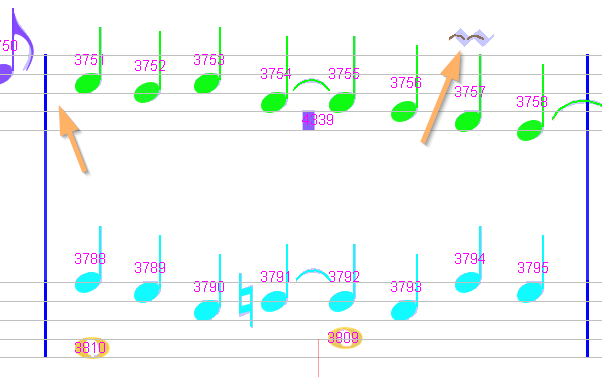

We align voices with the preceding measure,
delete two false small slurs and replace them by an inverted mordent.

### Sheet #4, Measure #14

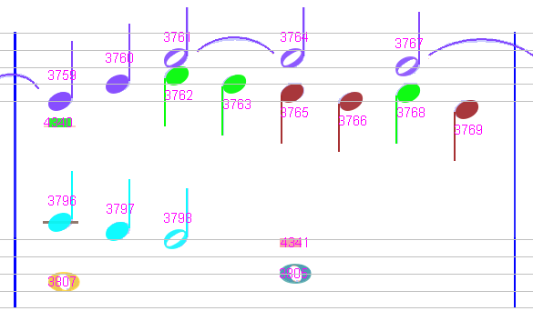

This measure is not in pink because no voice lasts longer than the measure duration (4/2),
however the rhythm is strange:
- On the upper staff, we have 3 voices, while 2 would be enough.
- On the lower staff, we have 4 voices, while 2 would be enough.

```
MeasureStack#14
    |0       |1/4     |1/2     |1       |5/4     |3/2     |2
--- P1
V 1 |Ch#3759 |Ch#3760 |Ch#3761 |Ch#3764 =========|Ch#3767 |2
V 2 |Ch#4340 ==================|Ch#3762 |Ch#3763 |Ch#3768 |7/4
V 3 |........|........|........|Ch#3765 |Ch#3766 |Ch#3769 |7/4
V 5 |Ch#3796 |Ch#3797 |Ch#3798 |........|........|........|1
V 6 |Ch#3807 ==================|........|........|........|1
V 7 |........|........|........|Ch#4341 ==================|2
V 8 |........|........|........|Ch#3805 ==================|2
```
The measure strip shows that chord #4340 is considered as a whole rest.   
Also clicking on this rest shows WHOLE_REST in the `Inter` board.

However, a look at the binary image gives a different result:   
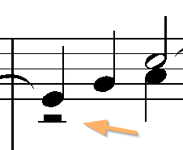

Once again, this rest was mistaken for a whole rest because of its vertical location with respect
to the related staff.
So, we delete it and manually reassign the underlying glyph as a HALF_REST.

This immediately fixes the rhythm on both upper and lower staves.

### Sheet #4, Measure #15

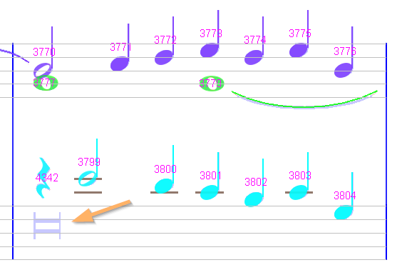

The sign at beginning of the lower staff is an old sign for a multi-measure rest,
a kind of entity not recognized by Audiveris.   
Since the measure duration is 2, we can manually insert a breve rest at the measure center,
and voice-link it (using "Next in Voice") with the corresponding whole note in the previous measure.

### Sheet #4, Measure #16

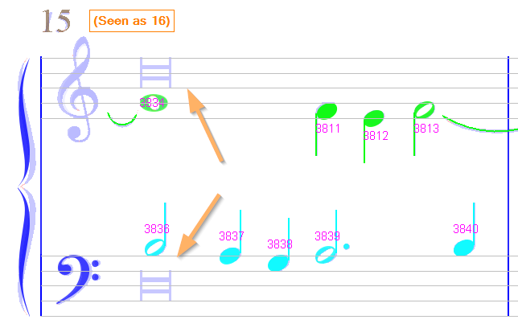

Here again, we can manually insert breve rests in the upper and lower staves.   
And assign the correct voice number (5) for starting chord #3836.

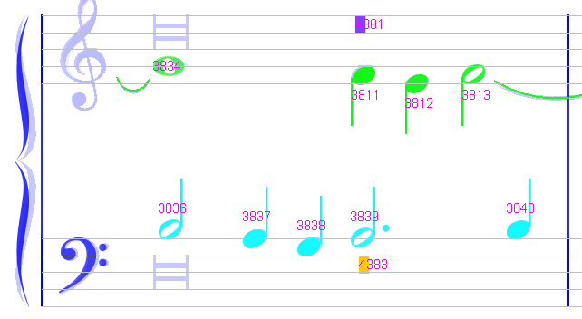

### Sheet #4, Measure #17

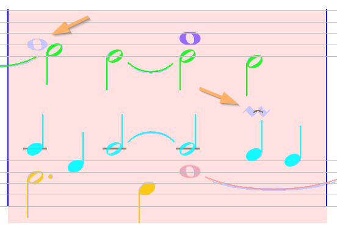

There is an un-recognized whole note in the upper left corner (to be inserted),
a false slur (to be deleted)
and an un-recognized inverted mordent (to be assigned from its underlying glyph).

### Sheet #4, Measure #18

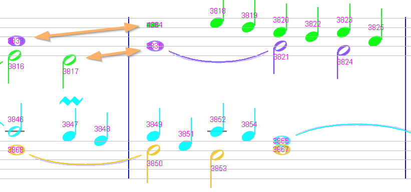

The measure rhythm is correct, but in the upper staff we can align voices with the previous measure.

### Sheet #4, Measure #19

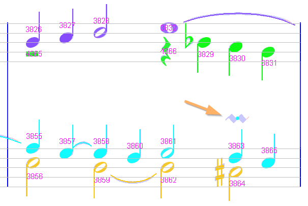

Finally a false staccato dot (to be deleted) and yet another inverted mordent to be assigned
from its underlying glyph.

This completes our work on sheet #4.

## Sheet #5

This sheet #5 continues the movement begun with sheet #4.

We update the page rhythm.
There are two measures left in pink in this sheet plus a few others to fix.

### Sheet #5, Measure #2


We have two slurs that should be recognized as tie slurs but are not
(and are thus displayed in black, instead of a voice color).   
The reason is that both are connected to the wrong head on their right side.

To fix this, we drag from each slur to the correct target head and release the mouse.   
Each slur is now recognized as a tie slur and its color turns to the color of its underlying voice.

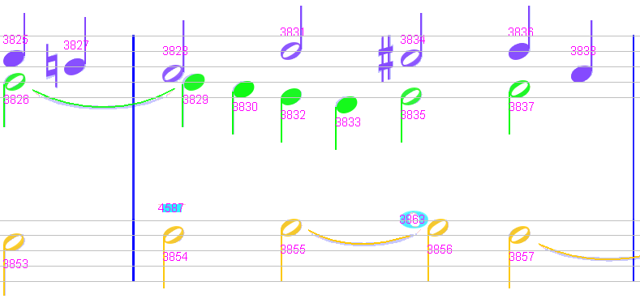

### Sheet #5, Measure #4

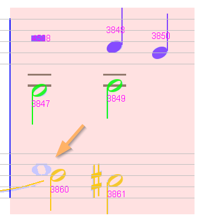

A missing whole head (in this half measure).

### Sheet #5, Measure #6

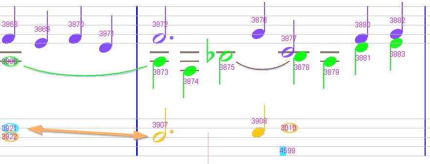

In the lower staff, voices need to be aligned with the previous measure,
for example by setting a "Next in Voice" relation between chords #3921 and #3907.

### Sheet #5, Measure #8

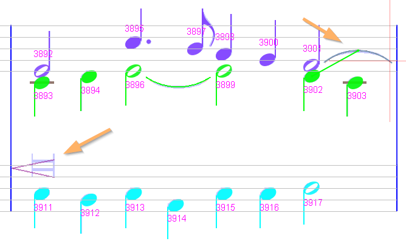

Lower staff: A false crescendo to delete and a breve rest to insert.

Upper staff: a slur that should be a tie.
The reason is this slur is not connected on its left side to the correct head,
it must be moved from #3902 to #3901

### Sheet #5, Measure #9

Again a breve rest to be manually inserted.

### Sheet #5, Measure #10

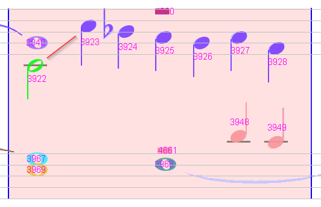

The pink measure is due to an incorrect voice connection in upper staff.

Aligning voices correctly in the upper staff has the side effect of aligning them correctly
in the lower staff as well.

### Sheet #5, Measure #12

In the upper staff, voices need to be swapped by connecting them to the corresponding voice
in the previous measure.

### Sheet #5, Measure #17

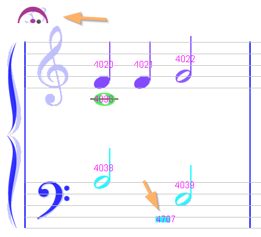

There is a false fermata at (the beginning! of) the upper staff. We delete it.

```
MeasureStack#17
    |0       |1/4     |1/2     |3/2     |2
--- P1
V 1 |Ch#4020 |Ch#4021 |Ch#4022 |........|1
V 2 |Ch#4036 ==================|........|1
V 5 |Ch#4038 =========|Ch#4707 |Ch#4039 |2
```

There is also a problem with the measure length.

In fact, it looks like a "half" measure which continues another "half" measure at the end of the
previous system with no ending  barline.

For the Audiveris data model, these are two separate measures.
And since neither of them lasts longer than 4/2, they are not flagged as abnormal pink measures.

However, the duration of voice #5 in the second half measure is 2, while we would expect 1.   
This is because of the whole rest chord #4707, which is inserted between the half chords #4038
& #4039 in a single voice.

We can try to force voice separation between the whole rest chord #4707 and the surrounding
half chords.
This results in a message like:
```
Measure{#17P1} No timeOffset for RestChordInter{#4707(0.796/0.796) stf:10 slot#3 dur:1}
```
In other words, the engine fails to determine the time offset of the whole rest chord #4707,
alone in its voice.
This is why the measure background turns pink.

In fact, we can consider that the original score here is wrong.   
The whole rest, as it is located here in the middle of the measure, should be considered as
a measure-long rest, but this would not be consistent with the other measures on this page.

So a workaround is to actually *shift* this badly located rest to the left, at the beginning of
the measure.   
To do so, via a double-click, we put the symbol into edit mode, and drag its handle to the left.

| Shift editing | End result |
| :---: | :---: |
|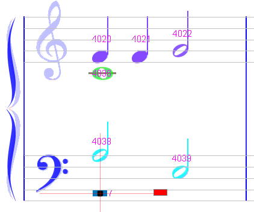   | 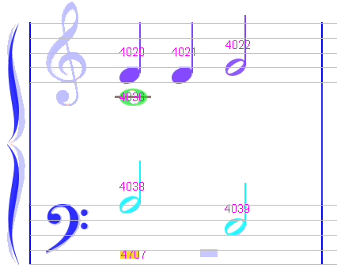  |

### Sheet #5, Measure #19

Again a breve rest to be manually inserted.

### Sheet #5, Measure #20

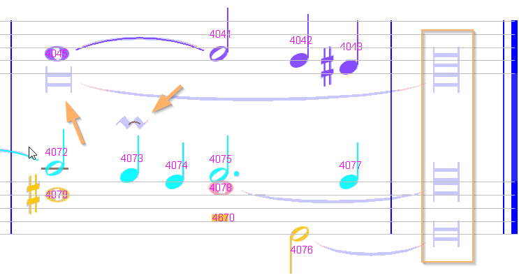

We have a breve rest to insert on the upper staff.
Plus a small slur to delete and an inverted mordent to insert.

Apart from that, the role of a slur that connects to a rest is not obvious.
Perhaps we can just ignore these slurs, and the next measure as well.

This completes our work on sheet #5,  
and concludes the whole editing session.

## Completion

In this editing session, we have focused on pure musical content, that is essentially the rhythm
aspect (chords organized in voices and time slots).

### Text

There are a few textual elements in this book, most of them are located on the first sheet.   
We can see a mix of several languages the OCR had to deal with.

Note, for visual check:
- the original text is easier to read in the binary view in physical mode

- while the OCR output is easier to read in logical mode


Here are all the textual elements found in this book
(we ignore text that represents a measure number)

| Original sentence | OCR output | Comments |
| :--- | :--- | :--- | :---: |
| O lux beata Trinitas |  ® fax Beam Ërinitas | Latin, gothic? font, OCR totally wrong |
| _Der du bist drei in Einigkeit._ | Der du _bist drei_ in _Einigkeit._ |German, OCR mix of italic & standard  |
| Restitution par P. Gouin. | Restitution par P. Gouin.| French  |
| Johann Friedrich Alberti  | Johann Friedrich Alberti | |
| (1642-1710) | (1642-1710) | |
| _Versus primus._ | _Versusprimus._ | Latin, OCR merged as one word |
| _Versus secundus._ | _Versus_ secunafus. | Latin, OCR mistake on "secundus" |
| _Versus tertius._ | _Versus_ tertius. | Latin, OCR mix of italic and standard |
| © Les Éditions Outremontaises - 2018 | © Les Editions Outremontaises - 2018 | French, OCR took 'É' for 'E'  |

If we except the book title "O lux beata Trinitas" which OCR totally failed to recognize,
probably because of its exotic font, the raw Tesseract OCR results are pretty good.

We can manually correct the few mistakes, via the `Inter` board.   
This must be done word by word, by selecting the word and modifying its content
(typing new characters and validating by pressing the `Enter` key).

Note that the current Audiveris UI let us modify only the textual **content** of any word,
not its **font** characteristics (such as font name, italic, bold, etc).

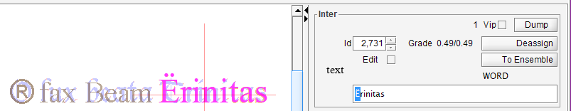

For manual text editing, text **content** is modified at the _word_ level
whereas text **role** is modified at the _sentence_ level.

In this book, nearly all sentences had their role correctly assigned by the OMR engine heuristics.
An exception is "© Les Éditions Outremontaises - 2018" whose role appears to be "UnknownRole".

To fix this, we select one word of this sentence and, in the `Inter` board,
click on the `To Ensemble` button (as you know, a sentence is modeled as an ensemble of words).

We can then choose the proper sentence role ("Rights"):

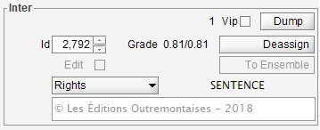

### MusicXML export

We can export to MusicXML via the {{ site.book_export }} menu item.
This gives:
```
[Trinitas] Exporting sheet(s): [#1#2]
[Trinitas] Score Trinitas.mvt1 exported to D:\soft\cases\Issue-481\Trinitas.mvt1.mxl
[Trinitas] Exporting sheet(s): [#3]
[Trinitas] Score Trinitas.mvt2 exported to D:\soft\cases\Issue-481\Trinitas.mvt2.mxl
[Trinitas] Exporting sheet(s): [#4#5]
[Trinitas] Score Trinitas.mvt3 exported to D:\soft\cases\Issue-481\Trinitas.mvt3.mxl
```
This book was exported as 3 separate .mxl files, one per detected movement.

### Plugin

If we have configured a few [plugins](../../../advanced/plugins.md)
to external programs such as MuseScore or Finale,
clicking on the desired plugin would:
1. Export an updated version of the 3 movements files, if needed,
2. Launch for example MuseScore on the 3 movement files.


We can then for example listen to MuseScore playback on these movements.   
This is an additional convenient way to check transcription results.
