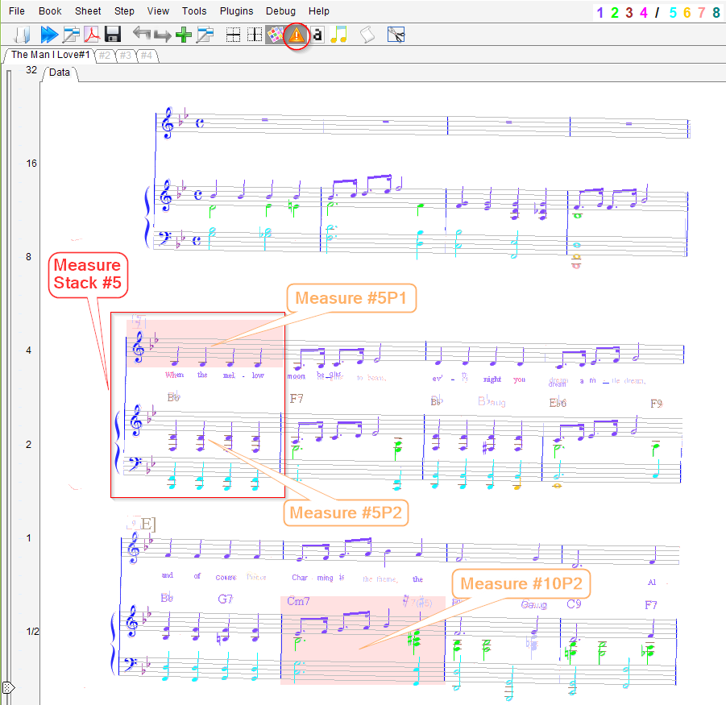
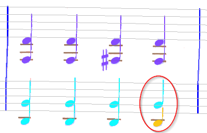
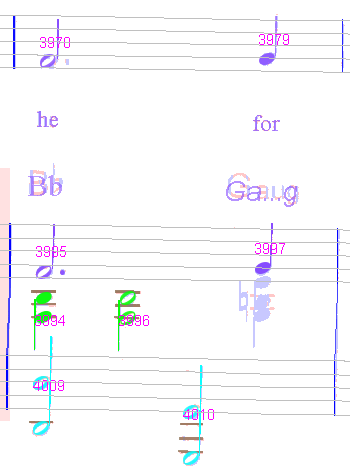
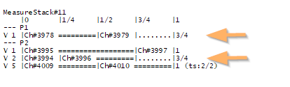
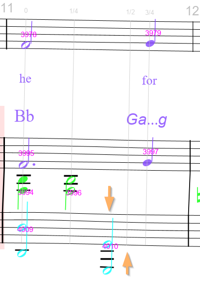
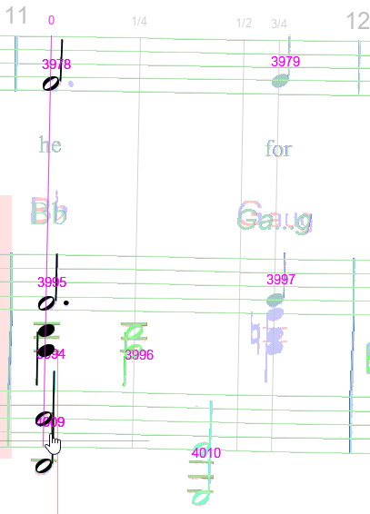
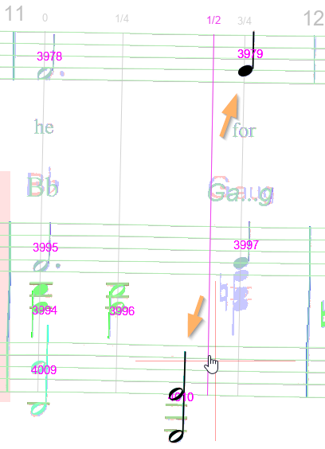

# Inspection
{: .no_toc }

In a perfectly transcribed score, all the items would be correctly recognized
and every chord in every voice in every measure would start at the right time and span the
right duration.

This beautiful mechanism can seize up for various reasons, large or small, and lead to
abnormal results.

The purpose of this inspection chapter is to present various means for detecting such abnormal
results and for discovering their root cause(s).

---
Table of contents
{: .no_toc .text-epsilon }
1. TOC
{:toc}
---

## Measure background

A pink measure background is the most obvious sign, meant to call user attention to a measure,
as in the following page view which displays two measures (#5P1 and #10P2) with a pink
background and the others with standard white background:  
[Unless we have disabled this feature via the menu item {{ site.view_errors }}
or the `F9` function  key or the related toolbar icon]



Even though the rhythm is defined at the _measure stack_ level
(denoted by the system-high red rectangle in the picture above),
abnormal rhythm is displayed down to the _measure_ level
(the part-high rectangle with pink background).

The measure background is defined:
- Horizontally by measure left and right limits,
- Vertically as the bounding box of all staves and chords involved in measure rhythm.

A measure is detected as _abnormal_ -- and thus displayed in pink -- if, for at least one of its
voices:
- The voice **starting time cannot be determined**, or
- The voice **ending time exceeds the measure expected duration**
   -- as defined by the current time signature

Note that, conversely, a measure not detected as abnormal
-- and thus displayed with the standard white background --
may still exhibit errors that the OMR engine could not reliably detect.
We'll see examples of these cases that today only the human reader can detect and fix.

## Colorized voices



The interest in choosing to colorize voices
(see [Voice colors](../../../tutorials/main_window/voice_colors.md#voice-colors))
is to visually check the content of every voice.

In the example above, voice 6 which appears in the bottom right corner of the
measure is really suspicious (although the measure is not flagged as _abnormal_).

## Jumbo mode


## Chords IDs

By default, chord IDs are not displayed in sheet view because they look too invasive.
To set them on, we use the pull-down menu {{ site.view_chords }}.

This gives the new picture below, where it is clear that we could merge chord 3963 and chord 3964
into a single chord:


## Measure strip

A right-click within a measure N leads to a measure contextual menu which offers to print out
all voices for the measure at hand.  

For example, let's focus on the measure below:



`≡ Measure #N | Dump stack voices` prints a strip for the whole system-high measure stack.  
`≡ Measure #N | Dump measure voices` prints a strip for just the part-high measure.

The latter (limited to one part) is meant for orchestra scores, with lots of parts within each
system, to allow to focus on one part at a time.

Here is a measure strip at stack level (with part P1 and part P2):



Strip legend:
- The strip top line displays the time offset of each slot within the measure.
- It then displays one part after the other, with one horizontal line per voice in the part.
- A voice line gives the voice ID, then each chord ID vertically aligned with its starting slot.
- A "====" segment indicates the voice is active, while a "...." segment indicates the voice is inactive.
- A voice line may end with a string (ts:Num/Den) to indicate that this voice looks like a typical
   measure in a Numerator/Denominator time signature.
   [This could be used to infer the actual time signature, but this feature is now disabled].

When compared with the corresponding measure image above, the strip at hand shows 2 anomalies:
1. Voice P1/V1 ends at offset 3/4, while on the image we would expect this voice to end at offset 1.  
Moreover, Ch#3979 starts at offset 1/2, whereas on the image it starts at offset 3/4.
(Evidently the dot on Ch#3970 has been overlooked by the engine.)
2. Voice P2/V2 also ends at offset 3/4.
   This is consistent with the image: there is a non-detected chord just below chord 3997.

Here again there is nothing, from the OMR engine point of view, to flag this measure as abnormal
-- all voices can be computed and all of them complete within the measure time limit.

## Time slots

Time slots are not visible in  physical mode.   
They are displayed in  combined and
 logical modes
-- provided that the {{ site.view_annotations }} flag is on.

A time slot is displayed as a thin vertical gray line, with its time offset value at the top.   
Here below, we can see 4 slots with respective offsets:

| Slot ID:| slot#1 | slot#2 | slot#3 | slot#4 |
|  ---:   | :---:  | :---:  | :---:  | :---:  |
| Time Offset: | 0 | 1/4 | 1/2 | 3/4 |



In this picture, we can notice that slot #3 at offset 1/2 looks strange,
with no chord aligned with it.
Moreover, chord 4010 at bottom center is not aligned with any slot.

To be more precise, we can investigate the content of each time slot, via a right-click on the slot:
- `≡ Slot #3 | Dump chords` gives   
```
slot#3 start=  1/2 [HeadChordInter{#3979(0.794/0.794) stf:7 slot#3 off:1/2 dur:1/4},HeadChordInter{#4010(0.815/0.815) stf:9 slot#3 off:1/2 dur:1/2}]
```
- `≡ Slot #3 | Dump voices` gives   
```
slot#3 start=  1/2 [V1 Ch#3979 s:7 Dur=  1/4, V5 Ch#4010 s:9 Dur=  1/2]
```

These outputs are not very readable, but they say that this slot contains chords 3979 and 4010.
Which looks strange.

A more readable output is available, but only in 
combined mode.
We simply press the right mouse button and move it near a time slot,
while staying vertically within part stave(s).
This highlights both the designated slot and the slot-related chords as in the pictures below:

| Correct slot #1 at offset 0 | | Abnormal slot #3 at offset 1/2 |
| :---: | --- | :---: |
|| ||

We can immediately see that slot at offset 1/2 wrongly contains chords 4010 and 3979.

A closer look near chord 3978 in slot #1 (time offset 0), at the upper left corner of the measure,
indicates that there is an unrecognized augmentation dot on the right of the chord note head,
which is the actual root cause of all the aforementioned time slot problems.
