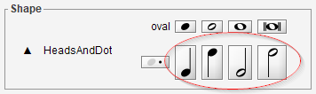

# `Inter` addition
{: .no_toc }

In the Audiveris data model, an `Inter` instance represents an interpretation, that is a candidate
likely to become a musical symbol in the end.

A manually created `Inter` is flagged as `MANUAL` and cannot be called into question by the
OMR engine, it is considered as certain.

We can manually create an `Inter` instance from a selected glyph, by "assigning" this glyph the
desired shape.
If we have no suitable glyph available, we can still create an `Inter` from nothing, via a simple
drag & drop from the shape palette.

In both cases, we may have to specify the target staff for the created inter if the context is not
clear enough for the engine.

---
Table of contents
{: .no_toc .text-epsilon }
1. TOC
{:toc}
---

## `Inter` from the underlying glyph

`Inter` creation from a glyph is the only case where a glyph is used in Audiveris manual editing.

The set of black pixels of one or several selected glyphs can be transcribed as one inter,
by specifying the target inter shape.
The precise location and bounds of the new inter are defined by the underlying set of pixels.

{: .note }
This method of selecting a glyph to "assign" an `Inter` to it, requires of course that a **suitable
glyph** be available.
In we can't find any such glyph, we'll have to drag & drop the desired shape from
the shape palette instead.

Also, knowing the target location is not always sufficient to detect the `Inter` **target staff**.
Several heuristics are used by the software, but if they fail we will be prompted for the
target staff:

The target shape can be specified via different means, as follows.

### Via the glyph classifier

This classifier automatically operates on the current glyph, be it the single selected glyph or
a transient glyph built on-the-fly from a multi-glyph selection.

Chances are we'll find our desired shape in this "top 5".
If so:
- We can just press the shape *button* with the mouse left button
- Or, on the keyboard, we can type the *number* (generally in 1..5 range)
corresponding to the rank of our desired shape within the top 5.

{: .note }
In order to use this classifier method, the target shape must be handled by the glyph classifier.  
This is **NOT** the case for the following shapes:    
    - **Lines** (staff lines, ledgers, barlines, stems, slurs, endings) use ad-hoc methods,  
    - **Beams** use image morphological closing,  
    - **Note heads** use template matching,  
    - **Texts** use OCR.

{: .note }
The top 5 is just a raw output of the glyph classifier, which runs on the glyph in isolation,
that is ***without taking the neighborhood into account***.    
This means that:  
    - a dot (augmentation, staccato, ...) will be at best recognized as `DOT_set`,  
    - a half or whole rest as `HW_REST_set`,
    - a grace note or an 8th beat unit as `EIGHTH_set`  .
For these three cases -- and only for them -- the glyph classifier is not precise enough.  
We'll have to explicitly select a more specific target shape, via the glyph pop-up menu
or via the shape palette.

### Via the glyphs pop-up menu

Once a glyph has been selected, we use a mouse right click to access
the {{ site.popup_glyphs }} sheet contextual menu.

Then we navigate through shape sets to our precise target shape.

### Via the shape palette

The shape palette (see next section) allows to assign a shape to the selected glyph.
This is done by a double-click on the desired shape in the palette.

## The shape palette

The palette offers the ability to choose the desired shape for a selected glyph.

And even if no precise glyph can be selected, we can directly drag a "ghost" `Inter`
from the shape palette, located on the right side of the sheet view, and drop this ghost
at the desired target location.

The starting aspect of the shape palette is a catalog of all shape sets.
It exhibits a dark-gray background, with one representative button for each shape set.
Nothing can be dragged from this catalog, we must first select a shape set:

### Entering a shape set
Pressing a shape set button replaces the catalog view by a specific palette dedicated to
the selected shape set.
For example, pressing on the ``ClefsAndShifts`` set button gives:

Within a set, a shape can be:

* Assigned (by a left double-click) if a glyph has been selected,
* Or dragged and dropped to a target location.

### Selecting the target staff
While we are dragging a shape, we have the freedom to move it wherever we want.
The last staff we hovered over is selected as the current target staff.

Before we "select" a staff, the dragged shape "ghost" is displayed isolated in dark-gray.

Once a staff has been "selected", a thin vertical red segment goes from the shape center to
the target staff middle line, the shape turns into the `Inter` selected color, additional objects
can appear -- such as intermediate ledgers or potential relations with nearby inters --,
it may get snapped according to staff lines, etc.

| before staff selection | after staff selection |
| --- | --- |
|  |  |

We can drop the shape only when a staff target has been selected.
If not, the drag & drop action is abandoned.

### Case of compound shapes

Note the ``HeadsAndDot`` set now contains four new shapes located at the end.

These are quarter notes and half notes, with stem either up or down.
There are called "compound" because they combine two shapes: a head shape and a stem shape.

They are generally more convenient to insert as a whole, the head can still be snapped on staff line
or ledger and the stem can still be automatically linked to beams nearby.

{: .note }
Once dropped, such a compound shape is replaced by two separate Inters
(head `Inter` and stem `Inter`) linked by a HeadStemRelation.
We can then later edit each "part" separately, for example to modify the stem length.
And we can add flags to the stem.

### Exiting a shape set
To leave the specific set palette and go back to the catalog view, we can:

* Click on the "triangle-up" sign located on the left side of the set palette,

  
* Or press the `ESC` key on the keyboard.

## Shape cache

We can notice, appearing on a line above the shape palette, the list of the most recent shape
buttons we have used so far.

These _cached_ buttons are meant for further direct access, avoiding the navigation to their
containing sets.

And if we want to add many Inters of the same shape, we can consider using the
 "Repetitive Input" mode below.

## Repetitive input

If we have numerous Inters of the **same shape** to add in a row, a convenient way is to switch
temporarily to the "_Repetitive Input_" mode.

We click on the toolbar icon or select the menu item {{ site.sheet_repetitive }}
or use the shortcut `Ctrl+Shift+N` and this mode is now set on.

From that point on, pressing with the left-button anywhere on the sheet will add a new `Inter`
(with the latest shape used) at the designated location.
We can shift the `Inter` location precisely, then release the mouse when we are satisfied.

If we press the left-button again, yet another instance will be created, and so on.
That's the rule, so let's mind our mouse press actions!

The latest ``Inter`` inserted is left in "`Inter` editing mode" with its editing handle(s) displayed.
We can press the `ENTER` key to finish this edit,
or click somewhere else to create another ``Inter``.

This repetitive mode is meant for simple shapes -- like a head, a rest, an accidental, etc. --
that don't require any further resizing.

But what if we really need to resize the inserted `Inter`?
We simply set the repetitive mode off, so that we can press and drag the inter editing handles.
Then, we can set the repetitive mode on again if so desired.

To exit this rather specific mode, we toggle the mode
(via the toolbar icon, the menu item or the shortcut).

## Relations with other ``Inter``'s

Key relation(s) with the nearby `Inter`(s), if any, will be updated automatically as we create
-- or later edit -- the `Inter`, but only as long as the required geometrical relationships can apply
(for example, as long as an accidental is sufficiently close to a note head on its right side).

If the relation constraints are not met, we will have to set the relation manually afterwards.

## Shortcuts for inter addition

In order to make long editing sessions easier, there are a few shortcuts to assign interpretations
without having our hands leave the keyboard.

They all work with a sequence of 2 strokes:
1. The first stroke selects a _set_ of shapes.   
   The selected set content appears in the right column.
2. The second stroke selects a _shape_ within the current set.  
   The selected shape appears first in the shape cache.

Example: Let's press `h` (heads) then `b` (black) and we get the `HeadsAndDot` set content displayed
and the black head shape in the cache.

If we had a glyph selected beforehand, this glyph is assigned the selected shape.
If not, no glyph gets assigned, but the shape cache now presents our selected shape in first
position, ready for further use (via double-click, drag & drop or repetitive input).

### Shortcuts table

Only sets and shapes that are used rather often are supported.

| 1st key | Set | 2nd key |
|    ---: | :---   | :---    |
|**a** |accidentals | **f** (flat), **n** (natural), **s** (sharp)
|**b** |beams       | **f** (full), **h** (half), **3** (triplet)
|**d** |dynamics    | **p** (piano), **m** (mezzoforte), **f** (forte)
|**f** |flags       | **u** (up), **d** (down)
|**h** |heads       | **w** (whole), **v** (void), **b** (black), **d** (augmentation dot), **h** (half-note), **q** (quarter-note)
|**p** |physicals   | **a** (slur above), **b** (slur below), **s** (stem)
|**r** |rests       | **1**, **2**, **4**, **8** (full, half, quarter, eighth)
|**t** |texts       | **l** (lyrics), **t** (text), **m** (metronome)
