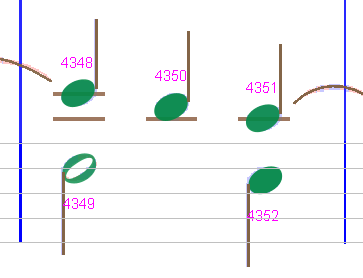
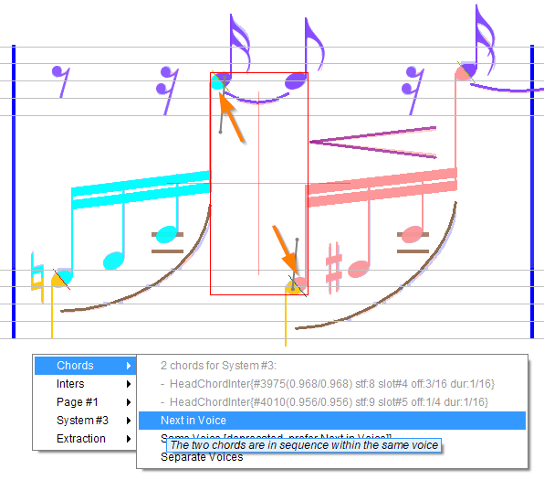
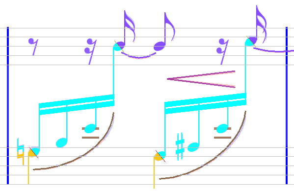

# Chords
{: .no_toc }

For Audiveris, a _chord_ is a container:
- A rest-chord contains exactly one rest.
- A head-chord contains one or several head(s), and often a stem.

Hence, we should understand by now that clicking on a note (head or rest) selects that note
rather than its containing chord (this is the rule known as "_member over ensemble_").

However, by selecting one or several notes, we can indirectly select and act on these chords.

This is made possible via the usual pop-up menu which can provide a specific `Chords...`
sub-menu, whose content tightly depends on the chords configuration.

---
Table of contents
{: .no_toc .text-epsilon }
1. TOC
{:toc}
---

## Chords menu

Below, we have selected two notes as indicated by the arrows: one note head and one rest,
before opening the {{ site.popup_chords }} contextual menu:

Notice that the global bounding box (gray rectangle) encompasses the bounds of both chords.

Also, the menu begins with information lines about the selected chords.
And if we hover over these lines, the bounding box is dynamically updated to show just the
selected item.
This is meant to allow a visual check of the selected chords:

| all chords | first chord | second chord |
| --- | --- | --- |
|  |  |  |

To ease manual dealing with chords, we can make each chord ID visible as in the picture below
(via the pull-down menu {{ site.view_chords }}):

{: .note}
The example Chords menu above shows only a partial list of possible chords actions,
because the list depends on the current status and configuration of the selected chords.

Next, we list all the possible items of the `Chords...` menu.

## Chord

The gathering of note heads into chords may need some user correction.

### Split

| One chord? | Two chords? |
| --- | --- |
|  |  |

The OMR engine may have considered this as just one chord with a long stem, whereas we find
these are in fact two separate chords, one above the other.
In that case, select this chord and use the ``Split`` command.

### Merge

Or, just the opposite, we may want to merge these two chords into a single one.
In that case, we select both chords and use the ``Merge`` command.

In the specific case of whole notes, the ``Merge`` command is often needed.
Because there is no stem involved, the engine has no clear heuristic [^whole_chord]
to gather whole heads into one chord.

## Voice

A voice is defined as a sequence of chords (head chords and rest chords) in the same music part.
[^voice_sharing]

The Audiveris algorithm for voice building is already very tricky.
It tries to reconcile different heuristics, but in some cases the result may not be the one the
user would expect.

The purpose of these voice actions is to guide the engine in voice building.

### Next in Voice

The `Next in Voice` command operates on a horizontal sequence of 2 chords,
say chord A and chord B, by establishing a relation from A to B,
stating two things:
1. That voice of chord B should be dynamically **copied** from chord A.   
   If later, for some reason, voice of chord A gets modified, the same modification will propagate to chord B.
2. And that chord B should start at (chord A start time + chord A duration).   
   In other words, chord B time slot should **immediately** follow chord A time slot.

So we have a double dynamic propagation rule: on voice and on time.
This is the reason why ``Next in Voice`` is now preferred to the old `Same Voice` command.

Here is the result:

We can always **undo** such an action, as any other UI action described here,
via the `Sheet → Undo` or `Ctrl+Z` standard commands.

Also if we want, much later in the process, to cancel this task, we can always get back
to selecting the same chords and we'll be offered to **cancel** the task.   
Cancelling this action removes the relation (and thus the related guidance).

### Same Voice

Since 5.4 release, the old `Same Voice` command has been deprecated in favor of
the more efficient `Next in Voice` command.

### Separate Voices

This command imposes the voice algorithm to assign the selected chords to **separate** voices.

Note this is not exactly the reverse of the `Next in Voice` command
(or the weaker `Same Voice` command):
* Without any command, we let the algorithm decide with no guidance.
* With a command (whether it's _next_, _same_ or _separate_), we explicitly guide the algorithm.

### Preferred Voice

Whereas the `Next in Voice`/`Same Voice` and `Separate Voices` commands operate on 2 chords,
by establishing a **dynamic** computing rule from chord A to chord B,
the `Preferred Voice` command operates on the single chord at hand,
by assigning this chord a **fixed** voice numeric value.

This feature is effective only on the _first chord_ in each measure voice.

It can be useful only for the very first chord of a voice in a system:
- Because the A-B relations can take place only within the same system (SIG),
there is no way to establish a voice computing rule across systems.
- Specifically, we may need a way to set the voice number of a chord at the start of
the very first measure of a movement.

{: .highlight }
These are the two cases where this feature can be useful.   
But except for these very specific cases, we are advised not to use this feature.
In particular, let's not imagine we could use it to somehow build voice sequences of chords!

## Time

Assigning a chord to the proper time slot is as tricky as voice assignment.
In fact, the time and voice algorithms are tightly coupled.

When two chords are rather close horizontally, when should we consider them as part of the same
time slot?

### Same Time Slot

Here, we can see that time slots on the second staff of the part are not correctly assigned.
This is because the whole note on the upper staff and the 8th note on the lower staff are too far apart
horizontally.
So, we force these two notes to share the same time slot.

Experience shows that the most efficient action is generally to grab the set of _all_ the chords
that should share the same slot (a rather vertical selection **within the same part**)
and apply the `Same Time Slot` command on the whole set.

### Separate Time Slots

As opposed to `Same Time Slot`, this command is used to force time separation between two
chords that the engine has considered as adjacent.

---

[^voice_sharing]:
    There is an on-going debate about the possibility for Audiveris to share [rest-] chords between voices.
    But for the current {{ site.audiveris_version }} release, a chord can be assigned to exactly one voice.

[^whole_chord]:
    The current heuristic for whole chords is to gather whole heads if they are aligned vertically
    and not more than one interline apart.
