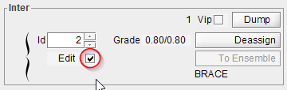
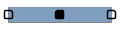
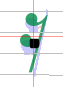

# `Inter` editing
{: .no_toc }

Since 5.2 release, any `Inter` -- whether it has been created by the OMR engine,
manually created from a glyph or dragged & dropped from the shape palette -- can be edited
in terms of precise location and size.

This is now the default general behavior, knowing that, depending on the `Inter` class at hand,
our mileage may vary.

And an `Inter` being edited has a behavior identical to one being dragged & dropped,
in terms of dynamic relations evaluation and in terms of potential snapping to items nearby.

---
Table of contents
{: .text-epsilon }
1. TOC
{:toc}
---

## Entering editing mode

To start editing an `Inter`, we must first set it into `editing mode`:
- This is most conveniently done by a left double-click on the `Inter`.
- If the `Inter` is already selected, the InterBoard on the right displays information about it.
  In this board, the `Edit` checkbox can be used to set the `Inter` into editing mode.    

  

## `Inter` handles

The `Inter` being edited now displays a set of one or several handles, depending on the
`Inter` class.

Handles are displayed as small squares with rounded corners, filled in black for the current handle,
in white for the others.
Clicking on another handle makes it the new current handle.

A handle is meant to be moved:
- either by mouse dragging,
- or by pressing the keyboard `ALT+ ←/↑/↓/→` keys in the desired direction.

Clicking on any location other than `Inter` handles makes the `Inter` exit its editing mode and
commits the editing.

By default, just one handle is displayed as in the case of the 16th rest shown above, allowing the
inter to be shifted in any direction.
Since this inter exhibits only one handle, it offers no resizing capability
-- not surprisingly, we cannot resize a 16th rest symbol.

In the case of a beam, 3 handles are displayed.
The center handle shifts the whole beam in any direction.
The left or the right handle moves just this beam edge in any direction, leaving the other edge in
place.

We will quickly notice, while moving or resizing this beam, that the green relation segments with
the related stems can come and go according to the possible geometric connections between the beam
being moved or resized and the (static) stems.

These are just two typical examples.
See the [`Inter` Editors](../../../reference/editors.md) reference section for a description
of all available `Inter` editors.

## Exiting editing mode

Finally, to complete the on-going editing, we simply press the `Enter` key or
click on any location other than the `Inter` handles.

It is always possible to undo (and redo) any manual editing.
