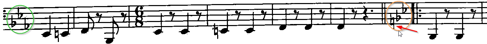
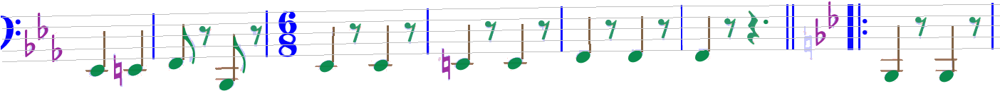
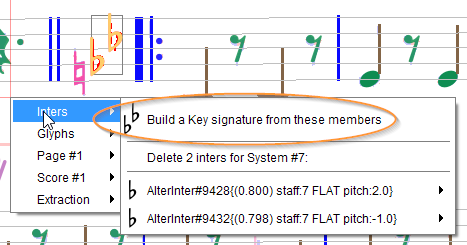

# Key Signature
{: .no_toc }
{: .d-inline-block }
updated in 5.8
{: .label .label-green}

A key signature generally appears at the beginning of a staff, within what Audiveris calls the staff
"header". A staff header is an initial sequence of: 
1. mandatory clef, 
2. optional key signature, 
3. optional time signature.

Generally, the engine correctly handles a key signature in the header, simply because it knows
precisely where to look.

Later down the staff, generally right after a double barline, a key change may appear.

Before the 5.8 release, this key change was not handled by the engine.
We had to always enter the key manually.

Since the 5.8 release, all key changes should be correctly handled by the engine.
The editing features are still available for any manual correction,
applied either to the initial key signature or to a key signature change.

Also since the 5.8 release, a key signature (initial or change) can be assigned or inserted as a whole
or be built from its members.

---
Table of contents
{: .no_toc .text-epsilon }
1. TOC
{:toc}
---

## Data models

An **initial** key signature is an homogeneous sequence of 1 through 7 sharp or flat signs
(located at precise pitches according to the effective clef and the key).
There can't be any natural sign in the initial key signature.

A key signature **change** is the sequence of:
1. an optional sequence of 1 through 7 natural signs
2. an optional homogeneous sequence of 1 through 7 sharp or flat signs

In the following examples (stolen from Wikipedia), see the right-most signatures.
- In the first example, the natural signs are just courtesy signs
and are safely skipped by the Audiveris engine, which recognizes just a 1-flat key signature
- In the second example, the natural signs are needed to cancel the previous 4-sharp key signature,
and the Audiveris engine does process them as a cancel key

| Example  | Description | Engine behavior |
| :--- | :--- | :--- |
|  | Courtesy natural signs | Naturals are ignored |
| | Mandatory natural signs | Naturals are recognized |

Here is a concrete input:

And the engine result:

## Building a key from its members

Suppose we have a set of AlterInter instances (either recognized by the engine, or assigned manually).

Since the 5.8 release, we can select these inters and
(if the sequence is compatible with the current clef / key configuration)
a new item appears in the Inters popup menu proposing to create a key with these member inters.

NOTA: Pay attention not to grab any leading courtesy natural sign(s) in the selected set,
unless this is an all-natural cancel key.

## Inserting a whole flat or sharp key

This can be done:
* Either by selecting a compound glyph and assigning the desired key shape,
* Or by dragging and dropping the desired key shape from the shape palette.

When dragging a "ghost" key from the shape palette, the ghost turns from dark-gray to green
when we enter a staff and, as usual, a thin red segment is drawn from the ghost center
to the staff mid line.

Moreover, the dragged key snaps immediately to the proper vertical position,
according to the effective clef at the point of insertion.

For example, let's insert a 2-sharp key, into the measure
that follows the measure with a 3-sharp key:

Note the two sharp signs are located on F and C steps respectively, and they can move only
horizontally until we release the mouse.  
Once dropped, we can still set the key into editing mode and again shift the inserted key.

## Inserting a whole cancel key

We cannot insert a key made of courtesy naturals followed by sharp or flat signs.
However, we can manually insert a _cancel key_ -- i.e. an all-natural key.

To do so, we drag the 1-natural key from the shape palette and move it to the desired insertion
point.

When we enter the target staff, the 1-natural ghost key will turn as usual from dark-gray to
green, but its configuration and position will be dynamically updated, to fit both:
* The effective **clef**,
* The effective **key** to be cancelled.

If for example the effective key is a 3-sharp key, the "cancel" key will be a 3-natural key,
with each natural sign located according to the corresponding sharp sign to cancel:

| Staff-relative location| Cancel Key appearance|
| --- | --- |
| Outside: |  |
| Inside: |  |

We can notice that this works only when the ghost is located in a staff measure _different_ from
the staff measure that contains the key to be cancelled.
This is so because there can't exist two keys in the same staff measure.
