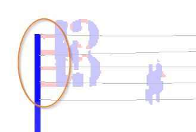
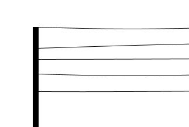
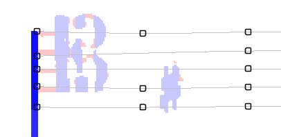
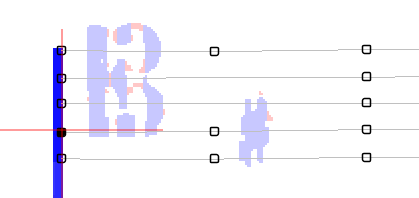
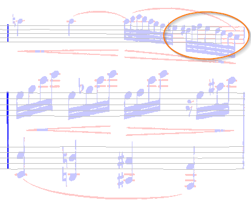
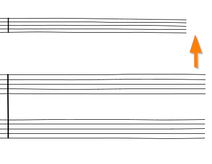
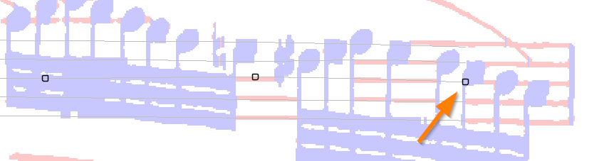
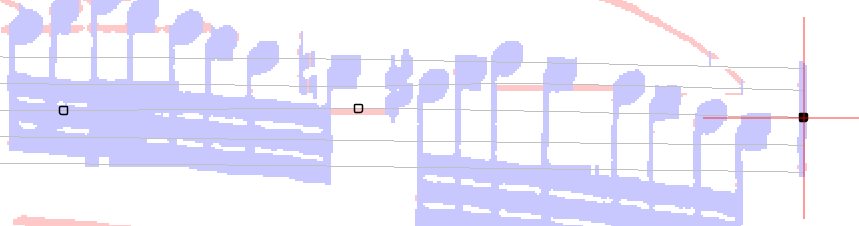
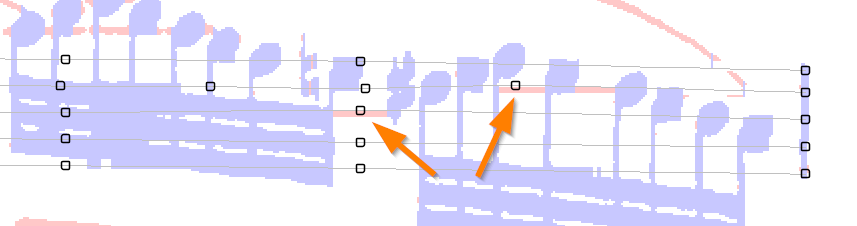
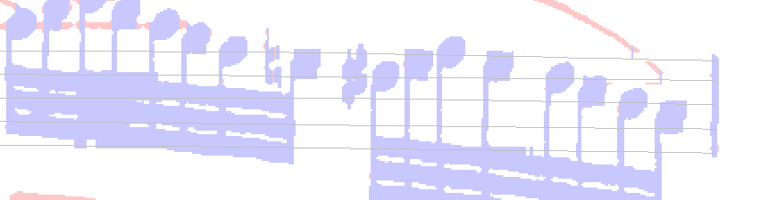

# Staff editing
{: .no_toc }

During the `GRID` step, the OMR engine strives to detect sequences of equally spaced,
long and thin horizontal filaments.
These filaments are then converted to staff lines and their underlying pixels are erased.

For this to work correctly, the score image must exhibit enough "long and thin" filaments.  
Of course, there are musical symbols lying on these staves, typically beam symbols, which may hide
the underlying staff lines.
Generally, the engine can interpolate -- or even extrapolate -- the holes found in image regions
with such broken filaments.

If the engine result is not satisfactory, we can manually correct these staves via staff
editing, which is provided in two different modes: `Global` mode and `Lines` mode.
The former operates on the staff as a whole, the latter on any line separately.

To enter staff editing, we right-click within a staff area, and in the {{ site.popup_staff }}
contextual menu we select:
- either the `Edit staff` item to edit the staff globally,
- or the `Edit lines` item to edit each staff line individually.

---
Table of contents
{: .text-epsilon }
1. TOC
{:toc}
---

## Lines mode

In this mode, we can modify the different lines of the staff individually.

| Input view | Output view |
| :---: | :---: |
|  |   |

In the example above, on the left-side picture, we can see that pixels at the beginning of the staff
have been left over (these are the horizontal sections displayed in pink color).
These non-erased pixels may impede further detection and recognition of symbols, because they will
be considered as parts of the symbol to recognize, here a C clef.

This was certainly due to the wrong extrapolation of staff lines, which is more visible on the
right-side picture. The staff lines, as detected, are not evenly spaced near the barline.

To fix this, preferably right after the `GRID` step, we enter the staff editing in `lines` mode
(Right-click in staff > ``Staff#n`` > ``Edit lines``).

Each line of the staff now exhibits its own sequence of handles, which we can press and drag to modify
the staff line locally.

In this `Lines` mode, the handles can move only vertically.
In the case at hand, we could slightly drag some left handles up or down.
We notice that the pink sections disappear when they get crossed by a staff line.

Clicking outside of any handle completes the editing.  
We can always undo/redo the operation.

In short, this mode is meant to finely adjust the vertical location of any line portion.
If we want to move the staff limits horizontally, then we need to use the `global` mode instead.

{: .note }
The number of handles may vary from line to line, as can be seen in the picture.
This number depends on the "wavyness" of the line detected by the engine.
It has no negative impact on the editing capabilities.

## Global mode

In this mode, we can move staff portions vertically and/or horizontally, and in doing so we modify
all staff lines as a whole.

| Input view | Output view |
| :---: | :---: |
|  |   |

In the example above, the upper staff is so crowded with heads, stems and beams that the engine
could not detect enough line portions.

So much so that many pink sections are still visible where staff lines should be, and that the staff
has even been truncated on its right side.

To fix this, we enter the staff editing in `global` mode
(Right-click in staff > ``Staff#n`` > ``Edit staff``).

As opposed to the `lines` mode, we get handles only along the staff middle line.
This is enough to move the whole staff:
- Side handles can move vertically **and horizontally**,
- Other handles can move only vertically.

So, we press the right-most handle and drag it horizontally to the right until it reaches
the right barline and vertically so that most if not all pink sections disappear.  
We then release the mouse.

We still have a couple of pink sections to fix on lines 2 and 3 (counted top down). This is a job for the `lines` mode.
We simply right-click in the staff area, and select the `lines` mode.

We slightly drag down two handles, and voila!:

{: .highlight }
TIP: Since moving a handle is often a matter of very few pixels, we may find it more
convenient to move a handle via the **keyboard**:
While keeping the `Alt` key pressed, we can use the 4 arrow keys to move the selected handle
one pixel at a time in the desired direction.
