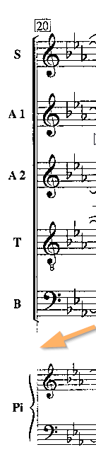
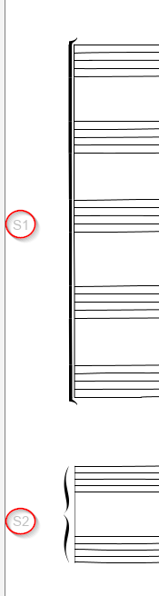
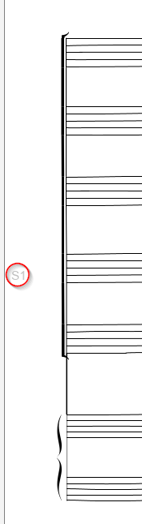
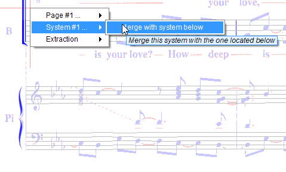
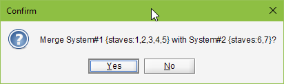

# System editing
{: .no_toc }

- TOC
{:toc}

## System merge

In the Audiveris ``GRID`` step, detected staves are gathered into systems, based on barlines found on
the left side of the staves.

In a poor quality score image, many black pixels may have disappeared, sometimes leading to broken
barlines.

In the example image below, the leading left barline has been damaged, resulting in a wrong
detection of systems by the OMR engine.

| Left barline broken | Resulting grid before fix | Resulting grid after fix |
| ---| --- | --- |
|  |  |    |

Since the 5.2 release, we can manually fix this problem.

We point at the upper system portion, and via the right-click {{ site.popup_system }} menu
we select "_Merge with system below_".

This is a key operation, so we need to confirm the detailed prompt:

And it's done: a connector was created between the two barline portions and the two system
portions merged.

We can still undo/redo the operation.

## Movement start

Audiveris automatically detects movement (score) boundaries by looking at system indentation —
an indented first system signals the start of a new movement.
This detection is controlled by the "_Use of system indentation_" processing switch in
Book Parameters.

However, in some cases (exercise books, anthologies, hymnals), multiple pieces share the same page
without any visual indentation between them.
In these situations, the automatic detection cannot identify the movement boundaries.

You can manually mark any system as a movement start.
Point at the desired system, and via the right-click {{ site.popup_system }} menu
select "_Mark as movement start_".

If the system is already marked as a movement start, the menu will show
"_Unmark as movement start_" instead, allowing you to remove the boundary.

After toggling, pages and scores are automatically rebuilt.
The book export will then produce separate MusicXML files for each movement.

This operation supports undo/redo.
