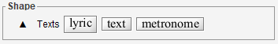

# Text
{: .no_toc }
{: .d-inline-block }
updated for 5.6
{: .label .label-green}

The recognition of textual elements is delegated to the Tesseract OCR library.

The `TEXTS` step runs the OCR on the current sheet.
We can also manually run the OCR on a selected collection of glyphs
or even drag n' drop text items from the `Shape` board.

Running the OCR results in one or several text words gathered in sentences,
which we can further modify manually, in terms of:
- textual _content_,
- font _attributes_ and _size_
- _type_ of words and sentences,
- _role_ of every sentence.

---
Table of contents
{: .no_toc .text-epsilon }
1. TOC
{:toc}
---

## TEXTS step

The `TEXTS` step runs the OCR on the whole sheet image
and tries to assign to each OCR'd item its content, attributes, size, type and role.

This engine step is influenced by three options available in the {{site.book_parameters }} menu:
- [ ] Support for chord names
- [x] Support for lyrics (assumed to be located below the related staff)
- [ ] Support for lyrics even located above staff

Chord names and lyrics are special items; this is the reason why their recognition must be
explicitly selected to avoid collateral damages of the OMR engine when they are not desired.

On the other hand, the metronome marks, thanks to their recognizable structuring,
don't require the setting of any specific option.

## Manual OCR

The OCR can also be launched manually on a glyph(s) selection by pressing one of the
buttons provided in the `Texts` palette of the Shape board:
* The `text` button
* The `lyric` button,
* The `metronome` button,

There are separate buttons because lyric items have a behavior significantly different from
other text items -- especially the gap between words can be much wider.
And the metronome is a specific item on its own.

By manually choosing one button or another, we clearly specify the desired result type
-- and thus the sentence role -- of the OCR operation.

We can as well drag n' drop items from the same `Texts` palette.  
In this case, no OCR is performed, and we have to manually enter every word content.

## Sentence vs. Words

A `Sentence` inter is an ensemble of one or several `Word` inter(s):

* Any `Word` handles its textual ___content___, font ___attributes___, font ___size___ and ___location___.
We can manually modify any of these informations.

  <!--  -->

* A `Sentence` is a sequence of words
  (we can easily navigate from a selected word to its containing sentence
  via the `ToEnsemble` button of the InterBoard).  

  A sentence is assigned a ___role___, which we can edit.

  The sentence ___content___ is simply defined as the concatenation of the contents of its words members.
  Except for the case of `Metronome` -- which mixes text and music characters --
  we __cannot__ modify a sentence content directly, but rather via each of its words members.
  
## Word editing

Here is the example of an input line and the corresponding OCR result, at the end of the TEXTS step:

| Source | Image |
| :--- | :---: |
| Input line |  |
| OCR result | |

### Word content

The word "senza" has been OCR'd as "scnza".

We can modify the content in the text field and press `ENTER`.

### Word attributes
{: .d-inline-block }
new in 5.6
{: .label .label-yellow }

We can do the same content modification for the word "sordino" OCR'd as "sardino".

But this is not enough.
The source was in italic and the result is displayed in upright style.

To fix this, we can now modify the word ___attributes___, via the `Attributes` field.

For "senza" the OCR'd attributes were "IS" (**I**talic **S**erif),
while for "sordino" the OCR'd attributes are just "S" (**S**erif).

So we can simply change the string in the `Attributes` field to "IS", and press `ENTER`.

Handling word attributes is a new feature provided by the 5.6 release.

The attributes, as transcribed by OCR or modified by the user, can be represented by a string
composed of the `BIUMSC` characters.

| Letter | Meaning     | Use |
| :---:  | :---        | :---    |
| **B**  | **B**old        | Style |
| **I**  | **I**talic      | Style |
| **U**  | **U**nderlined  | - ignored - |
| **M**  | **M**onospaced  | Font type |
| **S**  | **S**erif       | Font type |
| **C**  | Small **C**aps  | - ignored - |

These attributes are used to:
1. Choose the text font  (based on the `M` and `S` attributes):  
  The chosen font is *Serif* (if specified), otherwise *Monospaced* (if specified), otherwise *Sans Serif *[^MS]
2. Apply a font style (based on the `B` and `I` attributes)  :
  The chosen style is *Plain* or *Bold* or *Italic* or *Bold+Italic*.

Note: As of this writing, the `U` (Underlined) and `C` (Small Caps) attributes are not supported and thus merely ignored.

This results in the possible combinations:

| Type / Style | ( ) Plain | (B)old  | (I)talic | (B)old (I)talic |
| :---      | :---: | :---: | :---:  | :---:       |
| ( ) **Sans Serif** |  |  |  |  |
| **(S)erif** |  |  |  |  |
| **(M)onospaced** |  |  |  |  |

### Word location and size

Still working on the same sentence, the very first word ("sempre") needs to be fixed:

Modifying the word content and attributes, we get this first result:

The word bounds are too wide when compared to the underlying pixels.
To fix this, we have to put the word into the `edit` mode, either via a double-click on the word,
or by ticking the `edit` checkbox in the InterBoard.

A word being edited shows 2 handles:
- The _middle_ handle can move the word into any direction
- The _right_ handle can increase or decrease the word size (and the related font size accordingly).

Moving the right handle to the left allows to reduce the word width:

And later, in the `SYMBOLS` step, the "PP" glyph will indeed be recognized as a pianissimo symbol.

## Sentence editing

A sentence role can be set to any value among:
- UnknownRole
- ___Lyrics___
- ___ChordName___
- Title
- Direction
- Number
- PartName
- Creator
- CreatorArranger
- CreatorComposer
- CreatorLyricist
- Rights
- EndingNumber
- EndingText
- ___Metronome___

Since the 5.2 release, in all cases, we can manually modify the sentence role afterwards,
from any role to any other role.

### Plain sentence

A "plain" sentence is any sentence which is assigned a role different
from `Lyrics`, `ChordName` and `Metronome`.

Following an OCR recognition (`Texts` step or manual OCR), the role of each resulting 
_plain_ sentence is precised.
Based on a bunch of heuristics, the engine tries to further distinguish between plain roles
like: direction, part name , title, composer, lyricist, etc.

### Chord name

A chord name is a musical symbol which names and describes the related chord.

For example:
`C`, `D7`, `F♯`, `B♭min`, `Em♭5`, `G6/B`, `Gdim`, `F♯m7`, `Em♭5`, `D7♯5`, `Am7♭5`,
`A(9)`, `BMaj7/D♯`.

{: .important }
As of this writing, the Audiveris engine is not yet able to recognize chord names that include true
sharp (`♯`) or flat (`♭`) characters.
Perhaps one day, we will succeed in training Tesseract OCR on this text content.  
For the time being, Audiveris is able to recognize such chord names when these characters have
been replaced (by OCR "mistake", or by manual modification) by more "usual" characters:    
    - `'#'` (number) as replacement for `'♯'` (sharp),  
    - `'b'` (lowercase b) as replacement for `'♭'` (flat).

When we OCR a chord name word, Audiveris may be able to decode it as a chord name and thus wrap
it within a chord name sentence.

If Audiveris has failed, we can still force the chord name role (at the sentence level) and
type in the missing `b` or `#` characters if so needed (at the word level).
The chord name will then be decoded on-the-fly with its new textual content.

Note we don't have to manually enter the true sharp or flat signs.
Entering them via their Unicode value is a bit tricky and, in the end, useless.    
Instead, when text has been recognized or assigned as a chord name, its internal `b`
or `#` characters are automatically replaced by their true alteration signs.    
For example, we can type "Bb" then press `Enter` and the chord name will be translated and
displayed as "B♭".

### Lyric line

A lyric line is a sentence composed of lyric items.

When selected, the `Inter` board displays additional data:
* Voice number,
* Verse number,
* Location with respect to staff.

Each syllable (lyric item) is usually linked to a related chord, either above or below.    
But it is not always obvious whether the text concerns the staff above or below
nor is it always clear which voice is concerned.

If a syllable is not linked to the correct chord, we can modify this link manually by dragging
from the syllable to the suitable chord.
This will update on-the-fly the line data (voice, verse, location).

### Metronome mark

Since the 5.4 release, the [metronome](../../specific/metronome.md) marks
can be automatically recognized.  
We can also edit them afterwards and even create new marks from scratch.

A metronome mark is a sentence composed of words.  
One of its words is special as it contains not textual characters but music characters.
This word is the `BeatUnit` word.

Editing the metronome is detailed in this [specific section](../../specific/metronome.md#manual-editing).

[^MS]: Combining `M` (monospaced) and `S` (serif) could produce a font like "Courier New," but the result is unsatisfactory. Therefore, in "MS" the `M` is ignored in favor of the `S`.