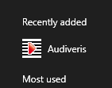

# Installing binaries
{: .no_toc }

Table of contents
{: .no_toc .text-delta }
1. TOC
{:toc}
---

## Windows

### Installation

Audiveris installers for Windows are hosted on
[https://github.com/Audiveris/audiveris/releases](https://github.com/Audiveris/audiveris/releases).

The latest version available is:
* Audiveris_Setup-5.2.????-windows-x86_64.exe (BINGO CHECK PRECISE FILE NAME!!!)

During installation, you will be prompted to associate the `.omr` file extension
(which represents an Audiveris Book) to Audiveris software.

After installation, your Windows start menu should contain a submenu named `Audiveris`
(or `Audiveris32` for the old 32-bit version):



#### Java Runtime Environment

WARNING: Audiveris installers perform all necessary installation
**except for the Java Runtime Environment**.
{: .warning-bg }

To check your existing java environment, you can use the `java -version` command from a terminal
window, to provide Java information like:
```
$ java -version
java version "11.0.3" 2019-04-16 LTS
Java(TM) SE Runtime Environment 18.9 (build 11.0.3+12-LTS)
Java HotSpot(TM) 64-Bit Server VM 18.9 (build 11.0.3+12-LTS, mixed mode)
```

If you don't have a suitable Java Runtime Environment (JRE) yet, you must install one.

- Make sure to install **Java version 11**
(which is today the latest LTS - Long Term Support - version)
for instance from   
[https://www.oracle.com/fr/java/technologies/javase/jdk11-archive-downloads.html](https://www.oracle.com/fr/java/technologies/javase/jdk11-archive-downloads.html)

- Audiveris 5.2 will not work with older Java versions (10 and below).

- It _may_ work with newer versions (12 and above).
We'll update this section whenever new results get available.

#### 32/64-bit architecture

Latest Audiveris version (5.2) uses Java 11 and, starting with Java 10, Oracle now provides
Java environments only for 64-bit architecture.
So a 64-bit architecture is now required.

If you really need a 32-bit version for whatever reason (perhaps because your equipment is too old),
you can still use previous Audiveris 5.1 installers which were available for both 32 and 64-bit
architectures.

#### Additional OCR languages
Audiveris uses Tesseract library to perform OCR operations,
and the installers automatically provide Tesseract data for 4 languages:
`eng`, `deu`, `ita` and `fra`.

If you wish, you can later download data for additional languages from
[Tesseract 3.04 tessdata repository](https://github.com/tesseract-ocr/tessdata/tree/3.04.00).
Pay attention to the fact that Audiveris is not compatible with version 4.0 which is the most
recent version of Tesseract, **it requires Tesseract version 3.04**.

NOTA: There are recurrent messages on Audiveris issues forum about Tesseract configuration.
They all originate from the same misunderstanding, so let's try to clarify the topic here below.
{: .nota-bg }
- Audiveris installer stores the default language data files into the folder named
 `"C:\Program Files (x86)\tesseract-ocr\tessdata\"`.
At run-time, Audiveris calls Tesseract software as a linked binary library,
not as an external executable.
- So there is no need to _install_ any Tesseract software version.
- You can even have a more recent 4.x Tesseract installed beside Audiveris
  (which uses old Tesseract 3.04 library).
- At run-time, Audiveris initializes Tesseract with a `tessdata` folder:
  1. It first searches this folder in the location defined by `TESSDATA_PREFIX` environment variable.   
Nota: This variable is called tessdata "prefix" probably because it should point to the **_parent_**
folder of tessdata folder.
  2. If not found there, it tries the default location according to the OS, which for Windows 64-bit
means `"C:\Program Files (x86)\tesseract-ocr\"`.
- So, wherever your Tesseract data files are stored, the best solution is to define `TESSDATA_PREFIX`
variable accordingly.

As an example, my personal configuration (under Windows 10 64-bit) is as follows:
```
D:\soft>echo %TESSDATA_PREFIX%
c:\Program Files (x86)\tesseract-ocr\
```
```

D:\soft>tree "%TESSDATA_PREFIX%"
c:\Program Files (x86)\tesseract-ocr\
└── tessdata
    ├── dan-frak.traineddata
    ...
    ├── eng.traineddata
    ...
    └── slk-frak.traineddata

1 directory, 33 files
```

Note that beside downloading additional language(s), you will have to select them at run-time
to effectively use them.
This is detailed in Tesseract OCR article within the [Building from sources](sources.md) section.

### Uninstallation

To uninstall the program, you can simply select `Uninstall` in Audiveris start menu.

The uninstaller will optionally keep the configuration files of the program.
So, if you re-install this program or a new version later, you will find the same settings that you
had used before uninstallation.

NOTA: You may not always see the `Uninstall` item under Audiveris in Windows start menu.
This is reportedly a new Windows behavior, which now recommends to open Windows Settings
(keyboard shortcut is `Windows + I`), then look in `Apps & features` section for the Audiveris item
and there press the `Uninstall` button.
{: .nota-bg }

## Linux
No installer.

## Mac-OS
No installer.
