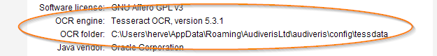

## OCR languages
{: .no_toc }

Audiveris delegates text recognition to Tesseract OCR library.

Whether you install Audiveris via its Windows installer or download the project and build it locally
from source, you will need to have a local copy of some Tesseract language files:
- `eng` (English) is mandatory,
- `deu` (German), `fra` (French), `ita` (Italian) are often useful.

Note that you can always download additional languages later from the dedicated 
[Tesseract tessdata] site which contains data files for 100+ languages.

---
Table of contents
{: .no_toc .text-delta }
1. TOC
{:toc}
---

### Tesseract as a linked library

Audiveris calls Tesseract software as a linked binary _library_,
not as a separate executable _program_.
- Tesseract library is automatically provided via Audiveris installation or building.
  As of this writing, Audiveris uses version {{ site.tesseract_version }} of Tesseract library.
- There is thus no need to _install_ any Tesseract program.
  You may already have a Tesseract program of whatever version installed on our machine,
  Audiveris will not interfere with that program.
- However, Tesseract library will need data (language files) which must be provided separately.

### Data version

Tesseract OCR engine can operate in two different OCR modes
-- the ``legacy`` mode and the new ``LSTM`` mode -- each with its own model.

To process text scattered among musical symbols, Audiveris must use the ``legacy`` mode.

The language files downloadable from [Tesseract tessdata] page are meant for Tesseract
version 4.x and up, each language file containing both ``legacy`` and ``LSTM`` models.  
So, these are the language data files that Audiveris requires.

### Data location

At starting time, Audiveris tries to initialize the Tesseract library with a `tessdata` folder:
  1. It first checks the location defined by the `TESSDATA_PREFIX` environment variable.
  2. If not found there, it tries the Tesseract tessdata default location according to the OS,
  which for Windows can be for example `"C:\Program Files\tesseract-ocr\tessdata"`.

If in doubt, we recommend the following actions:
1. Choose or create a specific folder, named ``tessdata`` for clarity.
2. Download a few language files (at least ``eng.traineddata`` file) from [Tesseract tessdata] page
to your specific folder.
3. Define the `TESSDATA_PREFIX` environment variable to point to your specific folder.

For illustration purpose, here is a personal configuration:
- I have created a ``"tessdata"`` sub-folder in Audiveris user ``config`` folder.
```bash
$ echo $TESSDATA_PREFIX
C:\Users\herve\AppData\Roaming\AudiverisLtd\audiveris\config\tessdata
```
- And downloaded just four files from [Tesseract tessdata] web page into it.
```bash
$ ls -lgh $TESSDATA_PREFIX
total 66M
-rw-r--r-- 1 herve 15M Jun 22 14:15 deu.traineddata
-rw-r--r-- 1 herve 23M Jun 22 12:18 eng.traineddata
-rw-r--r-- 1 herve 14M Jun 22 14:16 fra.traineddata
-rw-r--r-- 1 herve 16M Jun 22 14:16 ita.traineddata
```

The About dialog, launched from the ``Help | About`` pulldown menu, displays key information
about the OCR engine version and OCR tessdata folder:



### Languages selection

At runtime, you can specify which languages should be tried by the OCR software.  
This is done via a language specification string, a plus-separated list of language names:

- The easiest way is to define this language specification interactively.  
Using the `Book | Set Book Parameters` menu, you can make specifications
at the global level, book level and even individual sheet level.  
Depending upon the language files present in your local ``tessdata`` folder,
you will be presented with the list of  languages available for selection.

- The default (global) specification is determined by the application constant
`org.audiveris.omr.text.Language.defaultSpecification`, whose initial value is `deu+eng+fra`.  
Thus, you can also modify this default directly by changing the constant value:
  - either interactively (using `Tools | Options` menu)
  - or in batch (using something like
    `-option org.audiveris.omr.text.Language.defaultSpecification=ita+eng`).  

[Tesseract tessdata]:  https://github.com/tesseract-ocr/tessdata
