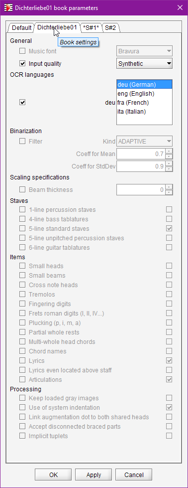

## Book parameters
{: .no_toc }

Table of contents
{: .no_toc .text-delta }

1. TOC
{:toc}

---

### Dialog

The pulldown menu  `Book | Set Book Parameters...` opens a dialog to let you display and modify
high-level processing parameters.

The following example displays the parameters dialog for a book (`Dichterliebe01`) which contains
two sheets:

### Scopes

The dialog is organized in several tabs to describe Default, Book and Sheet's scopes respectively.
In this example, the dialog provides 4 tabs, one for Default, one for Dichterliebe01 book,
and one for each sheet in the Dichterliebe01 book.

The same parameters are defined for each scope, and each scope by default inherits from the upper
scopes in hierarchy:
1. **Default** level: This is the information provided by default for all books.
Any such global value is read from source, unless it has been overridden by the user at default level.
2. **Book** level: The user can override any default value for this book only, and it will apply
transitively to all sheets in this book.
3. **Sheet** level: Finally, the user can override any value for the specific sheet at hand.

To override a value for a given scope:
1. First select the proper scope tab,
2. Then put a checkmark on the left side to indicate that you want to override the selected parameter.
The line gets enabled, it moves from gray to black.
3. Define the new value, either by selecting in a list, or typing a number,
or checking a boolean box, etc.

To cancel a value modification, simply un-check the box on left side.
The line then gets disabled, moving from black to gray, and it now displays the inherited value
in lieu of the overriding value.

### Lifecycle

All modifications apply only when the `OK` button is pressed, which actually commits them and
completes the dialog.

* All the modified **default** values persist from one run of the application to the other
(until they are modified again or reset to their factory value).

* All the modified **book/sheets** values persist in the book `.omr` project file.

### Parameters

* **Binarization**  
  Select the kind of filter (_global_ or _adaptive_) which gives the best results for the sheet
  image at hand.   
  You can also adjust the related numbers.
  Playing with _global_ threshold is easy, but we recommend against modifying   the parameters of
  the _adaptive_ filter.

* **OCR Languages**  
  Define the specification of dominant languages for OCR'ed text
  (note that you can select several languages)

* **Switches** for a list of binary features.   
  In some cases, supporting a rather rare feature may imply collateral damages, the small note heads
  are such example of tricky features.
  So it is safer to use them only when you have to.   

  NOTA: a switch can disable a feature only for the OMR automatic recognition, the feature remains
  available for manual user actions.
  {: .nota-bg }

  * Use poor input mode
  * Use of system indentation
  * Link augmentation dot to both shared heads
  * Keep loaded gray images
  * Support for articulations
  * Support for chord names
  * Support for fingering digits
  * Support for frets roman digits (I, II, IV...)
  * Support for plucking (p, i, m, a)
  * Support for lyrics
  * Support for lyrics even located above staff
  * Support for small black note heads
  * Support for small void note heads
  * Support for small whole note heads
  * Support for cross note heads
  * Support for implicit tuplets
  * Support for guitar tablatures (6 lines)
  * Support for bass tablatures (4 lines)
  * Support for percussion staves (1 line)
  * Support for partial whole rests
  * Support for multi-whole head chords

