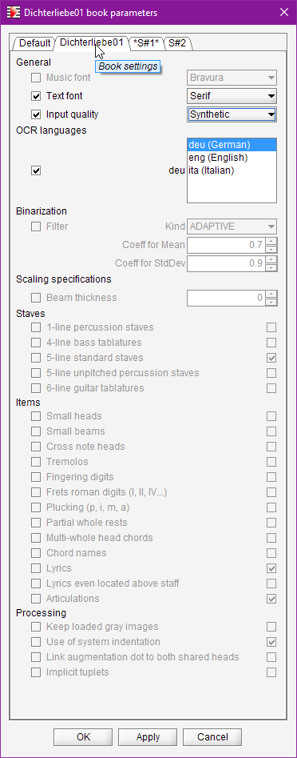

## Book Parameters
{: .no_toc }

Table of contents
{: .no_toc .text-delta }

1. TOC
{:toc}

---

### Dialog

The pulldown menu  `Book | Set Book Parameters...` opens a dialog to review and modify
high-level processing parameters.

The following example displays the parameters dialog for a book (`Dichterliebe01`) which contains
two sheets:

### Scopes

The dialog is organized in several tabs to describe Default, Book and Sheet's scopes respectively.
In this example, the dialog provides 4 tabs, one for Default, one for Dichterliebe01 book,
and one for each sheet in the Dichterliebe01 book.

The same parameters are defined for each scope, and each scope by default inherits from the upper
scopes in hierarchy:
1. **Default** level: This is the information provided by default for all books.
Any such global value is read from source, unless we have overridden it at default level.
2. **Book** level: We can override any default value for this book only, and it will apply
transitively to all sheets in this book.
3. **Sheet** level: Finally, we can override any value for the specific sheet at hand.

To override a value for a given scope:
1. We first select the proper scope tab,
2. We then put a checkmark on the left side to indicate that we want to override the selected parameter.
The line gets enabled, it moves from gray to black.
3. We define the new value, either by selecting in a list, or typing a number,
or checking a boolean box, etc.

To cancel a value modification, we simply un-check the box on left side.
The line then gets disabled, moving from black to gray, and it now displays the inherited value
in lieu of the overriding value.

### Lifecycle

All modifications apply only when either the `OK` button or the `Apply` button is pressed,
which actually commits them.
The `OK` button completes the dialog, while the `Apply` button keeps the dialog open.

* All the modified **default** values persist from one run of the application to the other
(until they are modified again or reset to their factory value).

* All the modified **book/sheets** values persist in the book `.omr` project file.

### Parameters

* **Binarization**  (needs SPECIFIC_ITEMS advanced topic)  
  We select the kind of filter (_global_ or _adaptive_) which gives the best results for the sheet
  image at hand.   
  We can also adjust the related numbers.
  Playing with _global_ threshold is easy, but modifying the parameters of   the _adaptive_ filter
  are not recommended.  
  In fact, the default adaptive filter seems to give good results in all cases, therefore this
  parameter is kept only for potential use on a specific case.
  It does not appear unless the SPECIFIC_ITEMS advanced topic has been selected.

* **Music font**  
We can here choose a precise music font between ``Bravura``, ``Finale Jazz`` or ``Jazz Perc``.  
This decision is especially important for heads recognition which is based on
template matching technique.  
See specific [Music Font](../specific/fonts.md#music-fonts) section.

* **Text font**  
Though less important than music font, we can adjust text font between
``Sans Serif``, ``Serif`` and ``Finale Jazz Text``.

* **Input quality**  
This item allows to adapt OCR engine behavior to the expected quality of the input image between
``synthetic``, ``standard`` and ``poor``.

* **OCR Languages**  
  Define the specification of dominant languages for OCR'd text
  (note that we can select several languages)

* **Switches** for a list of binary features.   
  In some cases, supporting a rather rare feature may imply collateral damages, the small note heads
  are such example of tricky features.
  So it is safer to use them only when we have to.   
  * Keep loaded gray images
  * Use of system indentation
  * Link augmentation dot to both shared heads
  * Support for percussion staves (1 line)
  * Support for bass tablatures (4 lines)
  * Support for unpitched percussion staves (5 lines)
  * Support for guitar tablatures (6 lines)
  * Support for small note heads
  * Support for small beams
  * Support for cross note heads
  * Support for tremolos
  * Support for fingering digits
  * Support for frets roman digits (I, II, IV...)
  * Support for plucking (p, i, m, a)
  * Support for partial whole rests
  * Support for multi-whole head chords
  * Support for chord names
  * Support for lyrics
  * Support for lyrics even located above staff  
  * Support for articulations
  * Support for implicit tuplets

{: .highlight }
A switch can disable a feature for the OMR automatic recognition,
but in most cases the feature remains available for manual user actions.

